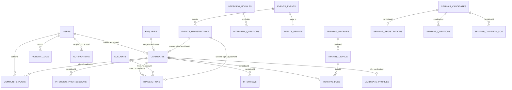
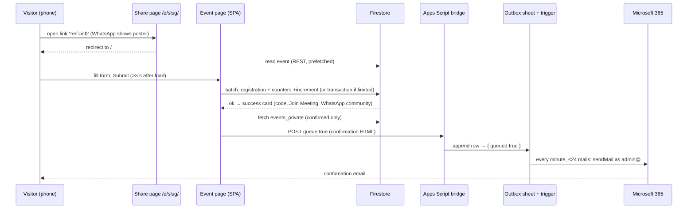
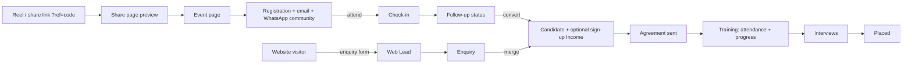
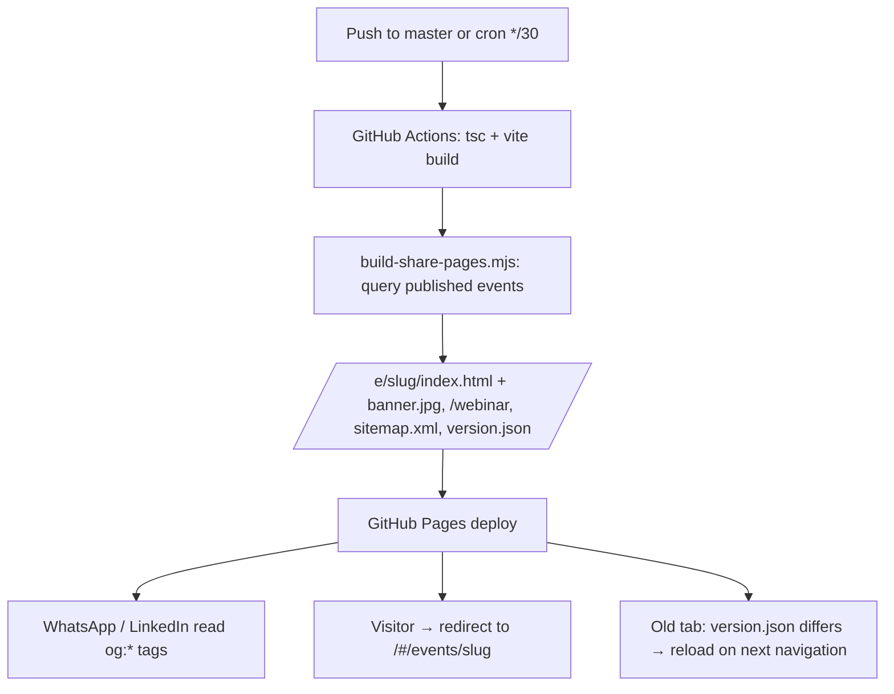

# Software Requirements Specification (SRS) & Business Requirements Specification (BRS)

# SPR TechForge Management Platform & Public Website

---

## 1. Document Control

| Field | Value |
| --- | --- |
| **Project Name** | SPR TechForge Management Platform & Public Website |
| **Document Type** | Combined SRS + BRS |
| **Version** | 2.1 |
| **Date** | 2026-09-23 |
| **Author** | Generated from codebase analysis and verified against QA and production behaviour (Claude, with Thirumal Reddy) |
| **Status** | Baseline for Sprint testing (September 2026 release) |
| **Repository** | https://github.com/thirumalreddy1995/SPRTechforge |
| **Environments** | Production https://sprtechforge.com · QA https://sprtechforge-qa.web.app |

### 1.1 Revision History

| Version | Date | Author | Description |
| --- | --- | --- | --- |
| 0.1 | 2026-05-17 | Generated | Initial draft from codebase exploration |
| 1.0 | 2026-05-17 | Generated | First baseline; covers all modules through Phase 4 |
| 2.1 | 2026-09-23 | Generated + T. Reddy | Section 5 rewritten in plain functional language for testers (purpose, who, where, expected behaviour, rules, scenarios); Candidate Management fully described; credentials and secrets removed from all documentation. |
| 2.0 | 2026-09-23 | Generated + T. Reddy | Retired SPRConnect Chat / Meetings / Video / Email inbox (MOD-18–21). Added Community (MOD-26), Events administration (MOD-27), public event registration, emails and link sharing (MOD-28), Website Content management (MOD-29), Communication Settings and Email Outbox (MOD-30), Seminar Campaigns (MOD-31). Rewrote Public Website (MOD-25). Master role now an `isMaster` flag. Updated architecture, integrations (Microsoft 365 mail, Google Sheets outbox, static share pages, scheduled rebuilds), NFRs (performance measurements, stale-build recovery, email rate limiting), data model, screens, traceability and open gaps. |

### 1.2 Glossary

| Term | Definition |
| --- | --- |
| **Admin** | A user whose `role` field is `admin`, or any user whose `modules` array contains `users`. Has access to management modules except Finance and master-only tools. |
| **Master** | The user record with `isMaster = true` (currently thirumalreddy@sprtechforge.com). Sees Finance, Activity Logs, Cloud Setup, Test Runner, Communication Settings and may delete events permanently. |
| **Staff** | A user whose `role` is `staff` — trainers and operations staff. |
| **Candidate** | A learner. `role = candidate`; linked to a `candidates` record through `linkedCandidateId`. |
| **Community** | The staff home page (`/community`): announcements, birthdays, celebrations, achievements, quote and learning of the day. Replaced SPRConnect Chat/Meetings/Email. |
| **Event** | A free webinar/seminar/workshop created in Events management, published at `/#/events/<slug>` and shared via `/e/<slug>/`. |
| **Slug** | URL-safe identifier derived from an event title on first publish; immutable afterwards. |
| **Share page** | A static HTML page per event generated at deploy time so WhatsApp/LinkedIn show the event's own poster; it forwards visitors into the app. |
| **Short link** | `sprtechforge.com/webinar` — always opens the next upcoming event. |
| **Ref code** | The `?ref=<code>` tag on a shared link, stored on each registration as its marketing source (influencer attribution). |
| **Registration code** | Public identifier of a registration, e.g. `SPR-WEB-Q728HPH`; used for check-in. |
| **Private join details** | Join URL, meeting ID and passcode of an online event; stored separately from the public event and revealed only to confirmed registrants and admins. |
| **Email bridge** | The Google Apps Script web app that sends mail on behalf of the platform, through Gmail or Microsoft 365 (Graph). |
| **Outbox** | The bridge's queue (a Google Sheet plus a 1-minute trigger) that sends mail at a safe rate with retries. |
| **Website Content** | Admin screen (`/admin/website`) holding hero banners, gallery photos, testimonial images, statistics and links shown on the public site. |
| **Web Lead** | An enquiry submitted through the website contact form. |
| **Enquiry** | A prospect record maintained by staff; can be merged into a Candidate. |
| **Agreement** | The training agreement a candidate accepts or rejects through the public portal link. |
| **Batch** | A training cohort identifier on the candidate record. |
| **GAS** | Google Apps Script. |
| **IST** | Indian Standard Time; all event times are entered and displayed in IST. |
| **DPDP** | India's Digital Personal Data Protection Act — consents on the registration form are timestamped and unticked by default. |

---

## 2. Introduction

### 2.1 Purpose

This document specifies the complete business and software requirements of the **SPR TechForge Management Platform and Public Website**. It is the authoritative reference for:

- Validating the system's behaviour during QA testing (sprint-level manual testing and automation).
- Onboarding new developers, testers, and stakeholders.
- Negotiating scope and priorities with the product owner.
- Producing test plans, epics, user stories, test cases, and traceability matrices.

A QA tester or business analyst with **no access to source code** shall be able to design a complete test plan from this document alone. Section 5 is written in plain functional language for that purpose; technical detail is confined to §7, §8 and §11.

### 2.2 Intended Audience

| Audience | What they get from this document |
| --- | --- |
| **QA Testers** | Module-level functional requirements with input validation rules, expected outputs, and ready-to-use test scenarios. |
| **Business Analysts** | Business goals, user roles, processes, and KPIs. |
| **Developers** | Data models, integration points, deployment pipeline and non-functional requirements. |
| **Stakeholders / Product Owner** | High-level scope, dependencies, gaps, and acceptance criteria. |
| **Marketing / Influencer coordinators** | How event links, previews, short links and ref codes behave (MOD-28). |

### 2.3 Project Scope and Objectives

**In scope:**

- Authentication and user/role management (admin, staff, candidate; master flag).
- Recruitment funnel: website enquiry → web lead → enquiry → candidate → agreement → training → interviews → placement.
- Training delivery: curriculum, attendance, progress tracking, interview question bank, interview prep.
- Finance (master only): accounts, transactions, statements, balance sheet, P&L, payroll, reports.
- Community home: announcements, birthdays, celebrations, achievements, daily quote and learning, notifications.
- Events: creation and publishing of free webinars/seminars, public registration on any device, confirmation and reminder emails, WhatsApp community hand-off, link previews with the event poster, influencer attribution, check-in and recap, conversion of registrants to candidates.
- Public website: company and academy positioning, admin-managed banners, photos, testimonial images, statistics and links, contact and enquiry form, SEO basics.
- Communications: runtime-configurable email bridge (Gmail or Microsoft 365) with a server-side outbox.
- Seminar campaign tool (legacy outreach module).
- Administrative tools: activity logs, cloud setup, in-app test runner, communication settings.
- Self-service candidate portal: agreement, profile, training dashboard, interview prep.

**Out of scope (current release):**

- Native mobile apps (the web app is responsive and tested on phones).
- Multi-tenant support (single organisation).
- Localisation (English UI; Telugu marketing content is produced outside the app).
- Push notifications (in-app notifications only).
- Online payment collection.
- Automatic reminder scheduling for events (reminders are sent by an admin from the event dashboard).

### 2.4 References

- [README.md](README.md) — project README.
- [SETUP-ENVIRONMENTS.md](SETUP-ENVIRONMENTS.md) — environment setup.
- [SETUP-EMAIL.md](SETUP-EMAIL.md) — email bridge, Outlook provider and outbox setup.
- [RUNBOOK.md](RUNBOOK.md) — operations runbook.
- [testing/README.md](testing/README.md) and [testing/SPR-Testing.xlsx](testing/SPR-Testing.xlsx) — test management pack (epics, stories, test cases, bug tracker).
- [types.ts](types.ts), [events/types.ts](events/types.ts), [site/types.ts](site/types.ts), [seminar/types.ts](seminar/types.ts) — data models.
- [context/AppContext.tsx](context/AppContext.tsx) — staff-side state and CRUD helpers.
- [services/cloud.ts](services/cloud.ts), [events/services/eventsPublicDb.ts](events/services/eventsPublicDb.ts), [site/services/siteDb.ts](site/services/siteDb.ts) — data access.
- [services/emailService.ts](services/emailService.ts), [apps-script/Code.gs](apps-script/Code.gs) — email bridge client and server.
- [scripts/build-share-pages.mjs](scripts/build-share-pages.mjs) — share pages, short link and sitemap generator.
- [lib/freshBuild.ts](lib/freshBuild.ts) — stale-build recovery.

---

## 3. Business Requirements (BRS)

### 3.1 Business Context and Problem Statement

SPR TechForge Pvt Ltd (Kukatpally, Hyderabad) is a software testing and quality-engineering company that also runs a training academy: it recruits learners from the open market, trains them across manual, automation, API, performance, mobile, desktop and security testing on live projects, prepares them for interviews and supports placement. Growth now comes largely from free online webinars promoted through Instagram influencers across Telangana and Andhra Pradesh.

Before the platform, operations ran on spreadsheets and ad-hoc tools for leads, candidate progress, interviews, fees and payroll; and event promotion relied on raw meeting links with no attribution, no preview image and no protection against email rate limits. The platform consolidates operations into one role-aware web application with shared real-time data, and gives marketing a registration funnel that works from a shared link on a phone.

### 3.2 Business Goals and Objectives

| ID | Goal | Success measure |
| --- | --- | --- |
| **BG-01** | One shared system for candidate, training and finance data. | All operations functions run from the app; no parallel spreadsheets. |
| **BG-02** | Make training and placement progress visible to candidates. | Candidate dashboard shows accurate attendance, progress and interview pipeline. |
| **BG-03** | Eliminate manual interview-question distribution. | Question bank ≥200 questions; bulk upload by admins. |
| **BG-04** | Turn webinar promotion into measurable registrations. | Every shared link previews with the event poster; every registration is attributed to a source; confirmations reach 100% of registrants during a burst of 200+ sign-ups per hour. |
| **BG-05** | Reliable, audit-trailed financial reporting for the master. | Balance sheet and P&L reconcile to transactions; locked transactions cannot be silently edited. |
| **BG-06** | Near-zero infrastructure cost. | Firebase Spark tier, Google Apps Script, Google Sheets, GitHub Pages / Firebase Hosting free quotas; the only paid item is the existing Microsoft 365 mailbox. |
| **BG-07** | Keep staff informed without chat noise. | Announcements, birthdays and daily learning on the Community home; in-app notifications. |
| **BG-08** | A public website that presents the company credibly on phones. | Real logo, admin-managed proof (numbers, testimonials, photos), working contact actions, no layout defects at 390 px width. |

### 3.3 Stakeholders and User Roles

| Stakeholder | Role in system | Primary needs |
| --- | --- | --- |
| **Owner / Director / Master** | `admin` with `isMaster = true` | Full visibility — finance, all modules, activity log, communication settings, permanent deletions. |
| **Admin (non-master)** | `admin` role (or `modules` includes `users`) | Manage candidates, training, interviews, users, events, website content, seminar campaigns, web leads. |
| **Staff Trainer** | `staff` role | Community, attendance, progress, interview prep, read-only candidates. |
| **Candidate** | `candidate` role | Profile, training dashboard, agreement, interview prep. |
| **Prospect / Website visitor** | Unauthenticated | Browse the website, call/WhatsApp/email, open the office in Maps, send an enquiry. |
| **Event registrant** | Unauthenticated | Register from a shared link on a phone, receive joining details instantly and by email, join the WhatsApp community, join the meeting. |
| **Influencer / partner** | Unauthenticated | Share a tagged link; registrations through it are counted under their code. |
| **Link crawler** (WhatsApp, LinkedIn, Facebook, Google) | System | Read Open Graph tags from the share pages and sitemap. |

### 3.4 High-Level Business Processes

```
   Instagram reel / WhatsApp share                 Website visitor
   (tagged link ?ref=<code> or /webinar)                 │
                 │                                       ▼
                 ▼                              ┌────────────────┐
        ┌────────────────┐                      │  Web Lead      │  (enquiry form)
        │ Share page     │ preview w/ poster    └──────┬─────────┘
        │ /e/<slug>/     │                             │
        └──────┬─────────┘                             ▼
               ▼                                ┌────────────────┐
        ┌────────────────┐                      │   Enquiry      │  (staff follow-up)
        │ Event page     │ register on phone    └──────┬─────────┘
        └──────┬─────────┘                             │ (Joined)
               ▼                                       ▼
        ┌────────────────┐  queued email +     ┌────────────────┐
        │ Registration   │  WhatsApp community │  Agreement     │
        └──────┬─────────┘                     └──────┬─────────┘
               │ attend → follow-up →                 ▼
               │ convert to candidate          ┌────────────────┐
               └─────────────────────────────▶ │  Candidate     │  (fee, batch)
                                               └──────┬─────────┘
                                                      ▼
                                  Training (attendance, progress, prep)
                                                      ▼
                                  Interview pipeline → Placed → Work support
```

Parallel processes running across all stages:

- **Community** — announcements, birthdays and daily learning for all staff; in-app notifications.
- **Finance** — fees collected (including event sign-up payments), salaries paid, statements generated (master only).
- **Website Content** — admins keep banners, numbers, testimonials and photos current.
- **Activity Logging** — every staff mutation is recorded for audit.

### 3.5 Success Criteria / KPIs

| KPI | Target |
| --- | --- |
| Registration success under burst | 100% of concurrent registrations succeed with unique codes (verified 1,000 concurrent on QA). |
| Confirmation email delivery | Every queued confirmation sent within 5 minutes at up to 24 mails/minute; 0 rate-limit failures. |
| Link preview correctness | Shared event links show the event poster within 30 minutes of publishing. |
| Attribution coverage | ≥95% of registrations from influencer links carry a ref code. |
| Event page speed on 4G phone | Content visible ≤3 s (measured 2.8 s on a throttled 1.6 Mbps profile). |
| Time to mark daily attendance | ≤2 minutes for a batch of 15. |
| Web Lead first response | ≤24 hours on business days. |
| Audit log completeness | 100% of staff mutations logged with actor + timestamp. |
| Finance reconciliation | Reports reconcile to transactions within ±₹0. |

### 3.6 Assumptions, Constraints, and Dependencies

| ID | Item |
| --- | --- |
| **A-01** | Users have modern evergreen browsers; registrants may be on low-end Android phones over 4G. |
| **A-02** | Stable internet for staff (real-time listeners). |
| **A-03** | The Microsoft 365 mailbox admin@sprtechforge.com is licensed and its Entra app registration (Mail.Send) remains valid; limits 30 messages/minute and 10,000 recipients/day. |
| **A-04** | Candidates with `role = candidate` have user records linked through `linkedCandidateId`. |
| **A-05** | The office Google Maps place and WhatsApp community invite links remain valid. |
| **C-01** | Firebase Spark (free) plan: no Cloud Functions, no Firebase Storage bucket on production (uploads fall back to inline images). |
| **C-02** | Production GitHub Actions has no Firebase secrets; the app and build scripts fall back to the production project configuration. |
| **C-03** | GitHub Pages caches every file for 10 minutes; the app compensates with stale-build recovery. |
| **C-04** | Production deploys to GitHub Pages at sprtechforge.com; QA to Firebase Hosting at sprtechforge-qa.web.app. |
| **D-01** | Depends on Firebase Firestore, Google Apps Script, Google Sheets, Microsoft Graph, GitHub Actions and Firebase Hosting being operational. |
| **D-02** | The `isMaster` flag must be set on exactly one user record; the bootstrap admin is patched at startup if missing. |

---

## 4. System Overview

### 4.1 High-Level Architecture

```
  ┌──────────────────────────────────────────────────────────────────────┐
  │                        Browser (React SPA, HashRouter)               │
  │  Public pages ──── firebase/firestore/lite (REST) ───────┐           │
  │  Staff app ─────── firebase/firestore (real-time) ───────┤           │
  │  emailService ──── HTTPS POST (queue:true) ──────────────┼─────┐     │
  │  lib/freshBuild ── /version.json check, chunk retry      │     │     │
  └──────────────────────────────────────────────────────────┼─────┼─────┘
                                                             ▼     ▼
        ┌────────────────────────────┐        ┌──────────────────────────────┐
        │ Firebase                   │        │ Google Apps Script bridge    │
        │  Firestore (all data)      │        │  doPost: send now / enqueue  │
        │  Hosting (QA)              │        │  Outbox = Google Sheet       │
        └────────────────────────────┘        │  1-min trigger → 24 mails/min│
                                              │  Gmail  or  Microsoft Graph  │
  ┌────────────────────────────┐              └──────────────────────────────┘
  │ GitHub Actions (CI)        │
  │  tsc + vite build          │        Static outputs per deploy:
  │  build-share-pages.mjs ────┼──────▶ /e/<slug>/index.html + banner.jpg
  │  cron every 30 min (prod)  │        /webinar, sitemap.xml, version.json
  │  GitHub Pages (prod)       │
  └────────────────────────────┘
```

### 4.2 Technology Stack

| Layer | Technology | Notes |
| --- | --- | --- |
| Frontend framework | React 18 + TypeScript | Hooks; lazy-loaded routes; error boundary with Reload. |
| Build tool | Vite 5 | Content-hashed chunks; `version.json` emitted with the commit SHA as build id. |
| Styling | Tailwind CSS 3 | Utility classes. |
| Routing | react-router-dom 6, HashRouter | Static hosting friendly; `ScrollToTop` on route change. |
| State | React Context (`AppContext`) | Staff subscriptions start only when a stored session exists. |
| Database | Firebase Firestore | Real-time SDK for staff; lightweight REST SDK for public pages. |
| File storage | Firebase Storage when provisioned; inline WebP data URLs otherwise | Banners, photos, testimonials, community images. |
| Email | Google Apps Script bridge → Gmail or Microsoft Graph (Outlook) | Outbox queue in Google Sheets; runtime config in `system_settings/messaging`. |
| Link previews | Static share pages generated by `scripts/build-share-pages.mjs` (Node + sharp) | WebP banners converted to JPEG for WhatsApp. |
| Spreadsheet parsing | `xlsx` (SheetJS) | Lazy chunk for bulk uploads and seminar import. |
| Production hosting | GitHub Pages | `deploy.yml`: push to master + cron every 30 min + manual. |
| QA hosting | Firebase Hosting | `deploy-qa.yml`: push to QA + manual. |

### 4.3 Deployment Environment

| Environment | URL | Firestore project | Email bridge | Triggered by |
| --- | --- | --- | --- | --- |
| **Production** | https://sprtechforge.com | `sprtechforge` (built-in fallback config; no CI secrets) | Shared Apps Script deployment, Outlook provider | Push to `master`, cron `*/30`, manual dispatch |
| **QA** | https://sprtechforge-qa.web.app | `sprtechforge-qa` (CI secrets) | Same Apps Script deployment | Push to `QA`, manual dispatch |
| **Local development** | http://localhost:5173 | Production project unless `.env.local` says otherwise — treat as live data | `npm run dev` |

Deploy characteristics: a production deploy takes about 1 minute; GitHub Pages serves every file with `Cache-Control: max-age=600`; the share pages and sitemap are regenerated on every build from Firestore.

### 4.4 External Integrations

| Integration | Purpose | Owner | Failure mode |
| --- | --- | --- | --- |
| Firebase Firestore | Data store, real-time listeners, public REST reads | Google | Staff app shows cloud-error banner; public pages show a retry message. |
| Firebase Hosting | QA hosting with SPA rewrite | Google | QA unavailable; production unaffected. |
| GitHub Pages + Actions | Production hosting, scheduled rebuilds | GitHub | Stale share pages until next successful run. |
| Google Apps Script | Email bridge (send, queue, outbox status) | Google (user-owned) | Emails queue on the client side fail with a friendly error; registration still succeeds. |
| Google Sheets | Outbox storage | Google | Enqueue fails → bridge falls back to sending immediately. |
| Microsoft Graph (Entra app) | Send as admin@sprtechforge.com | Microsoft 365 tenant | Friendly errors mapped from AADSTS / Graph codes on Communication Settings. |
| WhatsApp (wa.me, chat.whatsapp.com) | Share, invite, community | Meta | Links open WhatsApp; no API dependency. |
| Google Maps (maps.app.goo.gl) | Office location | Google | Link opens Maps app or web. |
| YouTube / Instagram | Social links; optional event intro video embed | Google / Meta | Missing embed shows nothing. |
| Microsoft Teams / Google Meet | Meeting platform for online events | Microsoft / Google | Join button opens the platform; not embedded. |

---

## 5. Functional Requirements by Module (SRS)

This section describes, module by module, **what the application is expected to do** in the words a tester or business user would use. Each module states its purpose, who uses it, where it is found in the application, the expected behaviour (numbered `FR-MM.N` for traceability), the rules and validations, and ready-to-run test scenarios (`TS-MM.N`). Technical details (database collections, file names) are kept out of this section and appear only in §7 and §11 for developers.

### Roles used throughout

| Role | Who | What they can reach |
| --- | --- | --- |
| **Master (Director)** | The owner's account, flagged as master | Everything, including Finance, System Logs, Cloud Setup, Communication Settings, Test Runner, permanent deletions and merges. |
| **Admin** | Operations managers | Everything except the master-only areas above: Candidates, Enquiries, Training, Interviews, Users, Web Enquiries, Website Content, Events, Seminar. |
| **Staff** | Trainers and support staff | Community, Address Book, Candidates (read), Training pages, Interviews (schedule, confirm, update). |
| **Candidate (student)** | Learners with a login | Community (student posts), My Profile, Training Stats, Interview Prep, Prompt Practice, Curriculum, request interview slots. |
| **Public visitor** | No login | Website, event pages and registration, agreement portal link, seminar link. |

Opening a page you are not allowed to see sends you to your home page (or to Login if you are signed out). Modules 18–21 are retired and are listed only so old references remain valid.

---

### MOD-01: Login & Session

**Purpose:** Let staff, admins and candidates sign in securely and keep them signed in for a working session.
**Who:** Everyone with a login. **Where:** Portal Login button on the website, or `/#/login`.

#### Expected behaviour

- **FR-01.1** The login screen shows Username / Email and Password fields, a show/hide eye on the password, "Forgot Password?", a "Sign In" button and a "Back to Website" link. The company logo is displayed.
- **FR-01.2** Username must contain "@" (message "Enter a valid email address"); password must be at least 4 characters. Sign In reads "Connecting…" until the user list has loaded and "Authenticating…" while checking.
- **FR-01.3** Wrong password and unknown username both show the same message, "Invalid credentials", and the user stays on the login page.
- **FR-01.4** After a successful login the toast "Login successful" appears and the user lands on their home page: the master on the Director Dashboard, everyone else on Community.
- **FR-01.5** The session lasts 60 minutes from login. Refreshing within that time keeps the user signed in; after it, any protected page returns to Login.
- **FR-01.6** New users and candidate accounts must set their own password on first login: "Set New Password" with New Password (at least 6 characters, not the same as the user's name), Confirm Password (must match), a strength meter (Too short / Weak / Moderate / Strong) and "Update Password & Continue".
- **FR-01.7** "Forgot Password?" opens "Reset Password Request": the user enters their username and sees the message to contact Thirumal Reddy for a new password.
- **FR-01.8** "Sign Out" (sidebar footer) ends the session and returns to the website.
- **FR-01.9** If the database cannot be reached, a "Connectivity Issue" banner appears on the login screen.

#### Rules

- **BR-01.1** Exactly one account is the master; the flag is set by the system, never through the UI.
- **BR-01.2** Passwords are set by an admin (Add/Edit User) or by the user at first login; there is no self-service change afterwards (see G-01).
- **BR-01.3** A password-reset request is not stored anywhere an admin can see (see G-08); the message tells the user to contact the owner.

#### Test scenarios

| TS-ID | Type | Scenario | Expected |
| --- | --- | --- | --- |
| TS-01.1 | Positive | Sign in as staff with correct details | "Login successful"; lands on Community. |
| TS-01.2 | Positive | Sign in as master | Lands on Director Dashboard; Finance group visible. |
| TS-01.3 | Negative | Username without "@" | "Enter a valid email address"; no request sent. |
| TS-01.4 | Negative | Wrong password / unknown user | "Invalid credentials" in both cases; still on /login. |
| TS-01.5 | Positive | New candidate account first login | Forced to "Set New Password"; weak/mismatched passwords blocked; continues after a valid one. |
| TS-01.6 | Boundary | Session older than 60 minutes | Redirected to Login on next page. |
| TS-01.7 | Positive | Sign Out | Website home shown; protected pages redirect to Login. |
| TS-01.8 | Negative | Forgot Password | Message shown; request is not visible to admins (record against G-08). |

---

### MOD-02: User Management

**Purpose:** Create and maintain staff, admin and candidate logins.
**Who:** Admin (and users holding the Users module). **Where:** Admin → Users (`/#/admin/users`).

#### Expected behaviour

- **FR-02.1** The Users page lists Full Name (with a "Director" badge on the master), Login ID, Contact, Role and Actions, on desktop and phone layouts.
- **FR-02.2** Admins can "+ Add User" and "Export CSV" (Name, Username, Role, Modules, Master, Auth Provider). Passwords are never included in exports.
- **FR-02.3** Add / Edit User captures Full Name, Login ID, Email Address, Phone Number, Address, Password and Role (Staff / Admin / Candidate). Name and Login ID are required ("Name and Login ID required"). Leaving the password blank sets it to the user's name and the user must change it at first login.
- **FR-02.4** Choosing role Admin grants the management modules automatically; Staff keeps the default set.
- **FR-02.5** The master's name and Login ID cannot be edited by others, and only the master can change the master's password ("Only the Master Admin can change this password.").
- **FR-02.6** Delete is available to the master only and never on the master's own row; it asks "Delete User" before removing.
- **FR-02.7** A "Pending Password Reset Requests" panel with Dismiss / Reset actions is shown to admins.
- **FR-02.8** User add, update and delete are recorded in System Logs.

#### Rules

- **BR-02.1** Login IDs are not checked for uniqueness (see G-01/G-12 area); testers should record duplicates as a defect.
- **BR-02.2** The Users page currently displays each user's password to admins with an eye toggle. **This is a known security weakness (G-01); it must not be relied upon and should be removed.** Testers do not need to verify password values.

#### Test scenarios

| TS-ID | Type | Scenario | Expected |
| --- | --- | --- | --- |
| TS-02.1 | Positive | Add staff user with name + Login ID only | User created; first login forces password change. |
| TS-02.2 | Positive | Add admin | Admin menu items visible to that user after login. |
| TS-02.3 | Negative | Save without Login ID | "Name and Login ID required". |
| TS-02.4 | Security | Non-master admin edits the master | Name/Login locked; password field disabled. |
| TS-02.5 | Security | Non-master looks for Delete | Not shown. |
| TS-02.6 | Positive | Master deletes a user | Confirmation, row removed, log entry present. |
| TS-02.7 | Positive | Export CSV | File downloads without passwords. |

---

### MOD-03: Director Dashboard & Home Routing

**Purpose:** Give the master a one-screen view of money and pipeline; send everyone else to Community.
**Who:** Master. **Where:** Overview → Dashboard (`/#/dashboard`).

#### Expected behaviour

- **FR-03.1** Opening Dashboard as anyone other than the master redirects to Community. The old `/chat`, `/meetings` and `/email` addresses also redirect to Community.
- **FR-03.2** The dashboard shows a "View All Financials" / "Hide Financials" toggle, off by default. When on: Net Liquidity (cash + bank), Cash in Hand, Bank Balance, Total Income, Total Payments, a Ledger Summary (Total Receivables, Total Payables), Profit & Loss (Income − Payments) with "Full Report" and "View Accounts", and the 5 most recent transactions.
- **FR-03.3** Always visible: Candidate Overview (Total, Placed, Ready, Training, Fees Pending, Today's Interviews), Active Interview Schedule (up to 8 upcoming, "Today" tagged, each opening the Interviews page) and Batch Overview (first 6 candidates with a progress bar).
- **FR-03.4** Figures reconcile with Finance: Fees Pending = sum of (agreed − paid) for active candidates; Paid = income received from the candidate minus refunds.

#### Test scenarios

| TS-ID | Type | Scenario | Expected |
| --- | --- | --- | --- |
| TS-03.1 | Positive | Master toggles financials | Figures match Finance → Overview. |
| TS-03.2 | Positive | Staff or candidate opens /dashboard | Redirected to Community. |
| TS-03.3 | Boundary | Empty database | Zeros shown, no errors. |

---

### MOD-04: Address Book

**Purpose:** Quick directory of staff and active candidates.
**Who:** Any signed-in user. **Where:** Overview → Address Book.

#### Expected behaviour

- **FR-04.1** Lists staff/admins (name, role, email) and active candidates (name, "Candidate (batch)", phone and alternate phone).
- **FR-04.2** Search by name, email or role; filter All Contacts / Candidates / Staff.
- **FR-04.3** Each card offers Call, Alt Call and Mail actions that open the phone dialer or mail app.
- **FR-04.4** "⬇ Export CSV" downloads the directory. The page is read-only.

| TS-ID | Type | Scenario | Expected |
| --- | --- | --- | --- |
| TS-04.1 | Positive | Search a candidate by phone | Only that card remains. |
| TS-04.2 | Positive | Tap Call on a phone | Dialer opens with the number. |
| TS-04.3 | Positive | Inactive candidate | Not listed. |

---

### MOD-05: Candidate Management

**Purpose:** Maintain the register of trainees from joining to placement: their details, fees, status, login and agreement.
**Who:** Admin (add, edit, statuses), Staff (view), Master (delete, refunds, financial statement). **Where:** Candidates → All Candidates (`/#/candidates`).

#### Expected behaviour — the list

- **FR-05.1** The header shows "Candidates" with counts (total · active · placed · discontinued) and the buttons "Export CSV", "Enquiries" and "+ Add Candidate".
- **FR-05.2** KPI cards: Total Enrolled (with batch count), In Training, Total Collected and Outstanding. Money is masked as "₹ ••••••" until "Show Amounts" is clicked (also per row with the eye icon).
- **FR-05.3** Tabs: All Candidates, Active (Training + Ready for Interview), Placed, Discontinued. Filters: search (name, batch, referred by, phone), batch, status, and "Clear". Ten rows per page.
- **FR-05.4** Columns depend on the tab: Active/Placed show Batch, Candidate, Status, (Company), Agreed, Paid, Due ("✓ Cleared" when nothing is due), an Active toggle and Actions; All shows Advance Collected, Outstanding, Refund Issued; Discontinued shows "Was at" company, Advance Collected, Refund Issued and Write-off.
- **FR-05.5** Row actions: View Profile (details in a pop-up), Edit, Agreement (opens the printable agreement, MOD-07), Financial Statement (master), Create Login Account, Delete (master), and on the Discontinued tab Refund (master).
- **FR-05.6** The Active toggle marks a candidate inactive/active immediately; inactive candidates drop out of attendance, address book and receivables.
- **FR-05.7** "Create Login Account" creates a student login using the candidate's email as username and a default password the admin communicates; the student must change it at first login. If an account already exists, "Account already exists" is shown; a candidate without email cannot get a login.
- **FR-05.8** Delete: staff/admins see "Only the Director can delete candidates"; the master is blocked with "Cannot delete: candidate has financial entries. Mark inactive instead." when any payment exists; otherwise a "Delete Candidate" confirmation removes the record.
- **FR-05.9** "Export CSV" downloads all candidates (Full Name, Batch, Email, Phone, Status, Agreed, Total Paid, Balance Due, Refund Issued, Referred By, Joined Date, Active).

#### Expected behaviour — Add / Edit Candidate

- **FR-05.10** "Personal & Contact Details": Active Status toggle, Full Name*, Batch ID*, Phone Number* (10 digits; a hint shows how many digits are still needed), Alternate Phone (10 digits if given), Email Address*, Referred By, Joining Date (defaults to today), Complete Address.
- **FR-05.11** "Financial Overview": Agreed Total Amount (₹)*, a read-only "Paid as per Ledger (₹)" computed from Finance with a status line ("Awaiting agreement amount" / "Current Due: ₹X" / "Fees Fully Cleared ✓"), Current Status* (Training, Ready for Interview, Placed, Discontinued; the master can "+ Add Status"), Placement Details (Company Name, Package / Salary Details) shown when status is Placed, and Notes.
- **FR-05.12** "Candidature Agreement": a five-clause template pre-filled with the candidate's name and amount, editable.
- **FR-05.13** Validation, in order: name, batch, email and phone required; phone exactly 10 digits; alternate phone 10 digits if present; agreed amount not negative; a candidate with the same email or phone already existing → "A candidate with this Email or Phone Number already exists."
- **FR-05.14** Saving shows a toast and returns to the list; new candidates start in the Active tab with status Training and Paid = 0. Adding a candidate is written to System Logs.

#### Rules

- **BR-05.1** Paid and Due are always calculated from Finance transactions; they cannot be typed in.
- **BR-05.2** Status Placed does not require company/package to be filled (they are optional fields); testers should not expect a block.
- **BR-05.3** Custom statuses added with "+ Add Status" are available for the current session only (see G-04 area).
- **BR-05.4** Deleting is blocked only by payments, not by interviews or attendance (see G-04).

#### Test scenarios

| TS-ID | Type | Scenario | Expected |
| --- | --- | --- | --- |
| TS-05.1 | Positive | Add candidate with all required fields | Appears under Active, status Training, Paid 0, Due = Agreed; log entry present. |
| TS-05.2 | Negative | Phone 9 digits | Blocked; hint shows "1 more digit needed". |
| TS-05.3 | Negative | Same email as an existing candidate | "A candidate with this Email or Phone Number already exists." |
| TS-05.4 | Negative | Agreed amount −1 | Blocked. |
| TS-05.5 | Positive | Record an Income payment in Finance | Paid and Due on the candidate update accordingly; "Fees Fully Cleared ✓" when paid in full. |
| TS-05.6 | Positive | Change status to Placed with company and package | Appears in Placed tab with company shown. |
| TS-05.7 | Positive | Toggle Active off | Candidate disappears from Attendance roster and Address Book. |
| TS-05.8 | Security | Staff clicks Delete | "Only the Director can delete candidates". |
| TS-05.9 | Negative | Master deletes a candidate with payments | Blocked with the financial-entries message. |
| TS-05.10 | Positive | Master deletes a candidate without payments | Removed after confirmation. |
| TS-05.11 | Positive | Create Login Account | Student can log in and is forced to set a password; second click says account exists. |
| TS-05.12 | Positive | Show Amounts | Masked values reveal; header KPIs match the sum of rows. |
| TS-05.13 | Positive | Export CSV | File contains all candidates with the listed columns. |

---

### MOD-06: Candidate Profiles

**Purpose:** Hold each student's personal, education and experience details, filled by the student and viewed by staff.
**Who:** Candidate (own profile), Staff (view), Admin (view, export). **Where:** Candidates → Candidate Profiles (`/#/candidates/info`); students see "My Profile".

#### Expected behaviour

- **FR-06.1** Staff/admins see "Candidate Information" with search (name or batch), a card per candidate and "View Info"; admins also get "Export CSV" of the filtered profiles.
- **FR-06.2** The profile has tabs: Personal Details (Date of Birth, Gender, Nationality, Permanent and Current Address), Education Details (Highest Degree, University / College, Passing Year, Percentage / CGPA), Experience Details ("Candidate has previous work experience" → Last Company, Designation, Years of Experience; Technical Skills), Training Progress (read-only ticks per topic with attendance badge) and Interview History (read-only).
- **FR-06.3** Staff see all fields disabled ("Admin View Mode" badge for admins). A student sees their own linked profile and saves with "Update My Profile".
- **FR-06.4** The Date of Birth drives the birthday cards on Community.

| TS-ID | Type | Scenario | Expected |
| --- | --- | --- | --- |
| TS-06.1 | Positive | Student updates DOB and skills | Saved; staff view shows the new values. |
| TS-06.2 | Security | Staff tries to type into a field | Fields are disabled. |
| TS-06.3 | Positive | DOB set to today | Birthday card appears on Community. |
| TS-06.4 | Positive | Admin exports | CSV of filtered profiles downloads. |

---

### MOD-07: Training Agreement (Staff page and Public Portal)

**Purpose:** Send the training agreement to a candidate, let them accept or reject it online, and keep a printable record.
**Who:** Admin/Staff (send, mark, print); Candidate (accept/reject via link, no login). **Where:** Candidates → Agreement action; portal link `/#/portal/agreement/<id>`.

#### Expected behaviour

- **FR-07.1** The agreement page (no sidebar, printable) shows the logo, company name, date, batch reference, "Candidature Training Agreement", the candidate's details, the agreement text, signature blocks with a "DIGITALLY ACCEPTED" or "REJECTED" stamp and the office address in the footer.
- **FR-07.2** Status bar: Sent (date or "Not Sent yet"), Accepted (date or "Pending"), Rejected (date and reason or "No Rejections").
- **FR-07.3** "Email Agreement & Link" needs the candidate's email; it opens a pre-filled mail with subject "Training Agreement - <name> (<batch>)", the portal link and the text, and records the Sent date.
- **FR-07.4** "Mark as Accepted" asks for confirmation, records the Accepted date and clears any rejection. "Print / Save PDF" opens the print dialog.
- **FR-07.5** On the portal the candidate sees their details and the text, must tick "I, <name>, have read and understood…", then "Accept & Sign"; or "I Disagree / Reject" with a required Reason. Result screens: "Agreement Accepted — Recorded on …" or "Agreement Rejected" with the reason.
- **FR-07.6** A rejected agreement can later be accepted (and vice versa); the latest action wins and clears the other.

#### Rules

- **BR-07.1** The portal must work in a browser where nobody is logged in. **Suspected defect (G-21):** it may stay on "Loading Agreement…" for anonymous visitors. TS-07.5 verifies this first.

| TS-ID | Type | Scenario | Expected |
| --- | --- | --- | --- |
| TS-07.1 | Positive | Email Agreement & Link | Mail draft opens; Sent date recorded. |
| TS-07.2 | Negative | Candidate has no email | Alert; nothing sent. |
| TS-07.3 | Positive | Mark as Accepted | Accepted badge with date; stamp on print. |
| TS-07.4 | Positive | Print / Save PDF | Print preview shows the full agreement. |
| TS-07.5 | Positive | Open the portal link in an incognito window | Agreement loads (if not, file a P0 referencing G-21). |
| TS-07.6 | Negative | Accept without ticking consent | Alert to tick the box. |
| TS-07.7 | Positive | Reject with a reason | Staff page shows Rejected with the reason. |

---

### MOD-08: Enquiries & Web Enquiries

**Purpose:** Track prospects from first contact to joining. Web Enquiries are messages from the website form; Enquiries are prospects staff follow up and may convert into candidates.
**Who:** Admin/Staff (enquiries), Admin (web enquiries), Master (merge, delete). **Where:** Candidates → Enquiries & Leads (`/#/candidates/enquiry`); Admin → Web Enquiries (`/#/web-leads`).

#### Expected behaviour — Enquiries

- **FR-08.1** Header: "N total enquiries · M follow-ups pending", "⬇ Export CSV" (filtered rows, notes joined with " | ") and "+ New Enquiry". KPI cards Enquiry / Follow-Up / Joined / Not Interested filter the list when clicked; tabs with counts; search by name, phone, email.
- **FR-08.2** Table: Name (with "✓ Merged" once converted), Contact, Batch/Date, Committed, Status, Actions: View, Edit, Add Note, Merge to Candidate (master), Delete (master).
- **FR-08.3** New / Edit Enquiry: Full Name*, Phone Number* (10 digits), Alternate Phone (10 digits), Email, Committed Amount (₹), Status (Enquiry, Follow-Up, Joined, Not Interested), Expected Joining Date, Batch, Address, Enquiry Date (defaults to today).
- **FR-08.4** Discussion notes: from the row ("Add Discussion Note") or inside "Enquiry Details" ("Add a discussion note…" → Add). Each note stores who added it and when; notes cannot be edited or deleted.
- **FR-08.5** "Merge to Candidate" (master) confirms then creates a candidate with the enquiry's contact details, batch (or "TBD"), agreed amount = committed amount, notes copied, status Training; the enquiry becomes Joined, "✓ Merged" and read-only. Two System Log entries are written and the user lands on Candidates.

#### Expected behaviour — Web Enquiries

- **FR-08.6** Each website enquiry appears newest first with a red "N new" badge in the sidebar; unread rows are bold with a dot. Search (name, email, company, service, phone), status filter, KPI buttons Total / New / In Progress / Responded, "⬇ Export CSV".
- **FR-08.7** Opening a lead marks it read and shows Phone, Email, "Service Interested In" (interest · preferred mode), Received, Their Message, a status dropdown (New, In Progress, Responded, Closed) saved immediately, an "Internal Note (visible to team only)" saved as you type, and Call / Send Email / Delete Lead.

#### Rules

- **BR-08.1** Merging does not create a login, an agreement or a payment; do those from the candidate record.
- **BR-08.2** Web enquiries cannot be converted into an enquiry or candidate directly (G-14); staff re-enter details.
- **BR-08.3** Enquiries have no duplicate check; merging bypasses the candidate duplicate check (record duplicates as defects).

| TS-ID | Type | Scenario | Expected |
| --- | --- | --- | --- |
| TS-08.1 | Positive | Create enquiry with 10-digit phone | Listed under Enquiry; KPIs update. |
| TS-08.2 | Negative | 9-digit phone | Blocked. |
| TS-08.3 | Positive | Add two notes | Both shown with name and date; no edit/delete controls. |
| TS-08.4 | Positive | Master merges | Candidate created with copied fields; enquiry Joined + Merged; Edit/Add Note gone. |
| TS-08.5 | Security | Staff opens an enquiry | No Merge or Delete. |
| TS-08.6 | Positive | Submit the website enquiry form | Lead appears unread with badge; service = "interest · mode". |
| TS-08.7 | Positive | Open lead, set Responded, type a note | Read mark, status and note persist after reload. |
| TS-08.8 | Positive | Export both CSVs | Files download with the expected columns. |

---

### MOD-09: Curriculum

**Purpose:** Define the syllabus as modules and topics with estimated hours; the basis for attendance and progress.
**Who:** Admin (edit), everyone else (view). **Where:** Training → Curriculum Setup.

- **FR-09.1** "+ New Module" opens Module Title* and Description → "Create Module"; modules list in creation order with Edit, Delete and "+ Add Topic".
- **FR-09.2** Topics capture Topic Title* and Estimated Hours* (number) → "Add Topic"; topics show Edit/Delete on hover.
- **FR-09.3** Delete asks "Confirm Deletion". Deleting a module currently leaves its topics behind (G-16).
- **FR-09.4** Staff and students see the syllabus without any editing controls.

| TS-ID | Type | Scenario | Expected |
| --- | --- | --- | --- |
| TS-09.1 | Positive | Create module + 2 topics | Shown in order; topics appear in Attendance with "(Nh)". |
| TS-09.2 | Negative | Topic without hours | Blocked. |
| TS-09.3 | Security | Staff opens Curriculum | Read-only. |
| TS-09.4 | Negative | Delete a module with topics | Topics remain (record against G-16). |

---

### MOD-10: Daily Attendance

**Purpose:** Record who attended class each day and which topic was covered.
**Who:** Staff, Admin. **Where:** Training → Daily Attendance.

- **FR-10.1** Controls: Date (default today) and "Topic Covered Today" (grouped by module with hours). The roster lists active candidates not Placed or Discontinued.
- **FR-10.2** Each student is Present (default), Absent or Excused.
- **FR-10.3** "Save Attendance" requires a topic ("Please select the Topic covered today before saving."). It saves one record per student for that date; re-saving the same date updates instead of duplicating. Present students get the topic's hours credited.
- **FR-10.4** Reopening a date pre-fills the saved statuses and topic.
- **FR-10.5** "Export Today's Summary" (per student: totals present/absent and today's status) and "Export Full History" (one row per student per date) download CSVs.

| TS-ID | Type | Scenario | Expected |
| --- | --- | --- | --- |
| TS-10.1 | Negative | Save without topic | Message shown; nothing saved. |
| TS-10.2 | Positive | Save Present/Absent/Excused for 3 students | Progress Tracker shows attendance and topic covered; Present hours credited. |
| TS-10.3 | Positive | Re-save same date with a change | One record per student; change reflected. |
| TS-10.4 | Positive | Placed candidate | Not in roster. |
| TS-10.5 | Positive | Both exports | CSVs match the saved data. |

---

### MOD-11: Progress Tracking

**Purpose:** Show how far each student has progressed and their attendance; give students their own view.
**Who:** Staff/Admin (Progress Tracker); Candidate (Training Stats). **Where:** Training → Progress Tracker; Student Portal → Training Stats.

- **FR-11.1** Progress Tracker lists active candidates with Status, Topics % (topics with any class record ÷ total topics), Attendance (present ÷ total), Last Active; search by name; "⬇ Export CSV".
- **FR-11.2** Training Stats greets the student ("Welcome, <name>"), shows batch, Total Hours and Progress %, "My Attendance & Progress History" and "Your Syllabus" with covered topics ticked and struck through.
- **FR-11.3** Both views use the same formulas as the Director Dashboard.

| TS-ID | Type | Scenario | Expected |
| --- | --- | --- | --- |
| TS-11.1 | Positive | After attendance for 2 of 8 topics | Tracker shows 25%; student view shows 25% and 2 ticks. |
| TS-11.2 | Positive | Student without linked profile | "No candidate profile linked…" message. |

---

### MOD-12: Interviews & Placements

**Purpose:** Schedule interviews, avoid clashes, record outcomes and feedback, and manage resumes.
**Who:** Admin (all), Staff (schedule, confirm, update), Candidate (request a slot, view own). **Where:** Training → Interviews & Resumes.

#### Expected behaviour

- **FR-12.1** Header: "N scheduled · M pending approval"; staff/admin see "⬇ Export CSV" and "+ Schedule Interview"; students see "Request Interview Slot". The sidebar badge counts scheduled interviews and "Today: N".
- **FR-12.2** Tabs: Dashboard (day navigator Prev / Today / Next, pending-approval banner, Candidate Stats with per-candidate export), Active Schedule (pending approvals, then scheduled by date with "· TODAY"), Ready Candidates (status Ready for Interview: Resume View/Upload, "Book Interview"), History (all finished interviews, export), My Schedule (students).
- **FR-12.3** Schedule Interview: Candidate*, Date*, Start Time*, End Time, Company Name*, Interview Type (Zoom, Teams, F2F, Telephonic), Round (default L1), Interviewer Name, Support Person, Notes. A new interview is refused when another interview anywhere overlaps the same date and time ("This slot conflicts…"); cancelled or rescheduled ones are ignored.
- **FR-12.4** A student's "Request Interview Slot" creates a pending request; staff Confirm (becomes Scheduled) or Reject (becomes Cancelled).
- **FR-12.5** "Update Interview Result & Feedback": New Status (Scheduled, Attended, No-show, Cleared, Rejected, Rescheduled, Cancelled), Interviewer, Support Person, "Feedback for the candidate" (a tip appears if left blank for a final status). Every change is kept in the status history with who changed it and when.
- **FR-12.6** Interview cards show time, candidate, company · round · type, interviewer, support, notes, feedback and badges Today / Overdue / Self-scheduled / status / ⚠ Conflict. Clicking opens the detail with Status History.
- **FR-12.7** Resume upload accepts PDF or DOCX up to 5 MB; PDF previews in the browser, DOCX downloads.
- **FR-12.8** Exports include candidate, contact, timing, company, round, type, status, interviewer, support, feedback and who scheduled.

#### Rules

- **BR-12.1** Setting Cleared does not change the candidate's status to Placed; do that on the candidate (G-25).
- **BR-12.2** Known defects to record, not re-report: the Confirm/Reject confirmation button is labelled "Delete"; Reject says the candidate will be notified but no message is sent (G-25).

| TS-ID | Type | Scenario | Expected |
| --- | --- | --- | --- |
| TS-12.1 | Positive | Schedule with required fields | Appears under the date; badge increments. |
| TS-12.2 | Negative | Overlapping time for another candidate | "This slot conflicts…". |
| TS-12.3 | Positive | Student requests a slot; staff confirms | Pending → Scheduled; visible in My Schedule. |
| TS-12.4 | Positive | Update to Attended then Cleared with feedback | History has both entries; feedback shows author/time. |
| TS-12.5 | Negative | Upload 6 MB resume | Blocked at 5 MB. |
| TS-12.6 | Positive | Candidate Stats | Counts match the candidate's interviews. |
| TS-12.7 | Security | Staff looks for Edit/Delete | Not shown (admin only). |

---

### MOD-13: Interview Question Bank

**Purpose:** A shared bank of interview questions grouped by module, with a one-click ChatGPT explanation and bulk import.
**Who:** Everyone (read, click); Admin (manage, import, export). **Where:** Training → Interview Question Bank.

- **FR-13.1** Modules are colour-coded cards listing their questions. Clicking a question copies an explanation prompt and opens ChatGPT in a new tab (toast confirms the copy).
- **FR-13.2** Admins can "+ Add Module" (title, colour), Edit/Delete a module, add questions ("Add Question"), select and batch-delete questions, "⬇ Export CSV" (Module, Question) and "Bulk Upload".
- **FR-13.3** Bulk Upload: choose Target module; paste one question per line or upload .xlsx/.xls/.csv/.txt (first column; a "Question" header row is skipped; blank lines skipped); preview of the first 50; "Import N questions" adds them after the existing ones and writes a System Log entry. At least one module must exist.
- **FR-13.4** Deleting a module currently leaves its questions in place (G-16).

| TS-ID | Type | Scenario | Expected |
| --- | --- | --- | --- |
| TS-13.1 | Positive | Click a question | Prompt copied; ChatGPT opens. |
| TS-13.2 | Positive | Bulk upload 20 questions from Excel | 20 added in order; log entry. |
| TS-13.3 | Negative | Bulk upload with no module | Told to create a module first. |
| TS-13.4 | Security | Staff | No admin controls. |

---

### MOD-14: Prompt Practice (Interview Prep)

**Purpose:** Let students rehearse spoken answers to interview questions with automatic scoring and history.
**Who:** Candidate (practice, history); Admin (Admin View: sessions and questions); Staff (practice). **Where:** Training → Prompt Practice.

- **FR-14.1** Setup: pick topic categories (at least one), number of questions (3–10), playback speed (Very Slow to Very Fast); warnings if speech or microphone are unavailable (typed answers are then allowed); "🎙️ Start Practice Session".
- **FR-14.2** During a session the question is read aloud, the student answers, and the answer is transcribed. Each question shows a score, feedback band, missed key terms and the model answer; "End Session" stops at any point.
- **FR-14.3** Results: overall score and grade (A–F), per-question bars, areas to improve and strong areas, and an Expression & Composure report from the camera. The session is saved automatically and appears in the student's History.
- **FR-14.4** Admin View → Sessions: totals, candidates tested, not yet attempted, average score, ranked list, per-candidate drill-down with PDF export. Admin View → Manage Questions: add category/question/model answer.
- **FR-14.5** Custom questions added by an admin are saved only in that browser (G-27).

| TS-ID | Type | Scenario | Expected |
| --- | --- | --- | --- |
| TS-14.1 | Positive | 5-question session | Scores per question; overall grade; session in History. |
| TS-14.2 | Positive | Microphone denied | Typed answer path works. |
| TS-14.3 | Positive | Admin Sessions tab | Ranking and averages correct; PDF opens print. |
| TS-14.4 | Negative | Custom question from another browser | Missing (record against G-27). |

---

### MOD-15: Finance — Accounts & Journal Entries

**Purpose:** Keep the books: ledger accounts and double-entry transactions for fees, expenses, transfers and refunds.
**Who:** Master only. **Where:** Finance → Chart of Accounts, Transaction Register, New Entry.

#### Expected behaviour

- **FR-15.1** Chart of Accounts groups accounts under Assets (Cash, Bank, Current Asset, Fixed Asset, Debtor), Liabilities (Creditor, Loan, Tax), Equity (Capital, Equity), Income, Expenses (Expense, Salary), then by Sub Ledger with subtotals; KPIs Cash & Bank, Total Assets, Sundry Debtors, Payables; search and type filter; "⬇ Export CSV"; hover actions View Statement, Edit, Delete. The system account "Office Cash" cannot be deleted.
- **FR-15.2** New Account: Account / Ledger Name*, Account Type (with explanation), Sub Ledger / Grouping, Opening Balance (₹), Description; for Salary or Expense accounts a "Fixed Monthly Obligations" block (Fixed Monthly Amount, Start Month/Date, Due Day of Month 1–31).
- **FR-15.3** New Journal Entry: choose type Income / Payment / Transfer / Refund; the Debit and Credit account labels change per type (e.g., Income: "Received Into (Bank / Cash)" and "Income From (Client / Revenue Account)"; Refund: "Refunded To (Candidate / Account)" and "Refunded From (Bank / Cash)"); Date* (default today), Amount (₹)* (> 0), Description / Memo. Account lists are grouped (Bank & Cash, Candidates, Creditors, Expenses, Income…) and show current balances; a "✓ Balanced" journal preview is displayed.
- **FR-15.4** Missing accounts → "Please select both Debit and Credit accounts."; zero amount → "Please enter a valid amount." Creating an entry is written to System Logs.
- **FR-15.5** Transaction Register: header count, summary tiles per type (click to filter), search, type pills, Filters (Credit account, Debit account, Locked/Unlocked, date range), "Net" (Income − Payment) for the filtered set, 15 rows per page, View / Edit / Delete, "Export".
- **FR-15.6** Income received from a candidate increases the candidate's Paid; a Refund to a candidate reduces it.

#### Rules

- **BR-15.1** Any account may be used on either side of any type; the application does not prevent illogical pairings.
- **BR-15.2** The "locked transaction" feature is not functional today (G-26).

| TS-ID | Type | Scenario | Expected |
| --- | --- | --- | --- |
| TS-15.1 | Positive | Create a Bank account with opening balance | Appears under Assets; Cash & Bank KPI updates. |
| TS-15.2 | Positive | Income ₹10,000 from a candidate into Bank | Bank +10,000; candidate Paid +10,000; log entry. |
| TS-15.3 | Positive | Payment ₹2,000 to an Expense from Cash | Cash −2,000; Top Expenses shows it. |
| TS-15.4 | Positive | Refund ₹1,000 to the candidate | Candidate Paid −1,000; Refund Issued shows. |
| TS-15.5 | Negative | Amount 0 / missing account | Respective alerts. |
| TS-15.6 | Positive | Filter register by type and date | Rows and Net correct; Export matches. |
| TS-15.7 | Security | Admin (non-master) opens Finance | Redirected. |

---

### MOD-16: Finance — Statements & Reports

**Purpose:** Account and candidate statements, Balance Sheet, Profit & Loss, Trial Balance, and the full report / backup.
**Who:** Master. **Where:** Finance → Overview, Financial Reports; account/candidate statement links; `/#/finance/reports`.

- **FR-16.1** Finance Overview: New Entry / New Account, KPIs Cash & Bank, Receivables, Payables, Net Profit/Loss (This Month), "Income vs Expenses — Last 6 Months" chart, Recent Transactions (8), Bank & Cash Accounts with total, Top Expenses this month.
- **FR-16.2** Statement (per account or candidate): Filter Period From/To, KPIs Opening, Total Debited, Total Credited, Closing; ledger rows Opening b/f → dated lines with Dr/Cr and running balance (Dr/Cr suffix) → Closing c/f; "Download CSV" and "Print".
- **FR-16.3** Financial Reports tabs: Balance Sheet (Assets: cash & bank, receivables incl. candidate fees pending, other current and fixed assets; Liabilities; Equity as Assets − Liabilities), Profit & Loss with a period filter (income from candidates/income accounts, expenses to expense/salary accounts, net result), Trial Balance ("balanced" banner or difference); "Print / PDF".
- **FR-16.4** System Management & Reports: "Download Full Excel Report" (Candidates, Transactions, Sundry Debtors, Debts and Creditors, Balance Sheet, Profit and Loss sheets), Pending Obligations Summary, Cash Flow Integrity, "Export Database" (JSON backup), "Import JSON File" (restore, with confirmation), "Reset to Fresh" (clears local data), System Status.

#### Rules

- **BR-16.1** P&L groups by account type while the dashboards use transaction types; totals can legitimately differ (documented).
- **BR-16.2** Restore and Reset are QA-only actions; never run them on production.

| TS-ID | Type | Scenario | Expected |
| --- | --- | --- | --- |
| TS-16.1 | Positive | Account statement for a date range | Opening/closing and running balance reconcile with the register. |
| TS-16.2 | Positive | Candidate statement | Paid and refunds match the candidate list. |
| TS-16.3 | Positive | Balance Sheet | Assets = Liabilities + Equity; candidate fees pending equals dashboard. |
| TS-16.4 | Positive | Trial Balance | Banner "balanced" or a clear difference. |
| TS-16.5 | Positive (QA) | Export database then import it | Data restored; log entry written. |
| TS-16.6 | Positive | Full Excel report | Opens in Excel with all six sheets. |

---

### MOD-17: Finance — Payroll & Fixed Expenses

**Purpose:** Track recurring obligations (salaries, rent) and what has been paid against them.
**Who:** Master. **Where:** Finance → Payroll.

- **FR-17.1** Lists Salary accounts and any account with a Fixed Monthly Amount and Start Date: Ledger / Employee, Due Cycle ("Nth of month" / "End of month"), Months Due, Monthly, Total Payable, Total Paid, Balance ("CLEARED" or amount with "Arrears"), actions View Ledger Statement / Edit Schedule.
- **FR-17.2** KPIs: Monthly Fixed, Total Payable, Total Paid, Pending / Arrears ("All cleared ✓"). Months Due counts a month once its due day has passed.
- **FR-17.3** "⬇ Export CSV", "New Ledger", "Make Payment" (opens a new journal entry).
- **FR-17.4** Paid counts Payment-type entries debiting the account; Transfers are not counted (G-05).

| TS-ID | Type | Scenario | Expected |
| --- | --- | --- | --- |
| TS-17.1 | Positive | Salary ₹20,000 since 3 months, ₹40,000 paid | Months Due 3, Payable 60,000, Paid 40,000, Pending 20,000 Arrears. |
| TS-17.2 | Positive | Fully paid | "CLEARED"; Pending KPI "All cleared ✓". |
| TS-17.3 | Negative | Salary paid as Transfer | Not counted (record against G-05). |

---

### MOD-18: SPRConnect → Chat (RETIRED)

Removed on 2026-09-15. `/chat` redirects to Community. Not to be tested.

### MOD-19: SPRConnect → Meetings (RETIRED)

Removed on 2026-09-15. `/meetings` redirects to Community. Not to be tested.

### MOD-20: SPRConnect → Video Calls (RETIRED)

Removed on 2026-09-15 with the video integration. Not to be tested.

### MOD-21: SPRConnect → Email Inbox (RETIRED)

Removed on 2026-09-15. `/email` redirects to Community. Outbound email is now described in MOD-30.

---

### MOD-22: System Logs

**Purpose:** Audit trail of who did what.
**Who:** Master. **Where:** Admin → System Logs.

- **FR-22.1** Columns Time, User, Action, Entity, Description; search by description or user; 15 per page; "Export CSV"; "Clear Logs" (confirm; with cloud on, only the local view clears).
- **FR-22.2** Logged today: login, user add/update/delete, candidate add and delete, enquiry add/delete/merge, transaction create, bulk question import, prompt-practice session, database restore, emails sent.
- **FR-22.3** Not logged (G-23): candidate updates, account changes, attendance, interviews, community, seminar and event actions.

| TS-ID | Type | Scenario | Expected |
| --- | --- | --- | --- |
| TS-22.1 | Positive | Perform each logged action | An entry with your name and time appears. |
| TS-22.2 | Positive | Search and export | Filtered rows; CSV downloads. |

---

### MOD-23: Cloud Setup

**Purpose:** Connect the application to a Firebase project (QA administration).
**Who:** Master. **Where:** Admin → Cloud Setup. **QA only.**

- **FR-23.1** Shows connection status, the configuration JSON, "Connect & Save" / "Update & Reconnect" (validates required fields and performs a test read, then reloads), "Disconnect" (reverts to the built-in configuration), "Troubleshoot Permissions" (rules text with Copy), "Sync Local → Cloud".

| TS-ID | Type | Scenario | Expected |
| --- | --- | --- | --- |
| TS-23.1 | Negative | Invalid JSON | Clear error naming the missing field. |
| TS-23.2 | Positive (QA) | Valid QA configuration | Reloads connected; Disconnect reverts. |

---

### MOD-24: Test Runner (Diagnostics)

**Purpose:** Built-in diagnostic suite for developers.
**Who:** Master. **Where:** `/#/admin/test-runner` (no menu entry). **QA only — never run on production.**

- **FR-24.1** "Run Full Test Suite" executes unit, data and balance checks and shows Total / Passed / Failed / Duration with a log.
- **FR-24.2** **Known defect (G-22):** the suite creates and deletes real records and one test deletes the live "Office Cash" account. Run only on QA after a backup and verify Office Cash still exists afterwards.

---

### MOD-25: Public Website

**Purpose:** Present SPR TechForge as a software-testing company and training academy, and convert visitors into enquiries and event registrations.
**Who:** Public visitors on phone and desktop. **Where:** https://sprtechforge.com.

#### Expected behaviour

- **FR-25.1** Sections in order: top navigation, hero carousel, numbers strip, Services, Training (8 tracks), Live Projects, Placements, Upcoming Free Events, Students success stories, Photo gallery, About, FAQ, Contact with enquiry form, footer, floating WhatsApp button.
- **FR-25.2** Navigation is transparent over the hero and turns solid white with a shadow once the page scrolls; on phones it is always fully opaque so page text never shows through the logo. The hamburger menu lists the sections, "Book a free demo class" and "Portal Login".
- **FR-25.3** Hero carousel: admin banners when set (MOD-29), otherwise three default slides (training, services, free seminars). Auto-advances every 6 s, pauses on hover/touch, supports swipe and arrow keys; dots sit below the buttons on every slide. On desktop the default slides show side panels whose tiles scroll to Training or Services.
- **FR-25.4** Numbers strip shows admin-entered statistics with a count-up; a 0 hides its tile; when all are 0 a line of five promises is shown instead. No invented numbers are ever displayed.
- **FR-25.5** Training lists eight tracks with description, tool chips and "Enquire about this track" (pre-selects the interest in the form).
- **FR-25.6** Upcoming Free Events lists published, not-yet-ended events with banner, badge, title, IST date/time and "Register free" (opens the event page at the top).
- **FR-25.7** Students success stories: admin-uploaded image cards, same size, one row, arrows, dots, touch scroll, auto-advance; tap to enlarge. Photo gallery: same carousel with a lightbox. Both sections hide when empty.
- **FR-25.8** Contact: two phone numbers with WhatsApp chips, two emails, the office address and social icons. Phone icon and number dial; email icon and address compose; map pin, address and "Open in Google Maps" open the office location on Android, iPhone and desktop.
- **FR-25.9** Enquiry form: Name*, Mobile* (10 digits), Email*, Preferred mode, "I'm interested in", Message, "Send enquiry". Messages: "Please enter your name.", "Enter a valid 10-digit mobile number.", "Please enter your email address so we can reach you if your mobile is unreachable.", "Enter a valid email address."; success: "Thanks! We have your enquiry." The enquiry appears in Admin → Web Enquiries.
- **FR-25.10** Footer: training tracks, company links, contacts (address opens Google Maps), socials, copyright, Privacy / Terms modals. On phones the WhatsApp button never covers the footer text.
- **FR-25.11** Browser tab title "SPR TechForge — Software Testing Training, QA Services & Placements | Hyderabad"; sharing the home page shows the company poster; the real SPR logo is used everywhere including the tab icon.

| TS-ID | Type | Scenario | Expected |
| --- | --- | --- | --- |
| TS-25.1 | Positive | Valid enquiry | Success message; lead in Web Enquiries. |
| TS-25.2 | Negative | No email / 9-digit mobile | Respective messages; nothing saved. |
| TS-25.3 | UI (phone) | Scroll whole page at 390 px | Opaque header, no overlap, no horizontal scroll, dots below buttons. |
| TS-25.4 | Positive | Phone / email / map actions | Dialer, mail app, Google Maps open. |
| TS-25.5 | Positive | Testimonials and gallery with content | Single-row carousels, same-size cards, auto-advance, enlarge/lightbox. |
| TS-25.6 | Positive | Register free from the events section | Event page opens at the top. |
| TS-25.7 | Positive | Share home link on WhatsApp | Company poster preview. |

---

### MOD-26: Community (Staff Home)

**Purpose:** The home page for everyone except the master: announcements, birthdays, celebrations, achievements and daily learning, with in-app notifications.
**Who:** All signed-in users (students see posts meant for them); staff/admins post; admins moderate. **Where:** SPRConnect → Community (`/#/community`).

#### Expected behaviour

- **FR-26.1** Header greets the user ("Good morning/afternoon/evening, <first name>") with today's context (birthdays, next event) and the buttons "📢 New announcement" and "🎉 Celebrate" for staff and admins.
- **FR-26.2** Today's birthdays: a card per active candidate whose Date of Birth is today, with "Post wishes" (once) or "✓ Wishes posted".
- **FR-26.3** Feed with filter chips All / Announcements / Birthdays / Celebrations / Achievements / Learning; pinned posts first, then newest; posts disappear a day after their "Hide after" date.
- **FR-26.4** Post card: type badge, "📌 Pinned", audience tag ("Staff only" / "Students"), title, related candidate, message, image, link, reactions (🎉 👏 ❤️ 💡, one each per user), author and time; Pin/Unpin (admins), Edit and Delete (author or admin).
- **FR-26.5** Composer: Type (Announcement, Birthday, Celebration, Achievement, Learning), Who sees it (Everyone / Staff only / Students only), About (candidate; for Birthday/Celebration/Achievement), Title (≤120, required — "Give the post a title"), Message (required unless an image is added — "Write something or add an image"), Link (must start with http:// or https://), Hide after (date), image add/replace/remove, "Pin to top" (admins). Birthday and Achievement types pre-fill a greeting.
- **FR-26.6** Creating a post notifies all other users through the bell (badge count, list of the latest 50, click to open, "Mark all read").
- **FR-26.7** Side column: "Quote of the day" and "💡 Learning of the day" (same all day; fallback content when offline), "Upcoming events" (next 4, with Manage for admins), "🎈 Upcoming birthdays" (next 8 days), "🏆 Recent placements" with a "Celebrate" shortcut.
- **FR-26.8** "📸 Moments at SPR Techforge" photo carousel; staff can add photos, caption, reorder and remove.
- **FR-26.9** Students see only posts for Everyone or Students; they cannot post.

| TS-ID | Type | Scenario | Expected |
| --- | --- | --- | --- |
| TS-26.1 | Positive | Admin posts an announcement to Everyone | Appears first in another user's feed within 5 s; bell notification. |
| TS-26.2 | Negative | No title / link without http | Blocked with the messages. |
| TS-26.3 | Positive | Staff-only post | Invisible to a student. |
| TS-26.4 | Positive | Pin a post | Sorted first with the pin badge. |
| TS-26.5 | Positive | Birthday today | Card and "Post wishes"; second click not offered. |
| TS-26.6 | Positive | Reactions | Toggle per user; counts correct. |
| TS-26.7 | Regression | Open /chat, /meetings, /email | Redirect to Community. |

---

### MOD-27: Events — Administration

**Purpose:** Create, publish and run free webinars and seminars; manage registrants; email them; measure which promoter brought them; convert attendees into candidates.
**Who:** Admin (all), Master (permanent delete). **Where:** SPRConnect → Events (`/#/events/manage`).

#### Expected behaviour — creating an event (5-step wizard)

- **FR-27.1** Step 1 Basics: Event title, Event type (webinar, seminar, workshop…), Short description (max 200 characters, used on cards and link previews), Full description (blank lines make paragraphs).
- **FR-27.2** Step 2 Schedule & Mode: Starts (IST), Ends (IST), optional "Registrations close at" (empty = at start); Mode Online / In person / Hybrid. Online: Platform (public), Join URL (private, required), Meeting ID and Passcode (private). In person: Venue name, Full address, Google Maps link. Any mode: WhatsApp group / community invite link (empty = the site-wide community link).
- **FR-27.3** Step 3 Content: Banner (required; JPG/PNG/WebP up to 5 MB, "Banner exceeds the 5 MB limit" otherwise), optional YouTube intro link, Speakers (name, title), Agenda (time, title), and one-per-line lists What you will learn, Who should attend, Prerequisites.
- **FR-27.4** Step 4 Registration: Capacity (0 = unlimited), "Enable waitlist when full", optional form fields (City, Qualification / degree, Passing year, Current status, How did you hear about us), custom questions (text or dropdown with at least 2 options, optional Required).
- **FR-27.5** Step 5 Review & Publish: lists anything missing with a "Fix in step N" link; "🚀 Publish Event" is enabled only when nothing is missing. The draft is saved at every step ("All changes saved ✓"). Publishing shows "Your event is live!" with the public link and a "Go to event dashboard" button.
- **FR-27.6** Editing a published event's date, time, mode or venue asks for confirmation and offers "Save & email the update to all registrants" or "Save without notifying".

#### Expected behaviour — running an event (event dashboard)

- **FR-27.7** Overview: counters Confirmed / Waitlisted / Attended / No-show / Capacity; event details with banner; "Join Meeting on <platform>" and "Copy link" for the private link (the raw address is never printed); actions Edit Event, Unpublish (only with zero registrations), "Cancel event…" (reason, optional cancellation email), "Delete permanently…" (master only, confirmation, removes everything).
- **FR-27.8** Share card (published events): the public link `https://sprtechforge.com/e/<event>/` with Copy, "Share on WhatsApp", "Share on LinkedIn", "Open public page"; a note that previews show the event's own banner; an **Influencer / partner links** box (type a code → link ending `?ref=<code>`, Copy, Send via WhatsApp) and the short link `sprtechforge.com/webinar`.
- **FR-27.9** "Registrations by source": one row per code with Total, Confirmed, Waitlisted, Cancelled and share %; plain-link registrations show as "Direct / untagged".
- **FR-27.10** Registrations tab: list with search and status filter; details pop-up (all answers, source, consents, follow-up status, admin notes); follow-up status changes; "Convert to candidate" (creates the candidate and optionally records a sign-up payment in Finance); "Email selected registrants" (your message plus event details, Join button, community box and contact footer); "⬇ Export CSV" including a Source column.
- **FR-27.11** Check-in tab: mark Attended / No-show on the day. Recap tab: recording link, final attendee count, photo links, notes.
- **FR-27.12** Events list: every event with status, date, counters and quick actions.

#### Rules

- **BR-27.1** A published event with registrations cannot be unpublished; cancel or (master) delete it.
- **BR-27.2** The public link never changes after publishing, even if the title is edited.
- **BR-27.3** Reminders are sent by an admin (day before, one hour before); there is no automatic scheduler (G-28).

| TS-ID | Type | Scenario | Expected |
| --- | --- | --- | --- |
| TS-27.1 | Positive | Complete the wizard and publish | Live modal; event listed on /events and the website. |
| TS-27.2 | Negative | Online event without Join URL | Publish disabled; "Fix in step 2". |
| TS-27.3 | Boundary | 201-character short description | Capped at 200. |
| TS-27.4 | Negative | 6 MB banner | "Banner exceeds the 5 MB limit". |
| TS-27.5 | Positive | Capacity 2 with waitlist; 3 registrations | Counters 2 / 1; third is waitlisted. |
| TS-27.6 | Positive | Change start time on a published event, notify | Change-notice emails received. |
| TS-27.7 | Negative | Unpublish with registrations | Not offered. |
| TS-27.8 | Positive | Code "Priya Test!" in influencer box | Link ends `?ref=priyatest`. |
| TS-27.9 | Positive | Registrations via `?ref=inf1` | Source row inf1 with the right count; CSV Source column matches. |
| TS-27.10 | Positive | Email selected registrants | Only selected people receive it, within 2 minutes. |
| TS-27.11 | Positive | Convert attendee with ₹5,000 sign-up | Candidate created; Income entry in Finance. |
| TS-27.12 | Security | Staff opens Events management | Redirected. |
| TS-27.13 | Security | Non-master looks for Delete permanently | Not offered. |

---

### MOD-28: Events — Public Registration, Emails & Link Sharing

**Purpose:** Let anyone register from a shared link on any device, receive joining details on screen and by email, join the WhatsApp community, and make every shared link preview with the event's own poster.
**Who:** Public registrants; WhatsApp/LinkedIn (previews). **Where:** `/#/events`, `/#/events/<event>`, share link `/e/<event>/`, short link `/webinar`.

#### Expected behaviour — the event page

- **FR-28.1** Shows logo (to the website) and "All events →", banner (tap scrolls to the form), WEBINAR/FREE badges, title, short description, date, IST time range, "Online on <platform> — Join link is emailed after you register" (or venue), speakers, "Reserve your free seat →", then About, What you'll learn, Who should attend, Prerequisites, Agenda, Speakers, optional video, the registration form and a footer with contacts, map link and "Visit sprtechforge.com".
- **FR-28.2** On phones a sticky "Register Free →" bar shows only while the hero button and form are off screen. Content appears within about 3 seconds on 4G.
- **FR-28.3** Form: Full name*, Email*, Mobile* with country selector (default India +91, exactly 10 digits, "Enter valid Mobile number"), the event's optional fields, custom questions, one consent checkbox (terms, email and WhatsApp contact), "Submit".
- **FR-28.4** Submitting within about 3 seconds of opening the page is refused: "That was fast! Please review your details and try again."
- **FR-28.5** Success card: registration code (SPR-WEB-XXXXXXX), "▶ Join Meeting on <platform>" (online, confirmed), "Join our WhatsApp community for reminders & the recording", "Add to Google Calendar", "Download .ics", "Invite a friend on WhatsApp" (plain text), email status ("Confirmation … is on its way …" or, if email fails, "Save this page or take a screenshot…"), and a link to learn more at sprtechforge.com.
- **FR-28.6** When capacity is full and the waitlist is on, the person is waitlisted (no Join button); when off, registration is closed.
- **FR-28.7** Registering again with the same email or mobile shows "You're already registered" with the existing code, lets the person correct email/mobile and resend the confirmation.
- **FR-28.8** The code in the link (`?ref=<code>`) is remembered for that visit, even after a detour to the home page, and stored as the registration's source.
- **FR-28.9** `/#/events` lists upcoming published events (cancelled ones flagged) with "Register free".

#### Expected behaviour — emails

- **FR-28.10** Confirmation email (from admin@sprtechforge.com): banner as a clickable picture (not an attachment), "You're registered! 🎉", when, "How to join" with "▶ Join Meeting on <platform>" and a copy-paste fallback link, Meeting ID/Passcode if set, registration code, WhatsApp community box, "Add to Google Calendar", a "learn more at sprtechforge.com" line, and a footer with both phone numbers, both emails, website, logo and the address linked to Google Maps. Waitlisted people get a waitlist version without the Join button.
- **FR-28.11** Reminder, change-notice, cancellation and admin custom emails share the same look and footer.
- **FR-28.12** Emails are queued and delivered within a few minutes even when hundreds of people register at once; a failed email never blocks a registration.

#### Expected behaviour — sharing

- **FR-28.13** Sharing `/e/<event>/` on WhatsApp, LinkedIn or Facebook shows the event's banner, title and date; tapping opens the event page. Sharing the website root shows the company poster instead. A cancelled event's preview title starts with "[Cancelled]".
- **FR-28.14** `sprtechforge.com/webinar` (optionally with `?ref=code`) opens the next upcoming event; with none, the events list.
- **FR-28.15** A link to an event published in the last 30 minutes still opens the event (its poster preview appears after the next scheduled rebuild). A link to an unknown event shows the app's "event link doesn't look right" page, never a blank 404.
- **FR-28.16** The site publishes `sitemap.xml` (home plus every published event) and `robots.txt`.

| TS-ID | Type | Scenario | Expected |
| --- | --- | --- | --- |
| TS-28.1 | Positive | Register on a phone via `?ref=inf1` | Success card complete; admin source inf1. |
| TS-28.2 | Negative | 9-digit mobile / no consent | Blocked with messages. |
| TS-28.3 | Negative | Submit within 2 s | "That was fast!…". |
| TS-28.4 | Positive | Same email twice | Already-registered card; correction and resend work. |
| TS-28.5 | Positive | Email in Gmail app, Outlook, Apple Mail | Banner as image; all links work (event, Teams, WhatsApp, phone, mail, Maps, website). |
| TS-28.6 | Positive | Share `/e/<event>/` on WhatsApp | Event poster, title, date. |
| TS-28.7 | Positive | `/webinar?ref=x` | Opens the event with the code kept. |
| TS-28.8 | Positive | Unknown event link | Friendly not-found page. |
| TS-28.9 | Load (QA) | 300 registrations at 100 concurrency | All succeed; unique codes; counters exact; emails drain within minutes. |

---

### MOD-29: Website Content Management

**Purpose:** Let admins change the public website's banners, photos, testimonial images, numbers and links without a developer.
**Who:** Admin. **Where:** Admin → Website Content (`/#/admin/website`).

- **FR-29.1** Tabs "Hero banners (n)", "Photo gallery (n)", "Testimonials (n)", "Numbers & links". Changes appear on the website on the next page load.
- **FR-29.2** Hero banners: "+ Add banner" with image, Headline (≤90), Sub-text (≤200), Button label, "Button goes to" (Contact, Training, Services, Events, Placements or a custom link), "Show on website"; Edit / Hide / Show / ↑ / ↓ / Delete. Active banners replace the default hero slides.
- **FR-29.3** Photo gallery: "+ Add photos" (several at once), caption saved on blur or Enter, reorder, remove.
- **FR-29.4** Testimonials are image cards only: "+ Upload testimonial" (several at once); per card Replace, Hide / Show, ← / →, Delete. No text form exists. Hidden or image-less records do not show on the website.
- **FR-29.5** Numbers & links: six statistics (0 hides), YouTube, Instagram, LinkedIn, X links (empty hides the icon), WhatsApp number (digits with country code), WhatsApp community invite link, Google Maps link, Address line 1 and 2; "Save numbers & links" → "Website numbers and links saved". Links must start with http:// or https:// ("Links must start with http:// or https://").

| TS-ID | Type | Scenario | Expected |
| --- | --- | --- | --- |
| TS-29.1 | Positive | Add an active banner | First hero slide on the website; button target works. |
| TS-29.2 | Positive | Students trained = 1000 | "1000+" tile with count-up. |
| TS-29.3 | Negative | Link without http | Save refused with the message. |
| TS-29.4 | Positive | Upload two testimonial images | Two equal cards in the website carousel; Hide removes one. |
| TS-29.5 | Positive | Change the map link | Contact map pin opens the new place. |
| TS-29.6 | Security | Staff opens Website Content | Redirected. |

---

### MOD-30: Communication Settings & Email Outbox

**Purpose:** Configure how the application sends email and make sure event emails go out reliably even during a rush.
**Who:** Master. **Where:** Admin → Communication Settings (`/#/admin/communication`).

- **FR-30.1** Email Bridge card: Bridge Web App URL, Shared Secret (show/hide), Default sender email, Sender display name; "Test Email Connection" reports the provider (Gmail or Outlook / Microsoft 365) and sender; "Save for All Users" applies to everyone, "Save (this browser)" only locally; the active configuration source is shown.
- **FR-30.2** Wrong secret or misconfiguration produce plain-language messages (e.g., the shared secret does not match; the Outlook app is missing permission).
- **FR-30.3** Event emails are queued on the server and sent at a safe rate (24 per minute by default) with automatic retries; addresses that do not exist end up as Failed after 4 attempts.
- **FR-30.4** "Email outbox (queue)" card: Pending, Sending, Sent (24 h), Failed (24 h), rate, oldest pending age, whether the sending worker is installed, a link to the outbox sheet, recent failures; buttons Refresh, "Send queued now", "Retry failed".
- **FR-30.5** File Uploads card: "Test Firebase Storage" explains whether images upload to storage or are embedded inline.

| TS-ID | Type | Scenario | Expected |
| --- | --- | --- | --- |
| TS-30.1 | Positive | Test Email Connection | Provider and sender reported. |
| TS-30.2 | Negative | Wrong secret | Friendly mismatch message. |
| TS-30.3 | Positive | Register on an event, Refresh | Pending 1 → 0 within a minute; Sent +1; Failed 0; worker installed. |
| TS-30.4 | Negative | Unreachable email domain | Failed after 4 attempts; Retry failed re-queues. |
| TS-30.5 | Security | Non-master opens the page | Redirected. |

---

### MOD-31: Seminar Campaigns

**Purpose:** Outreach for a free seminar: import invitee lists, email or WhatsApp each person a personal registration link, collect registrations and questions.
**Who:** Admin. Invitees use their personal link without login. **Where:** Seminar menu (`/#/seminar/…`); public link `/#/seminar/s/<token>`.

- **FR-31.1** Dashboard: candidates, invites sent/failed/pending, registrations online/in person, declined, unanswered questions; "Run Module Tests".
- **FR-31.2** Import Candidates: "Download Template", upload .xlsx/.xls/.csv (≤20 MB), automatic column detection with remapping, preview, "Confirm & Import", report (imported, updated, duplicates, invalid email/phone, skipped). Re-importing updates existing people instead of duplicating.
- **FR-31.3** Candidates: search, group and status filters; per person View, WhatsApp, Copy link, Delete (master); "Send WhatsApp Invites" (opens each chat one by one; the message is sent by you), "Export WhatsApp CSV", "⬇ Export All Data (CSV)".
- **FR-31.4** Campaign: Subject A/B, Invitation body, Reminder subject/body with placeholders ({name} {city} {link} {date} {time} {venue} {trainer}); rendered preview; "Send Test to Myself"; "Dry run" and "Include previously failed" options; "Send Invites (N)" / "Resume Sending", "Send Reminders to Registered (N)", "Stop"; progress bar and log. Sending respects the daily limit and delay from Settings and can resume next day.
- **FR-31.5** Questions: inbox with All / Unanswered, "⬇ Export CSV"; a Reply is saved and emailed; replies cannot be edited.
- **FR-31.6** Settings: banner (JPG/PNG/WebP ≤2 MB, at least 600 px wide), Seminar Title, Date & Time, Venue, Online Link, Trainer Name, Seats Limit, show seats remaining, Sender Name, banner delivery mode, Daily Send Limit, Delay Between Sends, Public Base URL; "Test Email Connection".
- **FR-31.7** Public page: banner, seminar line, benefits, "Reserve your free seat, <name>" with Online / In Person, "Reserve My Free Seat", "Can't attend this time"; after registering: "You're in", calendar buttons, "Release my seat"; Q&A thread with "Ask" (max 1000 characters; 5 per minute). Invalid links show "This link doesn't look right".
- **FR-31.8** The seat limit is shown but does not block registrations (G-31).

| TS-ID | Type | Scenario | Expected |
| --- | --- | --- | --- |
| TS-31.1 | Positive | Import 5 rows incl. 1 duplicate and 1 bad email | Report 4 imported / 1 duplicate / 1 invalid; unique tokens. |
| TS-31.2 | Positive | Dry run then real send with limit 3 | Nothing sent in dry run; 3 sent; "Resume Sending (N pending)". |
| TS-31.3 | Positive | Invitee reserves and asks a question | Dashboard updates within 5 s. |
| TS-31.4 | Negative | Bad token | Friendly error. |
| TS-31.5 | Positive | Reply to a question | Saved, emailed, marked replied. |
| TS-31.6 | Security | Staff opens Seminar pages | Redirected. |

---

## 6. Non-Functional Requirements

### 6.1 Performance

- **NFR-PERF-01** The public website and event pages shall show their first content within 3 s on a phone over a 1.6 Mbps / 150 ms connection with 4× CPU throttling (measured 2026-09-18: home 2.8 s, event page 3.7 s, back to home 2.6 s).
- **NFR-PERF-02** Public pages shall not load staff data or open real-time listeners; they read Firestore through the lightweight REST client and use the `index.html` prefetch for the event document.
- **NFR-PERF-03** Real-time Firestore updates (community posts, registrations, candidate changes) shall reach a second staff browser in ≤5 s.
- **NFR-PERF-04** Bulk writes shall use batches of ≤450–500 documents per round trip.
- **NFR-PERF-05** Heavy libraries (`xlsx`, admin screens, finance, training) shall load lazily; the public bundle stays under ~300 KB gzipped of JavaScript.
- **NFR-PERF-06** Registration on an unlimited-capacity event shall succeed at 1,000 concurrent submissions with exact counters and unique codes (verified 2026-09-12); limited-capacity events retry on contention.
- **NFR-PERF-07** Event banners are stored inline (base64) when Storage is absent; the editor resizes them to 1200 px so the event document stays under ~100 KB.

### 6.2 Reliability & Deployment

- **NFR-REL-01** A tab holding a previous build shall recover on its own: a failed lazy chunk import refreshes the HTML cache and reloads once (guarded against loops); on route change or when the tab returns to the foreground, the app compares its build id with `/version.json` and reloads on the next navigation if a newer build is live; a chunk that still fails shows "This page could not be loaded" with a Reload button instead of a blank page.
- **NFR-REL-02** Production rebuilds every 30 minutes; a rebuild of an unchanged commit produces identical files (build id = commit SHA) so users are not disturbed.
- **NFR-REL-03** Email sending shall never block a registration; confirmations are queued server-side and retried (4 attempts, exponential backoff); the client falls back to inline sending against an older bridge.
- **NFR-REL-04** Links to events not yet rebuilt (`/e/<slug>/`, `/webinar`) shall still open the correct page via `404.html` (GitHub Pages) or the SPA rewrite (Firebase Hosting).

### 6.3 Security

- **NFR-SEC-01** Passwords are stored in cleartext in Firestore and shown to admins on the Users page — a **known weakness** (G-01).
- **NFR-SEC-02** Master-only routes are enforced by `MasterRoute` (`isMaster` flag) in the client; Firestore Security Rules on QA are wide open and production rules must be tightened before finance data is considered protected (G-02).
- **NFR-SEC-03** Private join details of an event live in `events_private` and are only fetched after a confirmed registration or by an admin; the public event document never contains them.
- **NFR-SEC-04** The email bridge rejects any request without the shared secret; the secret is stored in `system_settings/messaging` and never logged.
- **NFR-SEC-05** The public registration form has a timing-based bot guard and duplicate detection by email and mobile; there is no CAPTCHA (G-09).
- **NFR-SEC-06** Consents on the registration form are unticked by default and timestamped (DPDP).
- **NFR-SEC-07** The application shall not log secrets to the browser console.

### 6.4 Scalability and Availability

- **NFR-SCA-01** Up to 50 concurrent staff users on the Firebase Spark tier without latency degradation.
- **NFR-SCA-02** Email throughput is bounded by the mailbox: Outlook 30 messages/minute and 10,000 recipients/day; the outbox sends 24/minute by default (`OUTBOX_PER_MINUTE`).
- **NFR-SCA-03** Static hosting (GitHub Pages / Firebase Hosting) provides ≥99.9% availability; GitHub Pages caches all files for 10 minutes.

### 6.5 Usability and Accessibility

- **NFR-USE-01** All primary actions reachable by keyboard; carousels support arrow keys; lightboxes close with Esc.
- **NFR-USE-02** Responsive from 375 px to 1920 px; at 390 px the website has no horizontal scroll, the header stays opaque while scrolling, hero indicators do not overlap buttons, and the floating WhatsApp button does not cover footer text.
- **NFR-USE-03** Colour is never the only carrier of meaning (badges carry text).
- **NFR-USE-04** Forms show inline validation messages; the event form and enquiry form wording is specified in MOD-25 and MOD-28.
- **NFR-USE-05** Dates are shown in IST with fixed English day/month names regardless of the visitor's browser locale.
- **NFR-USE-06** Brand marks use the official logo asset everywhere (site, portal, emails, favicon, link previews).

### 6.6 Compatibility

| Tier | Browser | Required? |
| --- | --- | --- |
| 1 | Chrome (latest) desktop and Android | Yes |
| 1 | Edge (latest) | Yes |
| 1 | Mobile Safari (iOS) for public pages, share links and emails | Yes |
| 2 | Firefox (latest) | Yes |
| 2 | Safari (macOS) | Best-effort |
| 2 | Instagram / WhatsApp in-app browsers for public pages | Smoke |
| 3 | Gmail app, Outlook desktop/web, Apple Mail for email rendering | Smoke |

### 6.7 Maintainability and Logging

- **NFR-MAINT-01** TypeScript must pass `tsc` before every build; CI builds fail otherwise.
- **NFR-MAINT-02** In-app self-tests exist for Events (20 cases), Community (4) and Seminar; the master Test Runner exercises finance and CRUD (see G-22 before running it on production).
- **NFR-MAINT-03** Activity log remains the source of actor attribution for staff mutations; coverage gaps are listed in G-23.
- **NFR-MAINT-04** Runtime configuration (email bridge, website content, community link, map link) must not require a rebuild.

### 6.8 Compliance

- **NFR-COMP-01** All external traffic is HTTPS.
- **NFR-COMP-02** Registrants can reach SPR TechForge by phone or email from every confirmation (footer) and can correct their contact details themselves.
- **NFR-COMP-03** Right-to-erasure of registrations requires a master (delete event) or a database operation (G-24).

---

## 7. Data Requirements

### 7.1 Key Entities

TypeScript models: [types.ts](types.ts) (staff), [events/types.ts](events/types.ts), [site/types.ts](site/types.ts), [seminar/types.ts](seminar/types.ts), [community/types.ts](community/types.ts).

| Entity / Collection | Key fields | Relationships / notes |
| --- | --- | --- |
| `users` | id, name, username, password (plaintext), role, modules, isMaster, isPasswordChanged, linkedCandidateId, email, phone | linkedCandidateId → candidates |
| `candidates` | id, name, batchId, email, phone, agreedAmount, paidAmount (cache), status, isActive, joinedDate, placedCompany, packageDetails, agreement* dates/text, resume (base64) | — |
| `candidateProfiles` | id = candidateId, dob, gender, education, experience, skills | dob feeds Community birthdays |
| `enquiries` | name, phone, email, committedAmount, status, notes[], isMerged, mergedCandidateId | mergedCandidateId → candidates |
| `webLeads` | name, phone, email, service, message, status, isRead, notes, submittedAt | written by the website form |
| `interviews` | candidateId, date, time, endTime, companyName, interviewType, round, status, statusHistory[], feedback | candidateId → candidates |
| `interviewModules`, `interviewQuestions` | title/color/order; moduleId, question, order | — |
| `interviewPrepSessions` | candidateId, score, grade, responses[] | — |
| `trainingModules`, `trainingTopics`, `trainingLogs` | order; moduleId, estimatedHours; candidateId, date, topicId, timeSpentMinutes, attendanceStatus | — |
| `accounts`, `transactions` | type, subType, openingBalance, recurring*; date, type, amount, from/to entity, isLocked | Candidate paid/due derived from transactions |
| `activityLogs`, `events` (audit) | timestamp, actor, action, entity, description | — |
| `notifications` | recipientId (`all` or user id), type, title, body, link, actorId, readBy[] | bell |
| `community_posts` | kind (announcement/birthday/celebration/achievement/learning), audience, title, body, imageUrl, link, pinned, expiresAt, reactions, authorId | aboutCandidateId → candidates |
| `community_gallery` | imageUrl, caption, order | — |
| `events_events` | slug, title, type, shortDescription (≤200), fullDescription, bannerUrl, videoUrl, speakers[], agenda[], mode, platform, venue*, whatsappGroupUrl, startAt/endAt (UTC ISO, shown IST), registrationClosesAt, capacity, waitlistEnabled, collectFields, customQuestions[], status (draft/published/cancelled), counters {confirmed, waitlisted}, registrationSeq, recap | slug unique & immutable |
| `events_private` | id = eventId, joinUrl, meetingId, passcode | fetched only for confirmed registrants/admins |
| `events_registrations` | eventId, eventSlug, registrationCode, fullName, email (lowercase), mobile (+91-normalised), city, qualification, passingYear, currentStatus, howDidYouHear, customAnswers, consentTerms/Email/WhatsApp {given, at}, status (confirmed/waitlisted/cancelled/attended/no_show), utm {source, medium, campaign}, registeredAt, remindersSent[], followUpStatus, adminNotes, convertedToCandidateId, attendedAt | unique per (event, email) and (event, mobile) |
| `site_banners` | imageUrl, title, subtitle, ctaLabel, ctaUrl, order, active | hero slides |
| `site_photos` | imageUrl, caption, order | gallery |
| `site_testimonials` | photoUrl (the card image), name (alt), approved, order; legacy role/quote/rating | image-only cards |
| `site_content/stats` | studentsTrained, placements, batchesCompleted, yearsExperience, liveProjects, hiringPartners | 0 hides |
| `site_content/settings` | linkedinUrl, twitterUrl, youtubeUrl, instagramUrl, whatsappNumber, whatsappCommunityUrl, mapUrl, addressLine1/2 | defaults in `site/types.ts` |
| `system_settings/messaging` | endpoint, secret, senderEmail, senderName, updatedAt | email bridge runtime config |
| `seminar_*` | see MOD-31 | separate from candidates/enquiries |

External stores: Google Sheet "SPR TechForge — Email Outbox" (queue rows: id, createdAt, status, attempts, nextAttemptAt, lastError, to, subject, sentAt, key, payload chunks); Apps Script Properties (`SHARED_SECRET`, `MAIL_PROVIDER`, `MS_*`, `OUTBOX_PER_MINUTE`, `OUTBOX_SHEET_ID`).

### 7.2 Entity-Relationship Diagram (Mermaid)



### 7.3 Validation Rules Summary

| Field | Rule |
| --- | --- |
| Email (staff forms) | `^[^\s@]+@[^\s@]+\.[^\s@]+$` |
| Email (event registration) | same regex, stored lowercase; duplicate per event blocked |
| Mobile (event registration) | Country code selector, default +91; India = exactly 10 digits ("Enter valid Mobile number"); stored E.164-style |
| Mobile (website enquiry, candidate, enquiry) | exactly 10 digits |
| Event short description | ≤200 characters |
| Event banner | JPG/PNG/WebP ≤5 MB, resized to 1200 px |
| Website URLs (settings, banners, community posts) | must start with `http://` or `https://` |
| Ref code (`?ref=`) | lowercase `[a-z0-9_-]`, ≤40 chars |
| Influencer/partner code (admin builder) | same normalisation |
| Registration timing | submissions <~3.3 s after page load rejected |
| Testimonial / gallery / banner images | any image; resized 1200 / 1600 / 1920 px |
| Resume | PDF or DOCX, ≤5 MB (stored base64) |
| Date (joined, transaction) | not in the future |
| Amount | >0 for transactions |
| Community post | title ≤120 required; body or image required |

### 7.4 Data Retention and Archival

- No automated retention for Firestore collections; the master may clear activity logs (local view only when cloud is on).
- Outbox rows are pruned 7 days after being sent or failed once the sheet exceeds 3,000 rows.
- Share pages and `sitemap.xml` are regenerated on every deploy; deleted or unpublished events disappear from them at the next build.
- Registrations cannot be deleted from the admin UI; deleting an event (master) removes its registrations.

---

## 8. Interface Requirements

### 8.1 User Interfaces (List of Screens)

| Route | Screen | Auth | Role |
| --- | --- | --- | --- |
| `/` | Public website | None | Public |
| `/#/events` | Public events list | None | Public |
| `/#/events/:slug` | Event page + registration | None | Public |
| `/e/<slug>/` | Static share page (redirects into the app) | None | Public / crawlers |
| `/webinar` | Short link to the next upcoming event | None | Public |
| `/login` | Login, first-login password change, forgot password | None | Public |
| `/portal/agreement/:id` | Agreement portal | None | Public via link (see G-25) |
| `/seminar/s/:token` | Seminar registration & Q&A | None | Public via token |
| `/dashboard` | Director dashboard (master) / redirect to Community | Yes | Master / any |
| `/community` | Community home | Yes | Any |
| `/candidates`, `/candidates/new`, `/candidates/edit/:id` | Candidate list / add / edit | Yes | Any (master-only actions inside) |
| `/candidates/info` | Candidate profiles | Yes | Any |
| `/candidates/agreement/:id` | Internal agreement page (printable) | Yes | Any |
| `/candidates/enquiry` | Enquiries | Yes | Any (master-only merge/delete) |
| `/address-book` | Directory | Yes | Any |
| `/training/curriculum`, `/training/attendance`, `/training/monitor`, `/training/dashboard`, `/training/interviews`, `/training/interview-questions`, `/training/interview-prep` | Training & interviews | Yes | Any (admin-only edits) |
| `/events/manage`, `/events/manage/new`, `/events/manage/edit/:id`, `/events/manage/view/:id` | Events administration | Yes | Admin |
| `/seminar/dashboard`, `/import`, `/candidates`, `/campaign`, `/questions`, `/settings` | Seminar campaigns | Yes | Admin |
| `/admin/users` (+ `/new`, `/edit/:id`) | Users | Yes | Admin |
| `/admin/website` | Website Content | Yes | Admin |
| `/web-leads` | Web Enquiries | Yes | Admin |
| `/finance/*` | Finance dashboard, transactions, accounts, statements, financial statements, payroll, reports | Yes | Master |
| `/admin/logs` | Activity logs | Yes | Master |
| `/admin/communication` | Communication Settings + Email outbox | Yes | Master |
| `/admin/cloud` | Cloud setup | Yes | Master |
| `/admin/test-runner` | Diagnostics (no sidebar link) | Yes | Master |
| `/chat`, `/meetings`, `/email` | Legacy redirects → `/community` | Yes | Any |

### 8.2 Software Interfaces

| External | Endpoint | Direction |
| --- | --- | --- |
| Firebase Firestore | `firestore.googleapis.com` (SDK + REST `runQuery`) | Read/write; real-time (staff), REST (public, build script) |
| Firebase Storage | `storage.googleapis.com` | Upload/download when provisioned |
| Google Apps Script bridge | `https://script.google.com/macros/s/<id>/exec` | `GET ?action=ping|list|outbox`, `POST` send / `queue:true` |
| Microsoft Graph | `graph.microsoft.com/v1.0/users/<mailbox>/sendMail` (from the bridge) | Send as admin@sprtechforge.com |
| Google Sheets | via Apps Script `SpreadsheetApp` | Outbox storage |
| WhatsApp | `wa.me/<number>?text=…`, `chat.whatsapp.com/<invite>` | Outbound links |
| Google Maps | `maps.app.goo.gl/<id>` | Outbound link |
| Google Calendar | `calendar.google.com/calendar/render?action=TEMPLATE…` and `.ics` download | Outbound |
| YouTube | `youtube.com/embed/<id>` | iframe embed on event pages |
| dummyjson.com | `quotes/<id>` | Community quote of the day (cached daily, fallback list) |
| ChatGPT | `chatgpt.com/?q=…` | Outbound link from the question bank |
| GitHub Actions | `deploy.yml`, `deploy-qa.yml` | CI/CD; cron on master |

### 8.3 Communication Interfaces

- All traffic is HTTPS. The event prefetch and bridge calls use `Content-Type: text/plain` POSTs to avoid CORS preflight.
- Share pages and `/webinar` forward the query string (`?ref=`) into the hash route.
- Emails are HTML with inline styles; images are hosted URLs where possible and CID attachments otherwise.

---

## 9. Assumptions, Constraints & Dependencies

Consolidated from §3.6:

- Firebase Spark tier; no Cloud Functions; production has no Storage bucket, so uploads become inline images.
- Production CI has no Firebase secrets; the app, the prefetch and the share-page generator fall back to the production project configuration.
- One shared Apps Script deployment serves both environments; `setupOutbox()` must be run once after pasting a new `Code.gs`, followed by "New version" deploy.
- The Microsoft 365 mailbox admin@sprtechforge.com and its Entra app (Mail.Send) are maintained by the owner.
- Production is GitHub Pages behind `sprtechforge.com`; QA is Firebase Hosting. All QA data may be wiped by anyone with master access.
- Local development points at production data unless `.env.local` overrides it.

---

## 10. Appendices

### 10.1 Sample Firestore Document — Event Registration

```json
{
  "id": "reg-mu8bz3p0-rvukg5",
  "eventId": "evt-mu8bq2qq-rt5cyj",
  "eventSlug": "ai-the-future-of-software-testing-free-live-webinar",
  "eventTitle": "AI & the Future of Software Testing — Free Live Webinar",
  "registrationCode": "SPR-WEB-Q728HPH",
  "fullName": "Asha Rao",
  "email": "asha.rao@example.com",
  "mobile": "+919812345678",
  "qualification": "B.Tech / B.E",
  "passingYear": "2025",
  "currentStatus": "fresher",
  "howDidYouHear": "Instagram",
  "customAnswers": { "q-1": "Is testing still a good career with AI?" },
  "consentTerms": { "given": true, "at": "2026-09-19T12:40:11.000Z" },
  "consentEmail": { "given": true, "at": "2026-09-19T12:40:11.000Z" },
  "consentWhatsApp": { "given": true, "at": "2026-09-19T12:40:11.000Z" },
  "status": "confirmed",
  "utm": { "source": "inf2", "medium": "influencer", "campaign": "" },
  "registeredAt": "2026-09-19T12:40:11.000Z",
  "remindersSent": [],
  "followUpStatus": "none",
  "adminNotes": ""
}
```

### 10.2 Sample Bridge Request — Queued Email

```
POST https://script.google.com/macros/s/<id>/exec?secret=…
Content-Type: text/plain;charset=utf-8

{ "to": "asha.rao@example.com",
  "subject": "Registered: AI & the Future of Software Testing — Free Live Webinar",
  "body": "<div style=…>…</div>", "isHtml": true,
  "from": "admin@sprtechforge.com", "fromName": "SPR Techforge",
  "queue": true,
  "key": "evt-mu8bq2qq-rt5cyj|asha.rao@example.com|Registered: AI & the Future…" }
```

Response: `{ "ok": true, "queued": true, "id": "6245177a-…", "duplicate": false, "pending": 1 }`

Outbox status: `GET …/exec?action=outbox&secret=…` → `{ "ok": true, "pending": 0, "sending": 0, "sent24h": 58, "failed24h": 1, "perMinute": 24, "triggerInstalled": true, "sheetUrl": "…" }`

### 10.3 Event Registration Sequence



### 10.4 Recruitment & Event Funnel Diagram



### 10.5 Deploy & Link-Preview Pipeline



---

## 11. Traceability Matrix

| FR-ID | Module | Source files |
| --- | --- | --- |
| FR-01.x | MOD-01 Auth | [pages/Login.tsx](pages/Login.tsx), [context/AppContext.tsx](context/AppContext.tsx), [App.tsx](App.tsx) |
| FR-02.x | MOD-02 Users | [pages/admin/UserList.tsx](pages/admin/UserList.tsx), [pages/admin/AddUser.tsx](pages/admin/AddUser.tsx) |
| FR-03.x | MOD-03 Dashboard | [pages/Dashboard.tsx](pages/Dashboard.tsx), `DashboardOrHome` in [App.tsx](App.tsx) |
| FR-04.x | MOD-04 Address Book | [pages/AddressBook.tsx](pages/AddressBook.tsx) |
| FR-05.x – 08.x | Candidates, Profiles, Agreement, Enquiries/Web Leads | [pages/candidates/*](pages/candidates/), [pages/public/PortalAgreement.tsx](pages/public/PortalAgreement.tsx), [pages/WebLeads.tsx](pages/WebLeads.tsx) |
| FR-09.x – 14.x | Training & Interviews | [pages/training/*](pages/training/) |
| FR-15.x – 17.x | Finance | [pages/finance/*](pages/finance/), [pages/Reports.tsx](pages/Reports.tsx), [utils.ts](utils.ts) |
| FR-18.x – 21.x | Retired | — (redirects in [App.tsx](App.tsx)) |
| FR-22.x – 24.x | Activity Logs, Cloud Setup, Test Runner | [pages/admin/ActivityLogs.tsx](pages/admin/ActivityLogs.tsx), [pages/admin/CloudSetup.tsx](pages/admin/CloudSetup.tsx), [pages/admin/TestRunner.tsx](pages/admin/TestRunner.tsx) |
| FR-25.x | MOD-25 Public Website | [pages/LandingPage.tsx](pages/LandingPage.tsx), [site/components/*](site/components/), [site/services/siteDb.ts](site/services/siteDb.ts), [index.html](index.html), [public/robots.txt](public/robots.txt) |
| FR-26.x | MOD-26 Community | [community/pages/CommunityHome.tsx](community/pages/CommunityHome.tsx), [components/NotificationBell.tsx](components/NotificationBell.tsx), `notifyUsers` in [context/AppContext.tsx](context/AppContext.tsx) |
| FR-27.x | MOD-27 Events admin | [events/pages/EventsAdminList.tsx](events/pages/EventsAdminList.tsx), [events/pages/EventEditor.tsx](events/pages/EventEditor.tsx), [events/pages/EventAdminDetail.tsx](events/pages/EventAdminDetail.tsx), [events/lib/validate.ts](events/lib/validate.ts), [events/services/eventsDb.ts](events/services/eventsDb.ts) |
| FR-28.x | MOD-28 Public events, emails, sharing | [events/pages/PublicEventsList.tsx](events/pages/PublicEventsList.tsx), [events/pages/PublicEventPage.tsx](events/pages/PublicEventPage.tsx), [events/services/eventsPublicDb.ts](events/services/eventsPublicDb.ts), [events/lib/emails.ts](events/lib/emails.ts), [events/components/shared.tsx](events/components/shared.tsx), [scripts/build-share-pages.mjs](scripts/build-share-pages.mjs), [public/404.html](public/404.html) |
| FR-29.x | MOD-29 Website Content | [pages/admin/WebsiteContent.tsx](pages/admin/WebsiteContent.tsx), [site/types.ts](site/types.ts) |
| FR-30.x | MOD-30 Communication & Outbox | [pages/admin/CommSettings.tsx](pages/admin/CommSettings.tsx), [services/emailService.ts](services/emailService.ts), [services/messagingConfig.ts](services/messagingConfig.ts), [apps-script/Code.gs](apps-script/Code.gs) |
| FR-31.x | MOD-31 Seminar | [seminar/pages/*](seminar/pages/), [seminar/services/*](seminar/services/) |
| NFR-REL-01 | Reliability | [lib/freshBuild.ts](lib/freshBuild.ts), [vite.config.ts](vite.config.ts) |

Cross-cutting: [context/AppContext.tsx](context/AppContext.tsx), [services/cloud.ts](services/cloud.ts), [components/Layout.tsx](components/Layout.tsx), [components/Components.tsx](components/Components.tsx), [types.ts](types.ts).

---

## 12. Codebase Gaps & Ambiguities (for Product-Owner Clarification)

Resolved since v1.0: **G-06** (master is now an `isMaster` flag), **G-17** and **G-19** (video calls removed), **G-18** (production email is configured at runtime through Communication Settings).

| # | Area | Gap / Ambiguity | Question / recommendation |
| --- | --- | --- | --- |
| **G-01** | Authentication | Passwords stored and displayed (Users page) in plain text; no lockout, no failed-login log. | Schedule Firebase Auth or hashing; hide the password column. |
| **G-02** | Firestore Rules | QA rules wide open; production rules not verified in this document. | Define and test rules per collection before finance data is considered protected. |
| **G-03** | Roles | Candidate-role users can open staff candidate pages by URL (only `ProtectedRoute`). | Add role checks to `/candidates*`, `/training/attendance`, `/training/monitor`. |
| **G-04** | Candidate deletion | Blocked only when transactions exist; interviews/logs are not considered. | Cascade, block or soft-delete? |
| **G-05** | Payroll | Salary paid by Transfer counts in P&L but not as paid in Payroll; no duplicate-run guard. | Decide the accounting rule. |
| **G-07** | Login audit | LOGIN_FAILED / PERMISSION_DENIED audit events are defined but never written. | Implement or remove. |
| **G-08** | Forgot password | Reset requests are held in memory only; admins never see them. | Persist to Firestore or replace with a mailto to the master. |
| **G-09** | Bot protection | Enquiry form has no rate limit; event form has only a timing guard. | Add honeypot/CAPTCHA if abuse appears. |
| **G-10** | Activity-log retention | Logs grow indefinitely; "Clear Logs" clears the local view only. | Retention period? |
| **G-11** | Resume storage | Base64 inside the candidate document. | Move to Storage when a bucket exists. |
| **G-12** | `modules` array | Only `users` has any effect; no UI to edit it. | Deprecate or make it meaningful. |
| **G-13** | Time zone | Staff dates have no timezone; event times are UTC ISO shown as IST. | Confirm single-timezone (IST) assumption. |
| **G-14** | Web Lead → Enquiry | No convert/merge action; separate collections. | Add "Convert to Enquiry". |
| **G-15** | Master indicator | UI shows a "Director" badge on the Users page only. | Acceptable? |
| **G-16** | Curriculum | Deleting a training module orphans its topics; deleting a question module keeps its questions. | Cascade delete? |
| **G-20** | Encryption at rest | Google-managed only; no application-level encryption. | Acceptable for scope. |
| **G-21** | Agreement portal | For an anonymous visitor the portal reads candidates from the staff context, which is not loaded on public routes; the emailed link likely never loads unless the browser is already logged in. | Fix by reading the candidate through the lightweight client; retest MOD-07. |
| **G-22** | Test Runner | "Negative: Delete System Account" actually deletes the live `cash-01` Office Cash account. | Guard system accounts in `deleteAccount` and never run the suite on production. |
| **G-23** | Audit coverage | Candidate update, account changes, attendance, interviews, community, seminar and events actions are not logged. | Decide required coverage. |
| **G-24** | Registrations | Cannot be deleted or anonymised from the admin; test registrations require a database operation. | Add "Remove registration" (master) with counter correction. |
| **G-25** | Interviews | Confirm/Reject dialogs show a button labelled "Delete"; Reject promises a notification that is never sent; Cleared does not set the candidate to Placed. | Fix label; decide notification and status automation. |
| **G-26** | Finance locking | Nothing sets `isLocked`; editing resets it to false. | Implement locking or remove the concept. |
| **G-27** | Prompt Practice | Custom questions live in localStorage of one browser though the UI claims they reach candidates. | Store in Firestore. |
| **G-28** | Events reminders | No scheduled reminders; admins send them manually from the event dashboard. | Automate T-1 day and T-1 hour via the outbox trigger? |
| **G-29** | Production CI | No Firebase secrets in the production GitHub environment; build scripts rely on hardcoded fallback config. | Add the secrets to the `production` environment. |
| **G-30** | Storage | Production has no Firebase Storage bucket (Blaze plan needed); all images are inline base64, which enlarges documents. | Provision Storage when budget allows. |
| **G-31** | Seminar seats | Seat limit is display-only; registration is not blocked when full. | Enforce or remove the limit. |
| **G-32** | Google sitelinks | Requested by QA (BUG-007); not controllable by the site. Structured data, sitemap and titles are in place. | Submit the sitemap in Search Console; monitor. |

---

*End of document.*
