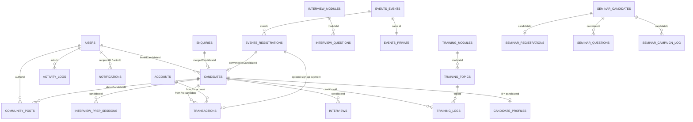
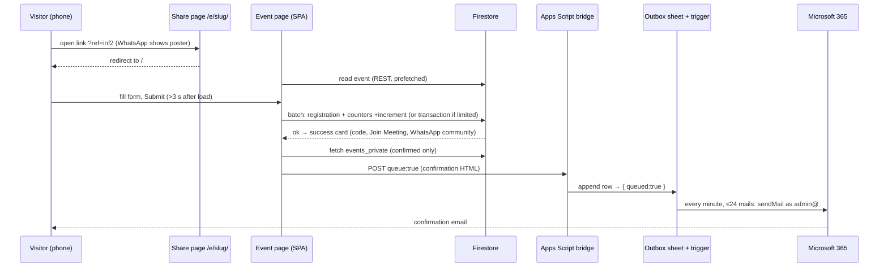
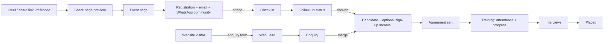
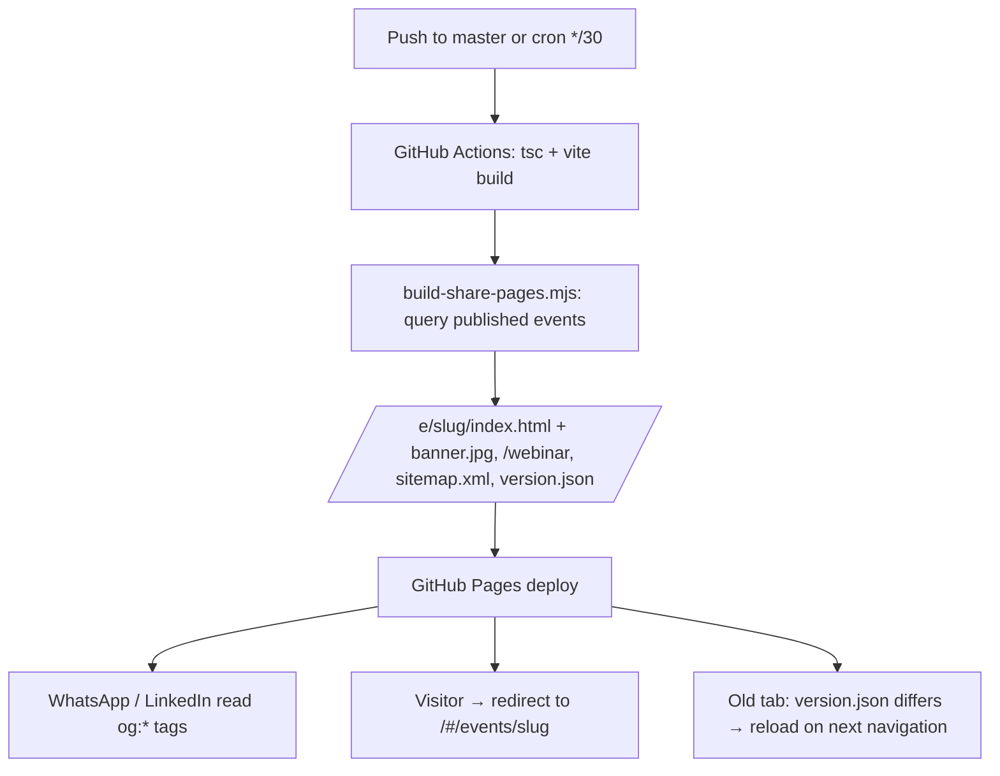

# Software Requirements Specification (SRS) & Business Requirements Specification (BRS)

# SPR TechForge Management Platform & Public Website

---

## 1. Document Control

| Field | Value |
| --- | --- |
| **Project Name** | SPR TechForge Management Platform & Public Website |
| **Document Type** | Combined SRS + BRS |
| **Version** | 2.0 |
| **Date** | 2026-09-23 |
| **Author** | Generated from codebase analysis and verified against QA and production behaviour (Claude, with Thirumal Reddy) |
| **Status** | Baseline for Sprint testing (September 2026 release) |
| **Repository** | https://github.com/thirumalreddy1995/SPRTechforge |
| **Environments** | Production https://sprtechforge.com · QA https://sprtechforge-qa.web.app |

### 1.1 Revision History

| Version | Date | Author | Description |
| --- | --- | --- | --- |
| 0.1 | 2026-05-17 | Generated | Initial draft from codebase exploration |
| 1.0 | 2026-05-17 | Generated | First baseline; covers all modules through Phase 4 |
| 2.0 | 2026-09-23 | Generated + T. Reddy | Retired SPRConnect Chat / Meetings / Video / Email inbox (MOD-18–21). Added Community (MOD-26), Events administration (MOD-27), public event registration, emails and link sharing (MOD-28), Website Content management (MOD-29), Communication Settings and Email Outbox (MOD-30), Seminar Campaigns (MOD-31). Rewrote Public Website (MOD-25). Master role now an `isMaster` flag. Updated architecture, integrations (Microsoft 365 mail, Google Sheets outbox, static share pages, scheduled rebuilds), NFRs (performance measurements, stale-build recovery, email rate limiting), data model, screens, traceability and open gaps. |

### 1.2 Glossary

| Term | Definition |
| --- | --- |
| **Admin** | A user whose `role` field is `admin`, or any user whose `modules` array contains `users`. Has access to management modules except Finance and master-only tools. |
| **Master** | The user record with `isMaster = true` (currently thirumalreddy@sprtechforge.com). Sees Finance, Activity Logs, Cloud Setup, Test Runner, Communication Settings and may delete events permanently. |
| **Staff** | A user whose `role` is `staff` — trainers and operations staff. |
| **Candidate** | A learner. `role = candidate`; linked to a `candidates` record through `linkedCandidateId`. |
| **Community** | The staff home page (`/community`): announcements, birthdays, celebrations, achievements, quote and learning of the day. Replaced SPRConnect Chat/Meetings/Email. |
| **Event** | A free webinar/seminar/workshop created in Events management, published at `/#/events/<slug>` and shared via `/e/<slug>/`. |
| **Slug** | URL-safe identifier derived from an event title on first publish; immutable afterwards. |
| **Share page** | A static HTML page per event generated at deploy time so WhatsApp/LinkedIn show the event's own poster; it forwards visitors into the app. |
| **Short link** | `sprtechforge.com/webinar` — always opens the next upcoming event. |
| **Ref code** | The `?ref=<code>` tag on a shared link, stored on each registration as its marketing source (influencer attribution). |
| **Registration code** | Public identifier of a registration, e.g. `SPR-WEB-Q728HPH`; used for check-in. |
| **Private join details** | Join URL, meeting ID and passcode of an online event; stored separately from the public event and revealed only to confirmed registrants and admins. |
| **Email bridge** | The Google Apps Script web app that sends mail on behalf of the platform, through Gmail or Microsoft 365 (Graph). |
| **Outbox** | The bridge's queue (a Google Sheet plus a 1-minute trigger) that sends mail at a safe rate with retries. |
| **Website Content** | Admin screen (`/admin/website`) holding hero banners, gallery photos, testimonial images, statistics and links shown on the public site. |
| **Web Lead** | An enquiry submitted through the website contact form. |
| **Enquiry** | A prospect record maintained by staff; can be merged into a Candidate. |
| **Agreement** | The training agreement a candidate accepts or rejects through the public portal link. |
| **Batch** | A training cohort identifier on the candidate record. |
| **GAS** | Google Apps Script. |
| **IST** | Indian Standard Time; all event times are entered and displayed in IST. |
| **DPDP** | India's Digital Personal Data Protection Act — consents on the registration form are timestamped and unticked by default. |

---

## 2. Introduction

### 2.1 Purpose

This document specifies the complete business and software requirements of the **SPR TechForge Management Platform and Public Website**. It is the authoritative reference for:

- Validating the system's behaviour during QA testing (sprint-level manual testing and automation).
- Onboarding new developers, testers, and stakeholders.
- Negotiating scope and priorities with the product owner.
- Producing test plans, epics, user stories, test cases, and traceability matrices.

A QA tester or business analyst with **no access to source code** shall be able to design a complete test plan from this document alone.

### 2.2 Intended Audience

| Audience | What they get from this document |
| --- | --- |
| **QA Testers** | Module-level functional requirements with input validation rules, expected outputs, and ready-to-use test scenarios. |
| **Business Analysts** | Business goals, user roles, processes, and KPIs. |
| **Developers** | Data models, integration points, deployment pipeline and non-functional requirements. |
| **Stakeholders / Product Owner** | High-level scope, dependencies, gaps, and acceptance criteria. |
| **Marketing / Influencer coordinators** | How event links, previews, short links and ref codes behave (MOD-28). |

### 2.3 Project Scope and Objectives

**In scope:**

- Authentication and user/role management (admin, staff, candidate; master flag).
- Recruitment funnel: website enquiry → web lead → enquiry → candidate → agreement → training → interviews → placement.
- Training delivery: curriculum, attendance, progress tracking, interview question bank, interview prep.
- Finance (master only): accounts, transactions, statements, balance sheet, P&L, payroll, reports.
- Community home: announcements, birthdays, celebrations, achievements, daily quote and learning, notifications.
- Events: creation and publishing of free webinars/seminars, public registration on any device, confirmation and reminder emails, WhatsApp community hand-off, link previews with the event poster, influencer attribution, check-in and recap, conversion of registrants to candidates.
- Public website: company and academy positioning, admin-managed banners, photos, testimonial images, statistics and links, contact and enquiry form, SEO basics.
- Communications: runtime-configurable email bridge (Gmail or Microsoft 365) with a server-side outbox.
- Seminar campaign tool (legacy outreach module).
- Administrative tools: activity logs, cloud setup, in-app test runner, communication settings.
- Self-service candidate portal: agreement, profile, training dashboard, interview prep.

**Out of scope (current release):**

- Native mobile apps (the web app is responsive and tested on phones).
- Multi-tenant support (single organisation).
- Localisation (English UI; Telugu marketing content is produced outside the app).
- Push notifications (in-app notifications only).
- Online payment collection.
- Automatic reminder scheduling for events (reminders are sent by an admin from the event dashboard).

### 2.4 References

- [README.md](README.md) — project README.
- [SETUP-ENVIRONMENTS.md](SETUP-ENVIRONMENTS.md) — environment setup.
- [SETUP-EMAIL.md](SETUP-EMAIL.md) — email bridge, Outlook provider and outbox setup.
- [RUNBOOK.md](RUNBOOK.md) — operations runbook.
- [testing/README.md](testing/README.md) and [testing/SPR-Testing.xlsx](testing/SPR-Testing.xlsx) — test management pack (epics, stories, test cases, bug tracker).
- [types.ts](types.ts), [events/types.ts](events/types.ts), [site/types.ts](site/types.ts), [seminar/types.ts](seminar/types.ts) — data models.
- [context/AppContext.tsx](context/AppContext.tsx) — staff-side state and CRUD helpers.
- [services/cloud.ts](services/cloud.ts), [events/services/eventsPublicDb.ts](events/services/eventsPublicDb.ts), [site/services/siteDb.ts](site/services/siteDb.ts) — data access.
- [services/emailService.ts](services/emailService.ts), [apps-script/Code.gs](apps-script/Code.gs) — email bridge client and server.
- [scripts/build-share-pages.mjs](scripts/build-share-pages.mjs) — share pages, short link and sitemap generator.
- [lib/freshBuild.ts](lib/freshBuild.ts) — stale-build recovery.

---

## 3. Business Requirements (BRS)

### 3.1 Business Context and Problem Statement

SPR TechForge Pvt Ltd (Kukatpally, Hyderabad) is a software testing and quality-engineering company that also runs a training academy: it recruits learners from the open market, trains them across manual, automation, API, performance, mobile, desktop and security testing on live projects, prepares them for interviews and supports placement. Growth now comes largely from free online webinars promoted through Instagram influencers across Telangana and Andhra Pradesh.

Before the platform, operations ran on spreadsheets and ad-hoc tools for leads, candidate progress, interviews, fees and payroll; and event promotion relied on raw meeting links with no attribution, no preview image and no protection against email rate limits. The platform consolidates operations into one role-aware web application with shared real-time data, and gives marketing a registration funnel that works from a shared link on a phone.

### 3.2 Business Goals and Objectives

| ID | Goal | Success measure |
| --- | --- | --- |
| **BG-01** | One shared system for candidate, training and finance data. | All operations functions run from the app; no parallel spreadsheets. |
| **BG-02** | Make training and placement progress visible to candidates. | Candidate dashboard shows accurate attendance, progress and interview pipeline. |
| **BG-03** | Eliminate manual interview-question distribution. | Question bank ≥200 questions; bulk upload by admins. |
| **BG-04** | Turn webinar promotion into measurable registrations. | Every shared link previews with the event poster; every registration is attributed to a source; confirmations reach 100% of registrants during a burst of 200+ sign-ups per hour. |
| **BG-05** | Reliable, audit-trailed financial reporting for the master. | Balance sheet and P&L reconcile to transactions; locked transactions cannot be silently edited. |
| **BG-06** | Near-zero infrastructure cost. | Firebase Spark tier, Google Apps Script, Google Sheets, GitHub Pages / Firebase Hosting free quotas; the only paid item is the existing Microsoft 365 mailbox. |
| **BG-07** | Keep staff informed without chat noise. | Announcements, birthdays and daily learning on the Community home; in-app notifications. |
| **BG-08** | A public website that presents the company credibly on phones. | Real logo, admin-managed proof (numbers, testimonials, photos), working contact actions, no layout defects at 390 px width. |

### 3.3 Stakeholders and User Roles

| Stakeholder | Role in system | Primary needs |
| --- | --- | --- |
| **Owner / Director / Master** | `admin` with `isMaster = true` | Full visibility — finance, all modules, activity log, communication settings, permanent deletions. |
| **Admin (non-master)** | `admin` role (or `modules` includes `users`) | Manage candidates, training, interviews, users, events, website content, seminar campaigns, web leads. |
| **Staff Trainer** | `staff` role | Community, attendance, progress, interview prep, read-only candidates. |
| **Candidate** | `candidate` role | Profile, training dashboard, agreement, interview prep. |
| **Prospect / Website visitor** | Unauthenticated | Browse the website, call/WhatsApp/email, open the office in Maps, send an enquiry. |
| **Event registrant** | Unauthenticated | Register from a shared link on a phone, receive joining details instantly and by email, join the WhatsApp community, join the meeting. |
| **Influencer / partner** | Unauthenticated | Share a tagged link; registrations through it are counted under their code. |
| **Link crawler** (WhatsApp, LinkedIn, Facebook, Google) | System | Read Open Graph tags from the share pages and sitemap. |

### 3.4 High-Level Business Processes

```
   Instagram reel / WhatsApp share                 Website visitor
   (tagged link ?ref=<code> or /webinar)                 │
                 │                                       ▼
                 ▼                              ┌────────────────┐
        ┌────────────────┐                      │  Web Lead      │  (enquiry form)
        │ Share page     │ preview w/ poster    └──────┬─────────┘
        │ /e/<slug>/     │                             │
        └──────┬─────────┘                             ▼
               ▼                                ┌────────────────┐
        ┌────────────────┐                      │   Enquiry      │  (staff follow-up)
        │ Event page     │ register on phone    └──────┬─────────┘
        └──────┬─────────┘                             │ (Joined)
               ▼                                       ▼
        ┌────────────────┐  queued email +     ┌────────────────┐
        │ Registration   │  WhatsApp community │  Agreement     │
        └──────┬─────────┘                     └──────┬─────────┘
               │ attend → follow-up →                 ▼
               │ convert to candidate          ┌────────────────┐
               └─────────────────────────────▶ │  Candidate     │  (fee, batch)
                                               └──────┬─────────┘
                                                      ▼
                                  Training (attendance, progress, prep)
                                                      ▼
                                  Interview pipeline → Placed → Work support
```

Parallel processes running across all stages:

- **Community** — announcements, birthdays and daily learning for all staff; in-app notifications.
- **Finance** — fees collected (including event sign-up payments), salaries paid, statements generated (master only).
- **Website Content** — admins keep banners, numbers, testimonials and photos current.
- **Activity Logging** — every staff mutation is recorded for audit.

### 3.5 Success Criteria / KPIs

| KPI | Target |
| --- | --- |
| Registration success under burst | 100% of concurrent registrations succeed with unique codes (verified 1,000 concurrent on QA). |
| Confirmation email delivery | Every queued confirmation sent within 5 minutes at up to 24 mails/minute; 0 rate-limit failures. |
| Link preview correctness | Shared event links show the event poster within 30 minutes of publishing. |
| Attribution coverage | ≥95% of registrations from influencer links carry a ref code. |
| Event page speed on 4G phone | Content visible ≤3 s (measured 2.8 s on a throttled 1.6 Mbps profile). |
| Time to mark daily attendance | ≤2 minutes for a batch of 15. |
| Web Lead first response | ≤24 hours on business days. |
| Audit log completeness | 100% of staff mutations logged with actor + timestamp. |
| Finance reconciliation | Reports reconcile to transactions within ±₹0. |

### 3.6 Assumptions, Constraints, and Dependencies

| ID | Item |
| --- | --- |
| **A-01** | Users have modern evergreen browsers; registrants may be on low-end Android phones over 4G. |
| **A-02** | Stable internet for staff (real-time listeners). |
| **A-03** | The Microsoft 365 mailbox admin@sprtechforge.com is licensed and its Entra app registration (Mail.Send) remains valid; limits 30 messages/minute and 10,000 recipients/day. |
| **A-04** | Candidates with `role = candidate` have user records linked through `linkedCandidateId`. |
| **A-05** | The office Google Maps place and WhatsApp community invite links remain valid. |
| **C-01** | Firebase Spark (free) plan: no Cloud Functions, no Firebase Storage bucket on production (uploads fall back to inline images). |
| **C-02** | Production GitHub Actions has no Firebase secrets; the app and build scripts fall back to the production project configuration. |
| **C-03** | GitHub Pages caches every file for 10 minutes; the app compensates with stale-build recovery. |
| **C-04** | Production deploys to GitHub Pages at sprtechforge.com; QA to Firebase Hosting at sprtechforge-qa.web.app. |
| **D-01** | Depends on Firebase Firestore, Google Apps Script, Google Sheets, Microsoft Graph, GitHub Actions and Firebase Hosting being operational. |
| **D-02** | The `isMaster` flag must be set on exactly one user record; the bootstrap admin is patched at startup if missing. |

---

## 4. System Overview

### 4.1 High-Level Architecture

```
  ┌──────────────────────────────────────────────────────────────────────┐
  │                        Browser (React SPA, HashRouter)               │
  │  Public pages ──── firebase/firestore/lite (REST) ───────┐           │
  │  Staff app ─────── firebase/firestore (real-time) ───────┤           │
  │  emailService ──── HTTPS POST (queue:true) ──────────────┼─────┐     │
  │  lib/freshBuild ── /version.json check, chunk retry      │     │     │
  └──────────────────────────────────────────────────────────┼─────┼─────┘
                                                             ▼     ▼
        ┌────────────────────────────┐        ┌──────────────────────────────┐
        │ Firebase                   │        │ Google Apps Script bridge    │
        │  Firestore (all data)      │        │  doPost: send now / enqueue  │
        │  Hosting (QA)              │        │  Outbox = Google Sheet       │
        └────────────────────────────┘        │  1-min trigger → 24 mails/min│
                                              │  Gmail  or  Microsoft Graph  │
  ┌────────────────────────────┐              └──────────────────────────────┘
  │ GitHub Actions (CI)        │
  │  tsc + vite build          │        Static outputs per deploy:
  │  build-share-pages.mjs ────┼──────▶ /e/<slug>/index.html + banner.jpg
  │  cron every 30 min (prod)  │        /webinar, sitemap.xml, version.json
  │  GitHub Pages (prod)       │
  └────────────────────────────┘
```

### 4.2 Technology Stack

| Layer | Technology | Notes |
| --- | --- | --- |
| Frontend framework | React 18 + TypeScript | Hooks; lazy-loaded routes; error boundary with Reload. |
| Build tool | Vite 5 | Content-hashed chunks; `version.json` emitted with the commit SHA as build id. |
| Styling | Tailwind CSS 3 | Utility classes. |
| Routing | react-router-dom 6, HashRouter | Static hosting friendly; `ScrollToTop` on route change. |
| State | React Context (`AppContext`) | Staff subscriptions start only when a stored session exists. |
| Database | Firebase Firestore | Real-time SDK for staff; lightweight REST SDK for public pages. |
| File storage | Firebase Storage when provisioned; inline WebP data URLs otherwise | Banners, photos, testimonials, community images. |
| Email | Google Apps Script bridge → Gmail or Microsoft Graph (Outlook) | Outbox queue in Google Sheets; runtime config in `system_settings/messaging`. |
| Link previews | Static share pages generated by `scripts/build-share-pages.mjs` (Node + sharp) | WebP banners converted to JPEG for WhatsApp. |
| Spreadsheet parsing | `xlsx` (SheetJS) | Lazy chunk for bulk uploads and seminar import. |
| Production hosting | GitHub Pages | `deploy.yml`: push to master + cron every 30 min + manual. |
| QA hosting | Firebase Hosting | `deploy-qa.yml`: push to QA + manual. |

### 4.3 Deployment Environment

| Environment | URL | Firestore project | Email bridge | Triggered by |
| --- | --- | --- | --- | --- |
| **Production** | https://sprtechforge.com | `sprtechforge` (built-in fallback config; no CI secrets) | Shared Apps Script deployment, Outlook provider | Push to `master`, cron `*/30`, manual dispatch |
| **QA** | https://sprtechforge-qa.web.app | `sprtechforge-qa` (CI secrets) | Same Apps Script deployment | Push to `QA`, manual dispatch |
| **Local development** | http://localhost:5173 | Production project unless `.env.local` says otherwise — treat as live data | `npm run dev` |

Deploy characteristics: a production deploy takes about 1 minute; GitHub Pages serves every file with `Cache-Control: max-age=600`; the share pages and sitemap are regenerated on every build from Firestore.

### 4.4 External Integrations

| Integration | Purpose | Owner | Failure mode |
| --- | --- | --- | --- |
| Firebase Firestore | Data store, real-time listeners, public REST reads | Google | Staff app shows cloud-error banner; public pages show a retry message. |
| Firebase Hosting | QA hosting with SPA rewrite | Google | QA unavailable; production unaffected. |
| GitHub Pages + Actions | Production hosting, scheduled rebuilds | GitHub | Stale share pages until next successful run. |
| Google Apps Script | Email bridge (send, queue, outbox status) | Google (user-owned) | Emails queue on the client side fail with a friendly error; registration still succeeds. |
| Google Sheets | Outbox storage | Google | Enqueue fails → bridge falls back to sending immediately. |
| Microsoft Graph (Entra app) | Send as admin@sprtechforge.com | Microsoft 365 tenant | Friendly errors mapped from AADSTS / Graph codes on Communication Settings. |
| WhatsApp (wa.me, chat.whatsapp.com) | Share, invite, community | Meta | Links open WhatsApp; no API dependency. |
| Google Maps (maps.app.goo.gl) | Office location | Google | Link opens Maps app or web. |
| YouTube / Instagram | Social links; optional event intro video embed | Google / Meta | Missing embed shows nothing. |
| Microsoft Teams / Google Meet | Meeting platform for online events | Microsoft / Google | Join button opens the platform; not embedded. |

---

## 5. Module-Wise Functional Requirements (SRS)

This section specifies each functional module. Requirements are numbered `FR-MM.N` where `MM` is the module number and `N` is sequential within the module. Modules 18–21 (the former SPRConnect group) were retired in September 2026 and are kept as stubs so that historical FR/TS identifiers remain unique.

The application defines four roles enforced by route wrappers in [App.tsx](App.tsx):

| Wrapper | Allows | Used for |
| --- | --- | --- |
| `ProtectedRoute` | Any authenticated user | Community, Dashboard, Candidates, Training, Address Book, candidate self-service. |
| `AdminRoute` | `role=admin` OR `users` present in the `modules` array | Admin → Users, Website Content, Web Enquiries, Seminar campaigns, Events management. |
| `MasterRoute` | User record has `isMaster = true` (checked by `isMasterUser()` in `utils.ts`) | Finance, Activity Logs, Test Runner, Cloud Setup, Communication Settings, permanent deletion of events. |

Public (unauthenticated) routes: `/` website, `/login`, `/portal/agreement/:id`, `/seminar/s/:token`, `/events`, `/events/:slug`, plus the static share pages `/e/<slug>/` and `/webinar` generated at deploy time. Public visitors never receive staff data: the app subscribes to staff collections only when a stored session exists, and the public pages read Firestore through the lightweight REST client.

Throughout this section, "the system shall" means the requirement is mandatory.

---

### MOD-01: Authentication & Session

**Purpose:** Provide secure login, logout, and session management for all users. Includes the bootstrap-admin fallback used to recover access on an empty database.

**Actors:** Anonymous visitor, Admin, Staff, Candidate, Master.

**Preconditions:**
- The application is reachable at the configured URL.
- Firestore is reachable, OR the bootstrap admin code is intact and the local users state is empty.

#### 5.1 Functional Requirements

- **FR-01.1** The system shall present a login form requesting username and password.
- **FR-01.2** The system shall authenticate the user against the `users` Firestore collection, with case-insensitive username matching.
- **FR-01.3** When the `users` collection returns no documents, the system shall fall back to an in-memory `DEFAULT_ADMIN` record (`thirumalreddy@sprtechforge.com` / `ThiruPriya@13`) so the system is never lockable-out.
- **FR-01.4** When Firestore returns a non-empty user list that does not contain `admin-01`, the system shall persist `DEFAULT_ADMIN` to Firestore automatically (idempotent regression fix).
- **FR-01.5** On successful login the system shall write a `SPR_TECHFORGE_SESSION_V4` entry to localStorage containing the userId and the current timestamp.
- **FR-01.6** The system shall keep a user logged in across page reloads while the session timestamp is younger than 60 minutes.
- **FR-01.7** After 60 minutes of inactivity, any protected route shall redirect the user to `/login`.
- **FR-01.8** The system shall provide a logout action that removes the session from localStorage and navigates to `/`.
- **FR-01.9** Failed login attempts shall display the generic message "Invalid credentials" with no information about whether the username or the password was wrong.
- **FR-01.10** The first-time-login flow shall require a candidate or new staff user to change their password before they reach the dashboard.
- **FR-01.11** The login screen shall display a "Forgot Password" link that creates a `passwordResetRequest` Firestore document the master can later resolve.

#### 5.2 Business Rules

- **BR-01.1** Exactly one user record carries `isMaster = true`; the flag, not the username, grants master capabilities.
- **BR-01.2** The bootstrap admin must never be silently removed from Firestore even when admins are managing users.
- **BR-01.3** Free-text login fields must be trimmed of leading/trailing whitespace before comparison.

#### 5.3 Input Fields

| Field | Type | Mandatory | Validation |
| --- | --- | --- | --- |
| Username | text | Yes | Trimmed, lower-cased before comparison. |
| Password | password | Yes | Plain-text equality match; no hashing in current build. |

#### 5.4 Output / Expected Behavior

- On success: redirect to `/dashboard`; sidebar renders user's name.
- On failure: inline error; URL remains `/login`; no localStorage write.

#### 5.5 UI / Screen Description

- Centred card with logo, two inputs, a "Sign In" button, and a "Forgot Password" link.
- Cloud-error banner (if Firestore subscription failed) is rendered at the top.

#### 5.6 Data Touched

- Reads/writes `users` collection.
- Reads `passwordResetRequests` collection (writes during forgot-password flow).
- Writes `activityLogs` (action `LOGIN`) on successful sign-in.

#### 5.7 Verification Notes (v2.0, 2026-09-23)

- Login form validation today: username must contain "@" ("Enter a valid email address"); password at least 4 characters; "Sign In" reads "Connecting…" until the users stream has loaded, then "Authenticating…".
- First-login password change applies when `isPasswordChanged === false` (new users and candidate accounts): new password ≥6 characters, not equal to the user's name, confirmation must match, strength meter shown; there is no self-service password change afterwards.
- "Forgot Password" creates the request in memory only (never persisted) and shows "Please contact Thirumal Reddy for your new password."; FR-01.11 is therefore not met (G-08).
- Master identity is the `isMaster` flag (BR-01.1 superseded); the bootstrap admin is patched with `isMaster` at startup and a `BOOTSTRAP_ISMASTER_PATCH` audit event is written.
- Session lifetime is 60 minutes from login with no sliding refresh; route guards wait for session restore (`isInitialized`). Public routes load no staff data.
- Not implemented: lockout / rate limiting, LOGIN_FAILED audit, `authProvider: google`.

#### 5.8 Test Scenarios

| TS-ID | Type | Scenario | Expected |
| --- | --- | --- | --- |
| TS-01.1 | Positive | Login with valid bootstrap admin on empty DB | Dashboard renders; Finance group visible. |
| TS-01.2 | Positive | Login with correct username different case | Authenticated successfully. |
| TS-01.3 | Negative | Login with wrong password | Generic error; URL stays `/login`. |
| TS-01.4 | Negative | Login with unknown username | Same generic error (no enumeration). |
| TS-01.5 | Negative | Empty username or password | Form-level validation prevents submission. |
| TS-01.6 | Boundary | Session timestamp 60 min + 1 sec old | Redirected to `/login` on next protected request. |
| TS-01.7 | Security | Tampered SESSION_KEY pointing to non-existent userId | App treats as unauthenticated. |
| TS-01.8 | Regression | Add a new user via Admin → Users on empty `/users` | `admin-01` auto-re-persists to Firestore. |

---

### MOD-02: User Management

**Purpose:** Admins can create, edit, delete, and assign modules to internal users (staff, admins, candidates with logins).

**Actors:** Admin, Master.

**Preconditions:** Logged in with `role=admin` or `modules` array includes `users`.

#### 5.9 Functional Requirements

- **FR-02.1** The system shall list all `users` documents on `/admin/users` with full name, login ID, contact, role, and a password show/hide toggle.
- **FR-02.2** The system shall expose an "Add User" form capturing name, username, email, phone, address, password, role, and modules array.
- **FR-02.3** Default `modules` for `role=admin` shall be `[candidates, users, training]`.
- **FR-02.4** Duplicate username submission shall be rejected with an inline error.
- **FR-02.5** The system shall provide an Edit User screen pre-populated with the user's current values; password is editable.
- **FR-02.6** The system shall provide a Delete User action, gated by the master role, that:
  - prevents the master from deleting themselves;
  - prevents the deletion of the last remaining admin.
- **FR-02.7** The Users page shall surface pending `passwordResetRequests` with Dismiss and Reset actions.
- **FR-02.8** When the master account is being edited by any other admin, master-specific protected fields shall be read-only.
- **FR-02.9** Every user CRUD operation shall produce a corresponding `activityLog` entry (`CREATE` / `UPDATE` / `DELETE`).

#### 5.10 Business Rules

- **BR-02.1** Username is unique system-wide.
- **BR-02.2** Passwords must be ≥4 characters (no other complexity enforcement in current build).
- **BR-02.3** Module assignment controls left-sidebar visibility, but master always sees Finance regardless of modules.

#### 5.11 Input Fields

| Field | Type | Mandatory | Validation |
| --- | --- | --- | --- |
| Name | text | Yes | 2–80 chars. |
| Username (login ID) | text | Yes | Unique; commonly an email address; trimmed/lower-cased. |
| Email | email | No | If present, must match RFC 5322 simple regex. |
| Phone | tel | No | Free-form (no format enforcement in current build). |
| Address | text | No | Up to 200 chars. |
| Password | text | Yes (on create) | ≥4 chars. |
| Role | enum | Yes | `admin` / `staff` / `candidate`. |
| Modules | string[] | No | Subset of `candidates, finance, users, training, web-leads`. |

#### 5.12 Verification Notes (v2.0, 2026-09-23)

- The Users page shows each user's plaintext password to admins (eye toggle; the master's row reads "Protected" for non-masters). Export CSV excludes passwords.
- Add/Edit User: Full Name and Login ID required; empty password defaults to the user's name; admins get modules `[candidates, users, training]`; new users get `isPasswordChanged: false`; `isMaster` can never be granted through the UI; no uniqueness check on Login ID.
- "Pending Password Reset Requests" panel only shows requests raised in the same browser session (memory only).
- Delete is master-only and never offered on the master's own row.

#### 5.13 Test Scenarios

| TS-ID | Type | Scenario | Expected |
| --- | --- | --- | --- |
| TS-02.1 | Positive | Admin adds a new staff user | Appears in list; can log in. |
| TS-02.2 | Negative | Duplicate username | Inline error; no user created. |
| TS-02.3 | Positive | Modules=[training] on a staff user | Only Training visible in sidebar on their login. |
| TS-02.4 | Negative | Non-admin attempts to reach `/admin/users` directly | Redirected to `/dashboard`. |
| TS-02.5 | Security | Self-delete by master | Action blocked with a clear error. |
| TS-02.6 | Boundary | Delete the last admin | Action blocked. |
| TS-02.7 | Positive | Resolve a pending password reset | User can log in with new password; request marked `resolved`. |

---

### MOD-03: Dashboard (Director) and Home Routing

**Purpose:** KPI landing screen for the master; routing rule that sends everyone else to the Community home (MOD-26).

**Actors:** Master (dashboard); all other roles (redirected).

#### 5.14 Functional Requirements

- **FR-03.1** `/dashboard` shall render the Director Dashboard when the signed-in user has `isMaster = true`; every other authenticated user shall be redirected to `/community`.
- **FR-03.2** The Director Dashboard shall show a "View All Financials" / "Hide Financials" toggle (off by default). When on: Net Liquidity (cash + bank balances), KPI cards Cash in Hand, Bank Balance, Total Income, Total Payments; a Ledger Summary (Total Receivables = positive debtor balances + fees pending from active candidates; Total Payables = negative creditor and salary balances); Profit & Loss (Income − Payments) with "Full Report" and "View Accounts" links; Recent Transactions (latest 5).
- **FR-03.3** Always visible: Candidate Overview (Total / Placed / Ready / Training, Fees Pending = Σ max(0, agreed − paid) over active candidates, Today's Interviews), Active Interview Schedule (up to 8 scheduled interviews from today, "Today" tag, each linking to `/training/interviews`), Batch Overview (first 6 candidates with a progress bar).
- **FR-03.4** "Paid" for a candidate shall equal Σ Income transactions from the candidate − Σ Refund transactions to the candidate; progress % = distinct topics with any training log ÷ total topics. The same formulas are used across the app.
- **FR-03.5** The sidebar "Dashboard" entry shall appear only for the master; "Home" points to `/community` for everyone.

#### 5.15 Business Rules

- **BR-03.1** Financial figures are masked until the master toggles them on.
- **BR-03.2** The staff ("Management Dashboard") and candidate ("Student Dashboard") views still present in the code are unreachable and out of test scope; candidates use MOD-11 Training Dashboard instead.

#### 5.16 Test Scenarios

| TS-ID | Type | Scenario | Expected |
| --- | --- | --- | --- |
| TS-03.1 | Positive | Master opens `/dashboard`, toggles financials | KPIs reconcile with `/finance/dashboard`; hidden again on toggle off. |
| TS-03.2 | Positive | Staff opens `/dashboard` | Redirected to `/community`. |
| TS-03.3 | Positive | Candidate opens `/dashboard` | Redirected to `/community`; student-only posts visible. |
| TS-03.4 | Boundary | Empty database | Cards render with 0 values, no console errors. |

---

### MOD-04: Address Book

**Purpose:** Unified directory of users and active candidates with click-to-call/email.

**Actors:** Any authenticated user.

#### 5.17 Functional Requirements

- **FR-04.1** The system shall list internal users (non-candidate role) and active candidates in one table.
- **FR-04.2** The list shall support search across name, email, phone, and role.
- **FR-04.3** The list shall provide a filter dropdown for "All / Candidate / Staff".
- **FR-04.4** Phone numbers shall render as `tel:` links; emails as `mailto:` links.

#### 5.18 Test Scenarios

| TS-ID | Type | Scenario | Expected |
| --- | --- | --- | --- |
| TS-04.1 | Positive | Search by partial phone | Matching rows remain. |
| TS-04.2 | Positive | Filter Candidate only | Staff hidden; placed candidates also hidden (only Active=true visible). |
| TS-04.3 | Boundary | A candidate with no email | Row renders an em-dash for email, not "undefined". |

---

### MOD-05: Candidate Management

**Purpose:** CRUD and pipeline management for trainees.

**Actors:** Admin (full), Staff (read), Master (delete-and-finance).

#### 5.19 Functional Requirements

- **FR-05.1** The system shall list candidates at `/candidates` with batch, status, agreed amount, paid amount (computed from transactions), and outstanding due.
- **FR-05.2** The list shall offer tabs (Active / Placed / All) plus a batch filter and status filter.
- **FR-05.3** The list shall expose KPI tiles (total enrolled, total collected, outstanding balance) with a master-only show/hide toggle.
- **FR-05.4** The system shall provide an "Add Candidate" form capturing name, batchId, phone, email, address, agreedAmount, joinedDate, status, notes, and an editable agreement-text template.
- **FR-05.5** The "Edit Candidate" form shall pre-populate all fields.
- **FR-05.6** The Delete Candidate action shall be available to master only and shall be blocked if any related `transactions` exist.
- **FR-05.7** The candidate detail screen shall display payment status (Awaiting / Due / Cleared) computed from `agreedAmount - sumPaid`.
- **FR-05.8** Master may add a custom status to the `candidateStatuses` array; all admins may then assign it.
- **FR-05.9** A candidate's status transitioning to `Placed` shall require `placedCompany` and `packageDetails` fields.
- **FR-05.10** The Active toggle shall set/clear `isActive`; only Active candidates appear in default lists.

#### 5.20 Business Rules

- **BR-05.1** Phone number is the de-facto unique identifier; duplicates are flagged but not blocked.
- **BR-05.2** `paidAmount` is derived from related `transactions`, not stored on the candidate.
- **BR-05.3** `workSupportStatus` of `Active` requires both start and end dates plus monthlyAmount.

#### 5.21 Input Fields (Add/Edit Candidate)

| Field | Type | Mandatory | Validation |
| --- | --- | --- | --- |
| Name | text | Yes | 2–80 chars. |
| BatchId | text | Yes | Free-form (e.g., `B-2026-Q1`). |
| Email | email | Yes | RFC 5322 simple validation. |
| Phone | tel | Yes | 10-digit numeric check on Add page. |
| Alternate Phone | tel | No | Same validation if present. |
| Address | text | No | Up to 200 chars. |
| Agreed Amount | currency | Yes | ≥0, integer. |
| Joined Date | date | Yes | Cannot be in the future. |
| Status | enum | Yes | Defaults to `Training`. |
| Placed Company | text | Conditional | Required when status=Placed. |
| Package Details | text | Conditional | Required when status=Placed. |
| Resume | file | No | PDF, ≤5 MB. Stored as base64 on the candidate record. |
| Agreement Text | textarea | No | Free-form; defaults to a template. |
| Notes | textarea | No | Free-form. |
| Active | boolean | Yes | Defaults to `true`. |

#### 5.22 Verification Notes (v2.0, 2026-09-23)

- Tabs: All / Active (Training + Ready for Interview) / Placed / Discontinued; 10 rows per page; amounts masked until "Show Amounts".
- Delete: non-master → "Only the Director can delete candidates"; candidate with transactions → "Cannot delete: candidate has financial entries. Mark inactive instead."
- "Create Login Account" makes a `candidate` user (username = email, password = phone or `pass123`, forced password change).
- Add/Edit validation order: name, batch, email, phone (10 digits), alternate phone, agreed amount ≥0, duplicate email/phone ("A candidate with this Email or Phone Number already exists."). Updates are not activity-logged.
- Custom statuses ("+ Add Status", master) live in memory only and are not saved to Firestore.
- CSV export covers all candidates regardless of filter.

#### 5.23 Test Scenarios

| TS-ID | Type | Scenario | Expected |
| --- | --- | --- | --- |
| TS-05.1 | Positive | Add valid candidate | Appears in list with `paidAmount=0` and status=Training. |
| TS-05.2 | Negative | Invalid email | Inline validation; save blocked. |
| TS-05.3 | Boundary | Joined date = today | Saves successfully. |
| TS-05.4 | Boundary | Joined date = tomorrow | Validation blocks. |
| TS-05.5 | Positive | Mark Placed with company + package | Status persists; appears under Placed tab. |
| TS-05.6 | Negative | Mark Placed without company | Validation blocks save. |
| TS-05.7 | Security | Non-master attempts delete | Delete button hidden; URL-forced delete fails. |
| TS-05.8 | Negative | Delete candidate with transactions | Action blocked with explanatory message. |
| TS-05.9 | Positive | Upload 4 MB PDF resume | Resume saved as base64; downloadable from detail page. |
| TS-05.10 | Boundary | Upload 6 MB PDF resume | Error toast; resume not saved. |

---

### MOD-06: Candidate Profile (Self-Service)

**Purpose:** Candidates complete their detailed bio (`candidateProfiles`) and view their own training/interview history.

**Actors:** Candidate (own profile), Admin/Staff (view-only).

#### 5.24 Functional Requirements

- **FR-06.1** The system shall expose `/candidates/info` with tabs Personal, Education, Experience, Training Progress, Interview History.
- **FR-06.2** Candidates shall edit Personal, Education, and Experience tabs only.
- **FR-06.3** Training Progress shall show a topic-by-topic checklist of attendance status.
- **FR-06.4** Interview History shall list past interviews with company, date, status, outcome.

#### 5.25 Test Scenarios

| TS-ID | Type | Scenario | Expected |
| --- | --- | --- | --- |
| TS-06.1 | Positive | Candidate fills all profile fields | Profile saved to `candidateProfiles/{candidateId}`. |
| TS-06.2 | Negative | Staff opens Personal tab | Read-only — Save button disabled or hidden. |
| TS-06.3 | Positive | Candidate views interview history | Only their own interviews appear. |

---

### MOD-07: Agreement Portal (Public)

**Purpose:** A public URL where a candidate can read and accept (or reject) the agreement without logging in.

**Actors:** Candidate (anonymous), Admin (sends).

#### 5.26 Functional Requirements

- **FR-07.1** A candidate record shall include `agreementSentDate`, `agreementAcceptedDate`, `agreementRejectedDate`, and `agreementRejectionReason`.
- **FR-07.2** Admins shall send the agreement by clicking "Send Agreement"; the system records `agreementSentDate=now()` and generates a portal URL of the form `/portal/agreement/:id`.
- **FR-07.3** The portal page shall be accessible without authentication.
- **FR-07.4** The portal shall display the agreement text, a consent checkbox, an "Accept & Sign" button, and an "I Disagree / Reject" button.
- **FR-07.5** Acceptance shall set `agreementAcceptedDate=now()`.
- **FR-07.6** Rejection shall open a reason modal; submitting it sets `agreementRejectedDate` and `agreementRejectionReason`.
- **FR-07.7** After acceptance or rejection, the portal shall display a confirmation message and become read-only.
- **FR-07.8** A rejected agreement may be re-sent by an admin; re-sending clears the previous rejection timestamps.

#### 5.27 Verification Notes (v2.0, 2026-09-23)

- "Email Agreement & Link" opens a `mailto:` with the portal link `#/portal/agreement/<candidateId>` and sets `agreementSentDate`; "Mark as Accepted" sets `agreementAcceptedDate` and clears rejection fields.
- Portal actions: consent checkbox required for "Accept & Sign"; "I Disagree / Reject" requires a reason.
- **Likely defect (G-21):** the portal reads the candidate from the staff context, which is not loaded on public routes; an anonymous visitor may see "Loading Agreement…" indefinitely. Verify on QA before relying on TS-07.x.

#### 5.28 Test Scenarios

| TS-ID | Type | Scenario | Expected |
| --- | --- | --- | --- |
| TS-07.1 | Positive | Candidate accepts | `agreementAcceptedDate` set; admin sees Accepted status. |
| TS-07.2 | Positive | Candidate rejects with reason | Both fields persisted. |
| TS-07.3 | Negative | Open portal for non-existent ID | Error/empty state, not a crash. |
| TS-07.4 | Positive | Admin re-sends after rejection | Previous rejection timestamps cleared. |
| TS-07.5 | Security | Open portal URL without auth | Page loads. |
| TS-07.6 | Boundary | Rejection reason empty | Validation blocks submission. |

---

### MOD-08: Enquiries & Web Leads

**Purpose:** Capture prospective leads, track follow-up, and convert qualified leads into candidates.

**Actors:** Admin, Staff.

#### 5.29 Functional Requirements (Enquiries)

- **FR-08.1** The system shall expose `/candidates/enquiry` for enquiry CRUD.
- **FR-08.2** A new enquiry shall default to status `Enquiry`.
- **FR-08.3** Enquiry status flow: `Enquiry → Follow-Up → Joined → (Not Interested)`.
- **FR-08.4** Each enquiry shall support free-text notes that are time-stamped and author-stamped.
- **FR-08.5** A `Joined` enquiry may be merged into a new candidate via "Merge to Candidate"; the new candidate inherits name/phone/email, the enquiry is marked `isMerged=true` with a `mergedCandidateId` link.
- **FR-08.6** A merged enquiry cannot be merged again.

#### 5.30 Functional Requirements (Web Leads)

- **FR-08.7** Submissions to the Landing Page contact form shall create a `WebLead` document with `status='New'` and `isRead=false`.
- **FR-08.8** The Admin → Web Enquiries page shall display the lead list with an unread badge counting `isRead=false`.
- **FR-08.9** Opening a lead shall flip `isRead=true`; the sidebar badge decrements.
- **FR-08.10** Admins may set `status` to `New / In Progress / Responded / Closed` and add an internal note.

#### 5.31 Verification Notes (v2.0, 2026-09-23)

- Enquiry statuses: Enquiry / Follow-Up / Joined / Not Interested; merge is master-only and forces Joined; merged enquiries become read-only.
- Merge creates the Candidate only (batch or "TBD", agreed = committed amount, notes copied). No transaction, user account or agreement is created; the AddCandidate duplicate check is bypassed.
- Web Enquiries: opening a lead marks it read; status New / In Progress / Responded / Closed saved immediately; internal note saved on every keystroke; Call / Send Email / Delete Lead. There is no convert-to-enquiry action (G-14).
- Website form now records `service` as "interest · mode"; email is mandatory (see MOD-25).

#### 5.32 Test Scenarios

| TS-ID | Type | Scenario | Expected |
| --- | --- | --- | --- |
| TS-08.1 | Positive | Add enquiry with all required fields | Saved; visible in list. |
| TS-08.2 | Positive | Move enquiry to Joined | Merge action becomes available. |
| TS-08.3 | Positive | Merge into candidate | Candidate created with enquiry data; enquiry flagged merged. |
| TS-08.4 | Negative | Merge already-merged enquiry | Merge action disabled. |
| TS-08.5 | Positive | Landing page form submission | Web Lead created; admin sidebar badge increments. |
| TS-08.6 | Positive | Mark Web Lead read | Badge decrements. |

---

### MOD-09: Training Curriculum

**Purpose:** Define training modules and topics that drive attendance + progress tracking.

**Actors:** Admin (CRUD), Staff/Candidate (read).

#### 5.33 Functional Requirements

- **FR-09.1** Admins shall create training modules with title, description, order.
- **FR-09.2** Each module may contain one or more topics with title, description, `estimatedHours`.
- **FR-09.3** Modules and topics shall sort by the `order` field across the application.
- **FR-09.4** Candidates and staff shall see the curriculum read-only.

#### 5.34 Verification Notes (v2.0, 2026-09-23)

- Editing is limited to `role === admin`; order = count + 1 with no reordering UI; deleting a module leaves its topics orphaned (G-16).

#### 5.35 Test Scenarios

| TS-ID | Type | Scenario | Expected |
| --- | --- | --- | --- |
| TS-09.1 | Positive | Admin creates module + topic | Both saved; visible in curriculum view. |
| TS-09.2 | Positive | Reorder modules | New order reflected on all pages that use them. |
| TS-09.3 | Negative | Candidate tries to edit | No edit controls visible. |

---

### MOD-10: Daily Attendance

**Purpose:** Capture per-day attendance and assignment status per candidate.

**Actors:** Staff, Admin.

#### 5.36 Functional Requirements

- **FR-10.1** The Daily Attendance page shall list all `Active` candidates for the chosen date and topic.
- **FR-10.2** For each candidate, the user shall record `attendanceStatus` (`Present / Absent / No Class`) and `assignmentStatus` (`Pending / Completed / N/A`).
- **FR-10.3** A save shall create one `TrainingLog` document per candidate per topic per date.
- **FR-10.4** Re-opening the same (date, topic) shall pre-load the existing records.
- **FR-10.5** When `attendanceStatus=Absent`, `assignmentStatus` shall default to `N/A`.
- **FR-10.6** Each save shall append a `CREATE` activity-log entry.

#### 5.37 Verification Notes (v2.0, 2026-09-23)

- Roster = active candidates not Placed/Discontinued. Statuses Present (default) / Absent / Excused (stored as "No Class"). Topic is required ("Please select the Topic covered today before saving."). One log per candidate per date; time = topic hours × 60 for Present. Exports: "Export Today's Summary" and "Export Full History".
- Progress % counts any log for a topic, including Absent, because the topic is written onto every student's log.

#### 5.38 Test Scenarios

| TS-ID | Type | Scenario | Expected |
| --- | --- | --- | --- |
| TS-10.1 | Positive | Mark 5 candidates Present and save | All TrainingLogs persisted. |
| TS-10.2 | Positive | Reopen same date and topic | Saved marks pre-loaded. |
| TS-10.3 | Negative | Save with no candidates marked | Validation prevents save OR records `Pending` for all (confirm desired behaviour with PO). |

---

### MOD-11: Progress Tracking

**Purpose:** Aggregate training logs into per-candidate completion metrics.

**Actors:** Staff, Admin.

#### 5.39 Functional Requirements

- **FR-11.1** The Progress Monitor shall list candidates with days-present, days-absent, and `assignmentsCompleted` aggregates.
- **FR-11.2** Filters shall include batch and candidate name.
- **FR-11.3** The Candidate Dashboard view shall show the same metrics scoped to the logged-in candidate only.

#### 5.40 Test Scenarios

| TS-ID | Type | Scenario | Expected |
| --- | --- | --- | --- |
| TS-11.1 | Positive | Aggregate matches underlying logs | Counts reconcile. |
| TS-11.2 | Boundary | Candidate with no logs | Renders 0s, no division-by-zero errors. |
| TS-11.3 | Positive | Candidate user opens dashboard | Sees only own data. |

---

### MOD-12: Interview Scheduling

**Purpose:** Schedule, track, and report on candidate interviews.

**Actors:** Admin (full), Staff (record outcomes), Candidate (view + resume upload).

#### 5.41 Functional Requirements

- **FR-12.1** The Interviews page shall provide tabs: Ready Candidates, Active (Scheduled), History.
- **FR-12.2** Schedule Interview shall capture date, time, company, round (`L1 / L2 / L3 / HR`), type (`F2F / Zoom / Teams / Telephonic`), support person, and notes.
- **FR-12.3** Status shall progress through `Scheduled → Completed / Rescheduled / Cancelled`.
- **FR-12.4** Outcome shall be `Selected / Rejected / Pending` and may be set only when status=Completed.
- **FR-12.5** Selecting `Selected` shall prompt the admin to mark the candidate as `Placed` with company + package.
- **FR-12.6** Candidates shall upload their resume from this page; the resume is stored on the candidate record as base64 (≤5 MB).
- **FR-12.7** The sidebar shall show a `Today: N` badge for interviews starting today and a total upcoming badge.
- **FR-12.8** Bulk status updates shall be supported via multi-select.

#### 5.42 Verification Notes (v2.0, 2026-09-23)

- Roles: admin/master can Edit/Delete; staff can schedule, Confirm/Reject pending requests and Update results; candidates can only "Request Interview Slot" (status `pending_confirmation`).
- Conflict rule: same date with overlapping times (default 60 min) across **all** candidates; Cancelled/Rescheduled ignored.
- Status flow shown as Scheduled → Attended / No-show → Cleared / Rejected (also Rescheduled, Cancelled); any status can be set; history appended with actor and feedback.
- **Defects (G-25):** the Confirm/Reject dialogs use a shared modal whose button reads "Delete"; Reject claims the candidate will be notified but nothing is sent; Cleared does not set the candidate to Placed.
- Resume upload: PDF/DOCX ≤5 MB stored base64 on the candidate.

#### 5.43 Test Scenarios

| TS-ID | Type | Scenario | Expected |
| --- | --- | --- | --- |
| TS-12.1 | Positive | Schedule interview for tomorrow | Appears under Active; sidebar count updates. |
| TS-12.2 | Positive | Cancel scheduled interview | Row visibly de-emphasised; badge decrements. |
| TS-12.3 | Positive | Outcome=Selected | Prompt to mark candidate Placed. |
| TS-12.4 | Negative | Set outcome on Scheduled interview | Action blocked. |
| TS-12.5 | Boundary | Upload 5.5 MB resume | Save rejected with clear error. |

---

### MOD-13: Interview Question Bank (with Bulk Upload)

**Purpose:** Maintain a categorised question library used for interview preparation; admins import many at once.

**Actors:** Admin (CRUD + bulk upload), Candidate (read + AI lookup).

#### 5.44 Functional Requirements

- **FR-13.1** Admins shall create interview modules with title, color, and order.
- **FR-13.2** Each module may contain any number of questions; each question carries a question text and order.
- **FR-13.3** Candidates may click a question to copy a prepared ChatGPT prompt and open chatgpt.com in a new tab.
- **FR-13.4** Admins may multi-select questions and delete them in batch.
- **FR-13.5** Admins shall access a **Bulk Upload Questions** modal supporting three input methods:
  - **Paste text** — textarea, one question per line.
  - **Upload .csv / .txt** — first column of each row.
  - **Upload .xlsx / .xls** — first column of the first sheet (uses lazy-loaded `xlsx` library).
- **FR-13.6** A leading row of `Question` / `Questions` / `Q` (case-insensitive) shall be automatically skipped.
- **FR-13.7** Each parsed question shall be appended after existing ones in the chosen module with `order = maxExistingOrder + i + 1`.
- **FR-13.8** A live preview shall show the first 50 parsed questions before commit.
- **FR-13.9** The bulk save shall use Firestore batch writes (≤500 docs per batch).
- **FR-13.10** A single activity-log entry shall record `Bulk imported N interview questions`.

#### 5.45 Input Fields (Bulk Upload)

| Field | Type | Mandatory | Validation |
| --- | --- | --- | --- |
| Target Module | dropdown | Yes | Must exist. |
| Paste textarea | text | One of paste/file | Empty lines ignored. |
| File upload | file | One of paste/file | .csv / .txt / .xlsx / .xls. |

#### 5.46 Verification Notes (v2.0, 2026-09-23)

- Clicking a question copies a ChatGPT prompt and opens chatgpt.com. Admin-only: Export CSV, Bulk Upload (paste or .xlsx/.xls/.csv/.txt, first column, header row skipped, preview 50, activity-logged), add/edit/delete modules and questions, batch delete.
- Deleting a module does not delete its questions (G-16).

#### 5.47 Test Scenarios

| TS-ID | Type | Scenario | Expected |
| --- | --- | --- | --- |
| TS-13.1 | Positive | Paste 3 questions; commit | 3 questions appended to chosen module. |
| TS-13.2 | Positive | Upload CSV with a `Question` header | Header skipped; only data rows imported. |
| TS-13.3 | Positive | Upload .xlsx with text in column A | First column imported. |
| TS-13.4 | Negative | Upload .docx | Error: unsupported file type. |
| TS-13.5 | Boundary | Paste 1000 lines | All imported via batch writes. |
| TS-13.6 | Negative | No module exists | Modal disables import and shows warning. |
| TS-13.7 | Security | Non-admin reaches the modal via direct URL | Button is hidden; even if forced, save fails (admin check). |

---

### MOD-14: Interview Prep Module

**Purpose:** Candidate-facing prompt-practice tool that scores spoken/typed responses to interview questions.

**Actors:** Candidate (primary), Admin (review).

#### 5.48 Functional Requirements

- **FR-14.1** Candidates shall start a prep session via `/training/interview-prep`.
- **FR-14.2** Each session records per-question `modelAnswer`, `spokenAnswer`, `score`, `feedback`, `missedKeywords` plus an overall `score`, `grade`, `improvementAreas`, `strongAreas`.
- **FR-14.3** Sessions shall persist to `interviewPrepSessions`.
- **FR-14.4** Candidates may replay past sessions to see their answers.

#### 5.49 Verification Notes (v2.0, 2026-09-23)

- 25 built-in Q&A across six categories plus custom questions stored in localStorage only (G-27). Setup: categories (≥1), 3–10 questions, five playback speeds. Scoring = keyword overlap; grades A–F; expression report from camera motion is shown but not saved. Sessions auto-save to `interviewPrepSessions` with an activity log. Admin View: sessions ranking, per-candidate PDF export (print), question management ("Generate Answer" is a template, not AI).

#### 5.50 Test Scenarios

| TS-ID | Type | Scenario | Expected |
| --- | --- | --- | --- |
| TS-14.1 | Positive | Complete a session | Session saved; overall score visible. |
| TS-14.2 | Positive | Re-open a past session | Per-question details visible. |

---

### MOD-15: Finance — Accounts & Transactions (Master-Only)

**Purpose:** Track every fee collected and every payment made.

**Actors:** Master only.

#### 5.51 Functional Requirements

- **FR-15.1** The Chart of Accounts shall support account types: Cash, Bank, Debtor, Creditor, Expense, Salary, Income, Equity, Fixed Asset, Current Asset, Loan, Tax, Capital.
- **FR-15.2** Each account shall capture name, type, sub-type, openingBalance, description, optional recurring schedule (amount, start/end, due-day).
- **FR-15.3** Transactions shall be one of types: Income, Payment, Transfer, Refund.
- **FR-15.4** Each transaction carries date, amount, fromEntityId, fromEntityType (`Account / Candidate / Staff`), toEntityId, toEntityType, description, optional category, `isLocked` flag.
- **FR-15.5** Account balances shall be computed at read time from the sum of relevant transactions plus openingBalance.
- **FR-15.6** A locked transaction (`isLocked=true`) shall not be editable or deletable through the UI.
- **FR-15.7** Delete-account shall be blocked if any transaction references the account.
- **FR-15.8** Every create/update/delete shall emit an activity-log entry.

#### 5.52 Business Rules

- **BR-15.1** All Finance routes are gated by MasterRoute.
- **BR-15.2** A transaction's from and to entity must not be the same.
- **BR-15.3** Transfer between two Bank accounts both increments target and decrements source.
- **BR-15.4** Refund reduces a candidate's effective paid amount.

#### 5.53 Input Fields (Add Transaction)

| Field | Type | Mandatory | Validation |
| --- | --- | --- | --- |
| Date | date | Yes | Cannot be future-dated by more than 1 day. |
| Type | enum | Yes | One of Income / Payment / Transfer / Refund. |
| Amount | currency | Yes | >0 integer. |
| From entity | id+type | Yes | Must exist; must differ from "to". |
| To entity | id+type | Yes | Must exist; must differ from "from". |
| Description | text | Yes | 3–200 chars. |
| Category | text | No | Free-form. |
| Locked | boolean | No | Defaults to false. |

#### 5.54 Verification Notes (v2.0, 2026-09-23)

- Journal entry types Income / Payment / Transfer / Refund with Dr/Cr labels per type; both accounts required; amount > 0; no type-based account restriction (Dr may equal Cr).
- `isLocked` is never set by any UI and editing resets it to false (G-26). Only `role === admin` sees Edit/Delete on locked rows.
- System account `cash-01` cannot be deleted from the UI, but the context has no guard (see G-22).
- Balance rule: Creditor and Salary start at −opening; Income/Equity invert debit/credit; Capital is not inverted.

#### 5.55 Test Scenarios

| TS-ID | Type | Scenario | Expected |
| --- | --- | --- | --- |
| TS-15.1 | Positive | Add Income from candidate to bank | Bank +amount, Candidate fees due -amount. |
| TS-15.2 | Positive | Lock a transaction | Edit/Delete disabled. |
| TS-15.3 | Negative | Edit a locked transaction via URL | Save fails with error. |
| TS-15.4 | Negative | From == To | Save rejected. |
| TS-15.5 | Positive | Transfer between two bank accounts | Source -amount, destination +amount; statements show both legs. |
| TS-15.6 | Security | Non-master types `/finance/transactions` | Redirected to /dashboard. |
| TS-15.7 | Negative | Delete account with related transactions | Action blocked with clear error. |

---

### MOD-16: Finance — Statements & Reports (Master-Only)

**Purpose:** Per-account statements, balance sheet, P&L, and multi-sheet Excel exports.

**Actors:** Master only.

#### 5.56 Functional Requirements

- **FR-16.1** `/finance/accounts/:id/statement` shall list all transactions involving the account with a running balance column.
- **FR-16.2** The Balance Sheet shall compute Assets = Cash + Bank + Receivables; Liabilities = Creditors + Salary Payables + Customer Advances; Equity = Capital + Net Profit.
- **FR-16.3** The Profit & Loss shall compute total revenue (Income transactions) minus total expense (Payment transactions) for the selected period.
- **FR-16.4** A "Export Full Report" action shall download a multi-sheet `.xls` covering Candidates, Transactions, Sundry Debtors, Debts and Creditors, Balance Sheet, and P&L.
- **FR-16.5** All amounts shall be Indian-rupee formatted (no decimal places in current build).

#### 5.57 Verification Notes (v2.0, 2026-09-23)

- Balance Sheet lists Cash & Bank, receivables (candidate fees pending + debtors), other current and fixed assets; liabilities = negative Creditor/Loan/Tax balances; equity is implied (Assets − Liabilities), so the sheet always balances by construction.
- P&L works by account type (credit side Candidate/Income = income; debit side Expense/Salary = expense, any transaction type), while dashboards use transaction types; totals can differ.
- Trial Balance flags "balanced" when |Dr − Cr| < 1; candidates excluded.
- `/finance/reports` (no sidebar link): full Excel report (XML Spreadsheet 2003), pending obligations, cash-flow integrity, JSON backup export/import (excludes webLeads, prep sessions, notifications, community, seminar) and "Reset to Fresh".

#### 5.58 Test Scenarios

| TS-ID | Type | Scenario | Expected |
| --- | --- | --- | --- |
| TS-16.1 | Positive | Balance sheet reconciles | Assets = Liabilities + Equity. |
| TS-16.2 | Positive | P&L for a month | Revenue and expense match underlying transactions for that month. |
| TS-16.3 | Positive | Export full report | `.xls` downloads; expected sheets present. |
| TS-16.4 | Boundary | Period with no transactions | Sheets render with zeros, no errors. |

---

### MOD-17: Finance — Payroll (Master-Only)

**Purpose:** Run periodic salary payments for staff.

**Actors:** Master only.

#### 5.59 Functional Requirements

- **FR-17.1** The Payroll page shall list staff users with linked Salary accounts.
- **FR-17.2** Clicking Run for a month shall create Payment transactions from a chosen Bank account to each Salary account.
- **FR-17.3** Re-running the same month shall either be blocked or clearly flag duplicates (decide with PO).

#### 5.60 Verification Notes (v2.0, 2026-09-23)

- Accounts appear when (type Salary or recurringAmount > 0) and a start date is set; months due count once today ≥ min(dueDay, days in month); Paid = Payment transactions debiting the account (Transfers are not counted, G-05).

#### 5.61 Test Scenarios

| TS-ID | Type | Scenario | Expected |
| --- | --- | --- | --- |
| TS-17.1 | Positive | Run payroll for current month | Transactions created for each eligible staff member. |
| TS-17.2 | Negative | Re-run same month | Duplicates prevented or clearly flagged. |

---

### MOD-18: SPRConnect → Chat (RETIRED)

**Status:** Removed on 2026-09-15. The `/chat` route now redirects to `/community` (MOD-26). Chat collections (`chats`, `chatMessages`) are no longer read or written by the application. Requirements FR-18.x are withdrawn and must not be tested.

---

### MOD-19: SPRConnect → Meetings (RETIRED)

**Status:** Removed on 2026-09-15. The `/meetings` route redirects to `/community`. The `meetings` collection is unused. Requirements FR-19.x are withdrawn.

---

### MOD-20: SPRConnect → Video Calls (RETIRED)

**Status:** Removed on 2026-09-15 together with the Jitsi integration. There is no `/call/:roomId` route and no `callInvitations` traffic. Requirements FR-20.x are withdrawn.

---

### MOD-21: SPRConnect → Email Inbox (RETIRED, replaced)

**Status:** The staff inbox/compose page at `/email` was removed on 2026-09-15 (`/email` redirects to `/community`). Outbound email is now a platform service used by the Events and Seminar modules and configured under **Admin → Communication Settings** (MOD-30). Requirements FR-21.x are superseded by FR-30.x.

---

### MOD-22: Activity Logs (Master-Only)

**Purpose:** Persistent audit trail of every significant action.

**Actors:** Master only.

#### 5.62 Functional Requirements

- **FR-22.1** Every CRUD operation across the app shall append an `activityLogs` document with `id, timestamp, actorId, actorName, action (CREATE/UPDATE/DELETE/LOGIN/RESTORE/OTHER), entityType, entityId, description`.
- **FR-22.2** `/admin/logs` shall page through the logs at 15 per page, newest first.
- **FR-22.3** Master shall be able to clear all logs (irreversible).
- **FR-22.4** Master shall be able to export the visible logs to CSV.
- **FR-22.5** Search shall filter by actor name or description substring.

#### 5.63 Verification Notes (v2.0, 2026-09-23)

- Logged today: login, user add/update/delete, candidate add/delete, enquiry add/delete/merge, transaction create, bulk question import, prep session, DB restore, emails sent. Not logged: candidate update, accounts, attendance, interviews, community, seminar, events (G-23). "Clear Logs" clears only the local view when cloud is on.

#### 5.64 Test Scenarios

| TS-ID | Type | Scenario | Expected |
| --- | --- | --- | --- |
| TS-22.1 | Positive | Recent action by another user | Appears in master's log within 5 seconds. |
| TS-22.2 | Positive | Clear all logs | Table empties; subsequent actions repopulate. |
| TS-22.3 | Security | Non-master opens `/admin/logs` | Redirected to /dashboard. |

---

### MOD-23: Cloud Setup (Master-Only)

**Purpose:** Configure or change the active Firebase project at runtime.

**Actors:** Master only.

#### 5.65 Functional Requirements

- **FR-23.1** `/admin/cloud` shall display the current Firebase project ID and a textarea accepting a Firebase config JSON.
- **FR-23.2** Saving a new config shall persist it to `localStorage.SPR_TECHFORGE_FIREBASE_CONFIG` and reload the page so the SDK picks it up.
- **FR-23.3** "Disconnect" shall clear the override and revert to the build-time config.
- **FR-23.4** A "Sync local to cloud" action shall batch-write every local collection to the active Firestore project.
- **FR-23.5** On a permissions error, the page shall auto-display copy-pasteable Firestore security rules.

#### 5.66 Verification Notes (v2.0, 2026-09-23)

- "Connect & Save" validates projectId/apiKey/appId and performs a test read, then stores the config in localStorage and reloads; "Disconnect" reverts to the built-in config; "Sync Local → Cloud" uploads in-memory collections; "Troubleshoot Permissions" shows allow-all rules for copying.

#### 5.67 Test Scenarios

| TS-ID | Type | Scenario | Expected |
| --- | --- | --- | --- |
| TS-23.1 | Positive | Paste a different valid Firebase config | App reconnects to that project. |
| TS-23.2 | Negative | Paste malformed JSON | Validation error; no override saved. |
| TS-23.3 | Positive | Sync local→cloud | All collections appear in the connected project's Firestore. |

---

### MOD-24: Test Runner (Master-Only)

**Purpose:** Built-in diagnostic suite running ~20 unit/integration assertions to validate core logic.

**Actors:** Master only.

#### 5.68 Functional Requirements

- **FR-24.1** `/admin/test-runner` shall list available tests with pass/fail badges.
- **FR-24.2** Running all shall execute the tests sequentially and stream results to a live log.
- **FR-24.3** Temporary test entities shall use the `TEST_` prefix and be cleaned up on completion.
- **FR-24.4** A summary card shall show total/passed/failed/duration.

#### 5.69 Verification Notes (v2.0, 2026-09-23)

- **Do not run on production.** The suite creates and deletes real users, candidates, accounts and transactions, and "Negative: Delete System Account" actually deletes the `cash-01` Office Cash account because `deleteAccount` has no system guard (G-22).

#### 5.70 Test Scenarios

| TS-ID | Type | Scenario | Expected |
| --- | --- | --- | --- |
| TS-24.1 | Positive | Run all tests | All assertions pass on a healthy build. |
| TS-24.2 | Negative | Force a fail (e.g., delete a system account) | Failure is captured with reason. |
| TS-24.3 | Boundary | Run twice in a row | No `TEST_` artifacts remain. |

---

### MOD-25: Public Website (Marketing Site)

**Purpose:** Convert visitors into enquiries and event registrations, and present SPR TechForge as both a software-testing services company and a training academy. Replaced the earlier single-section landing page on 2026-09-16.

**Actors:** Anonymous visitor (phone or desktop); Admin (manages content through MOD-29; consumes web leads through MOD-08).

**Preconditions:** None. The page renders with built-in copy when no admin content exists.

#### 5.71 Functional Requirements

- **FR-25.1** `/` shall render, in order: fixed top navigation, hero carousel, trust strip / numbers, Services, Training (8 tracks), Live Projects, Placements, Upcoming Free Events, Student success stories (image carousel), Photo gallery (carousel), About, FAQ, Contact + enquiry form, footer, floating WhatsApp button.
- **FR-25.2** The navigation shall be transparent over the hero and become a solid white bar (with shadow) once the page scrolls more than 40 px; on screens narrower than the `lg` breakpoint it shall be fully opaque so page text never shows through the logo. A hamburger menu shall list the section links, "Book a free demo class" and "Portal Login".
- **FR-25.3** The hero shall be a carousel. When admin banners exist (MOD-29) they replace the default three slides (training, services, free seminars). Slides auto-advance every 6 s, pause on hover/touch, support swipe and arrow keys, and show dot indicators below the call-to-action buttons. On desktop the default slides show a side panel (training tracks, service tiles or seminar agenda) whose tiles scroll to the matching section when clicked.
- **FR-25.4** The trust strip shall show the admin-entered numbers (students trained, placements, batches, years, live projects, hiring partners) with a count-up animation; a number set to 0 is hidden and the strip is replaced by five text promises when all numbers are 0. The site shall never display invented statistics.
- **FR-25.5** The Training section shall list eight tracks (Manual, Automation, API, Performance, Desktop Automation, Mobile API, Mobile Automation, Security) with description, tool chips and an "Enquire about this track" link that pre-selects the interest in the enquiry form.
- **FR-25.6** The Upcoming Free Events section shall list published, not-yet-ended events read through the lightweight Firestore client, each with banner, type badge, title, IST date range and a "Register free" link to `/#/events/<slug>`.
- **FR-25.7** Student success stories shall render admin-uploaded testimonial images as same-size 4:5 cards in a single horizontal carousel (arrows, dots, touch scroll, auto-advance every 4.5 s); tapping a card opens it enlarged. Text-only legacy testimonials are not displayed.
- **FR-25.8** The Photo gallery shall render admin photos as same-size 4:3 tiles in the same horizontal carousel component with a lightbox (keyboard ←/→/Esc).
- **FR-25.9** The Contact section shall show two phone numbers (+91 82972 76500, +91 82176 51466) each with a WhatsApp chip, two emails (admin@, hr@), the office address, and social icons for every configured social link. The phone icon and number shall dial (`tel:`), the email icon and address shall compose (`mailto:`), and the map pin, address text and "Open in Google Maps" shall open the configured Google Maps link (default `https://maps.app.goo.gl/diXNusi9LLbdN2ZdA`) in a new tab.
- **FR-25.10** The enquiry form shall capture Name (required), Mobile (required, exactly 10 digits, digits only), Email (required, valid format), Preferred mode, "I'm interested in" and Message. Validation messages: "Please enter your name.", "Enter a valid 10-digit mobile number.", "Please enter your email address so we can reach you if your mobile is unreachable.", "Enter a valid email address.". On success a `webLeads` document is created (service = interest · mode) and the text "Thanks! We have your enquiry." is shown; the button label is "Send enquiry".
- **FR-25.11** The footer shall list training tracks, company links (each scrolling to its section), contact details (phones, emails, address linking to Google Maps), social icons, copyright, and Privacy / Terms links that open modals. On phones the footer shall reserve space so the floating WhatsApp button does not cover the copyright line.
- **FR-25.12** Route changes shall start at the top of the new page (e.g. "Register free" opens the event page scrolled to the top).
- **FR-25.13** The page `<title>` shall be "SPR TechForge — Software Testing Training, QA Services & Placements | Hyderabad"; the head shall carry company Open Graph/Twitter tags pointing at `/og-image.png`, Organization/WebSite/SiteNavigation structured data, and the site shall serve `robots.txt` and a generated `sitemap.xml`.
- **FR-25.14** All brand marks shall use the real SPR logo asset (`/logo.png`, transparent background); the favicon and Apple touch icon derive from the same artwork.

#### 5.72 Business Rules

- **BR-25.1** Only the two official phone numbers and two official mailboxes are shown; the former contact@ address is not used anywhere.
- **BR-25.2** Statistics come exclusively from Admin → Website Content → Numbers & links.
- **BR-25.3** Email is mandatory on the enquiry form because a mobile number may be unreachable.

#### 5.73 Test Scenarios

| TS-ID | Type | Scenario | Expected |
| --- | --- | --- | --- |
| TS-25.1 | Positive | Submit valid enquiry | Web Lead created; "Thanks! We have your enquiry."; admin badge increments. |
| TS-25.2 | Negative | Submit without email | Blocked with the email-required message; nothing saved. |
| TS-25.3 | Negative | 9-digit mobile | "Enter a valid 10-digit mobile number." |
| TS-25.4 | UI (phone) | Scroll the whole page at 390 px width | Header stays opaque; no text visible through it; no horizontal scroll; dots below hero buttons on every slide. |
| TS-25.5 | Positive | Tap phone icon / email icon / map pin | Dialer / mail app / Google Maps open respectively. |
| TS-25.6 | Positive | Testimonials with ≥2 images | Single row, same-size cards, auto-advances, arrows work, tap enlarges. |
| TS-25.7 | Positive | Click "Register free" on an event card | Event page opens scrolled to the top. |
| TS-25.8 | SEO | Fetch `/robots.txt`, `/sitemap.xml`, view page source | Both files served; title and structured data present. |

---

### MOD-26: Community (Staff Home)

**Purpose:** Internal notice board that replaced Chat/Meetings/Email as the landing screen for every logged-in user. Announcements, birthdays, celebrations, achievements and daily learning content in one feed, with in-app notifications.

**Actors:** All authenticated users (read, celebrate); Admin/Master (post announcements); the system (daily quote and learning of the day).

#### 5.74 Functional Requirements

- **FR-26.1** `/dashboard` shall route the master user to the KPI Dashboard (MOD-03) and every other authenticated user to `/community`; `/community` shall be reachable by all authenticated users and is the "Community" entry under SPRConnect in the sidebar (with "Events").
- **FR-26.2** The header card shall greet the user by first name with the current date and provide "New announcement" and "Celebrate" actions.
- **FR-26.3** Posts shall be stored in `community_posts` and filterable by chips: All, Announcements, Birthdays, Celebrations, Achievements, Learning.
- **FR-26.4** Birthdays shall be derived from user/candidate records and surfaced automatically on the day.
- **FR-26.5** The right column shall show "Quote of the day" and "Learning of the day", fetched from an online source once per day and cached; failures fall back to built-in content without console errors.
- **FR-26.6** Creating a post shall notify the target users through the in-app notification bell (`notifyUsers`).
- **FR-26.7** Images attached to posts shall be stored in `community_gallery` (inline data URL fallback when Storage is unavailable) and shown as a slideshow when more than one image is attached.
- **FR-26.8** On laptop widths the learning card shall not overlap the right-hand column (layout uses `min-w-0` and wrapping).

#### 5.75 Test Scenarios

| TS-ID | Type | Scenario | Expected |
| --- | --- | --- | --- |
| TS-26.1 | Positive | Staff user logs in | Lands on Community, not Dashboard; sidebar shows Community and Events. |
| TS-26.2 | Positive | Master logs in | Lands on Dashboard; Community reachable from sidebar. |
| TS-26.3 | Positive | Admin posts an announcement | Appears at top of feed for all users within 5 s; bell shows a notification. |
| TS-26.4 | Positive | User with birthday today | Birthday card appears under Birthdays. |
| TS-26.5 | Negative | Quote service unreachable | Fallback quote shown; no error toast. |
| TS-26.6 | Regression | Open `/chat`, `/meetings`, `/email` | Redirected to `/community`. |

---

### MOD-27: Events — Administration

**Purpose:** Create, publish and run free webinars/seminars; manage registrants; communicate with them; measure marketing sources; convert attendees into candidates.

**Actors:** Admin (all except permanent delete); Master (permanent delete).

**Routes:** `/events/manage` (list), `/events/manage/new`, `/events/manage/edit/:id` (5-step editor), `/events/manage/view/:id` (event dashboard).

#### 5.76 Functional Requirements — Editor

- **FR-27.1** The editor shall be a five-step wizard: Basics, Schedule & Mode, Content, Registration, Review & Publish. Every step change saves a draft; the header shows "All changes saved ✓", "Save Draft" or, for a published event, "Save Changes".
- **FR-27.2** Basics shall capture Event title, Event type (webinar / seminar / workshop / meetup …), Short description (max 200 characters; shown on cards and link previews) and Full description (blank lines create paragraphs).
- **FR-27.3** Schedule & Mode shall capture Starts (IST), Ends (IST), optional "Registrations close at (IST)" (empty = closes at start), Mode (Online / In person / Hybrid). Online/hybrid: Platform (public), Join URL (private, required to publish), Meeting ID and Passcode (private, optional). Offline/hybrid: Venue name, Full address, Google Maps link. All modes: WhatsApp group / community invite link (optional; empty = site-wide community link from MOD-29).
- **FR-27.4** Private join details shall be stored in `events_private/{eventId}`, never in the public event document, and only returned to a confirmed registrant or an admin.
- **FR-27.5** Content shall require a banner (JPG/PNG/WebP, ≤5 MB, resized to 1200 px; stored inline as a data URL when Firebase Storage is unavailable) and allow an optional YouTube intro link (any YouTube URL format), Speakers (name, title), Agenda (time, title), and one-per-line lists: What you will learn, Who should attend, Prerequisites.
- **FR-27.6** Registration shall capture Capacity (0 = unlimited), "Enable waitlist when full", optional collected fields (City, Qualification/degree, Passing year, Current status, How did you hear about us) and custom questions (text or dropdown with ≥2 options, optional "Required").
- **FR-27.7** Review & Publish shall list blocking issues with a "Fix in step N" link, and enable "🚀 Publish Event" only when none remain. Publishing assigns a URL slug from the title (max 60 characters, unique) that never changes afterwards, and shows a "Your event is live!" modal with the public link.
- **FR-27.8** Editing a published event's registrant-facing details (date, time, mode, platform, venue) shall require confirmation and offer "Save & email the update to all registrants" (change-notice email) or "Save without notifying".

#### 5.77 Functional Requirements — Event dashboard

- **FR-27.9** The Overview tab shall show counters (Confirmed, Waitlisted, Attended, No-show, Capacity), event details with the banner, and a private "Join Meeting on <platform>" button plus "Copy link" (the raw URL is never printed).
- **FR-27.10** For a published event the Overview shall show a share card with the public share link `https://<host>/e/<slug>/`, Copy, "Share on WhatsApp", "Share on LinkedIn", "Open public page", an explanatory note about link previews, an **influencer / partner link builder** (code → `…/e/<slug>/?ref=<code>`, lowercase letters/digits/-/_ only, with Copy and "Send via WhatsApp") and the short link `https://<host>/webinar`.
- **FR-27.11** A "Registrations by source" table shall count registrations per `?ref=` code (total, confirmed, waitlisted, cancelled, share %), with untagged registrations shown as "Direct / untagged".
- **FR-27.12** Actions: "Unpublish (back to draft)" only when there are zero registrations; "Cancel event…" (reason, optional cancellation email to all registrants); "Delete permanently…" (master only; erases the event, its private details and all registrations after a confirmation dialog).
- **FR-27.13** The Registrations tab shall list registrants with search and status filter, open a detail modal (all answers, source, consents, follow-up status, admin notes), allow follow-up status changes, allow "Convert to candidate" (creates a candidate record and optionally books a sign-up payment as an Income transaction), allow "Email selected registrants" (free-text message rendered with event details, Join button, community block and contact footer), and "⬇ Export CSV" including a `Source` column.
- **FR-27.14** The Check-in tab shall mark registrants Attended / No-show on the day; the Recap tab shall store recording URL, final attendee count, photo URLs and notes.
- **FR-27.15** The admin list shall show all events with status, date, counters and quick actions; a default reminder message template shall be offered that references the Join Meeting button rather than a raw link.

#### 5.78 Business Rules

- **BR-27.1** A published event with registrations can be cancelled or deleted, never unpublished.
- **BR-27.2** Slugs are immutable after publish so shared links never break.
- **BR-27.3** Only the master may delete permanently; deletion is irreversible and does not notify registrants.

#### 5.79 Test Scenarios

| TS-ID | Type | Scenario | Expected |
| --- | --- | --- | --- |
| TS-27.1 | Positive | Complete all five steps and publish | Live modal with `/e/<slug>/` link; event appears on `/events`. |
| TS-27.2 | Negative | Publish online event without Join URL | Blocked; issue "Join URL is required…" with Fix link. |
| TS-27.3 | Boundary | Short description of 201 characters | Editor caps at 200. |
| TS-27.4 | Negative | Banner of 6 MB | Toast "Banner exceeds the 5 MB limit". |
| TS-27.5 | Positive | Change the start time of a published event | Confirmation; choosing notify sends change-notice emails to all registrants. |
| TS-27.6 | Negative | Unpublish with registrations | Button not offered; only Cancel/Delete. |
| TS-27.7 | Positive | Type "Priya Test!" in influencer builder | Link ends `?ref=priyatest`. |
| TS-27.8 | Positive | Registrations via `?ref=inf1` | Source table shows `inf1` with the correct count; CSV Source column matches. |
| TS-27.9 | Security | Staff (non-admin) opens `/events/manage` | Redirected; no event data shown. |
| TS-27.10 | Positive | Convert registrant to candidate with ₹5,000 sign-up | Candidate created; Income transaction visible in Finance. |

---

### MOD-28: Events — Public Registration, Confirmation & Sharing

**Purpose:** Let anyone register for a free event from a shared link on any device, receive joining details instantly and by email, and ensure shared links preview correctly on WhatsApp/LinkedIn.

**Actors:** Registrant (public); WhatsApp/LinkedIn/Facebook link crawlers; the deploy pipeline.

**Routes:** `/events` (list), `/events/:slug` (event page, hash route), `/e/<slug>/` (static share page), `/webinar` (short link).

#### 5.80 Functional Requirements — Event page

- **FR-28.1** The event page shall render header (logo → website, "All events →"), banner (tapping it scrolls to the form), type/FREE badges, title, short description, detail rows with icons (date, time range in IST with fixed English day/month names, mode/platform with "Join link is emailed after you register", speakers), a hero "Reserve your free seat →" button, About, What you'll learn, Who should attend, Prerequisites, Agenda, Speakers, optional YouTube embed, the registration form (sidebar on desktop, inline on phone), and a public footer with contacts, map link and "Visit sprtechforge.com".
- **FR-28.2** On phones a sticky "Register Free →" bar shall appear only while neither the hero button nor the form is on screen.
- **FR-28.3** The page shall load event data through the lightweight Firestore client and use a prefetch started from `index.html` (falls back to the production project when build env is absent) so first paint is not blocked by the JavaScript bundle.
- **FR-28.4** The form shall capture Full name, Email, Mobile with a country-code selector (default IN +91; Indian numbers must be 10 digits, error "Enter valid Mobile number"), the event's optional fields, custom questions, and one consent checkbox covering terms, email and WhatsApp contact (stored as three timestamped consent stamps). Button label: "Submit".
- **FR-28.5** Submissions made within about 3 seconds of the page opening shall be rejected with "That was fast! Please review your details and try again." (bot guard).
- **FR-28.6** Registration shall be atomic. Unlimited-capacity events use a batch write with counter increments and a random code `SPR-WEB-XXXXXXX`; limited-capacity events use a transaction with contention retry and sequential codes. When full and waitlist is on, the registrant is waitlisted.
- **FR-28.7** A duplicate (same email or same mobile for the event) shall show the "already registered" card with the existing code, allow correcting the email/mobile, and resend the confirmation.
- **FR-28.8** The success card shall show the registration code, a "▶ Join Meeting on <platform>" button (confirmed + online only; raw URL never displayed), the WhatsApp community button (event link or site-wide link), "Add to Google Calendar", "Download .ics", "Invite a friend on WhatsApp" (plain-text share, no emoji), an email status line ("Queuing…" → "Confirmation … is on its way …" or "Save this page or take a screenshot…" on failure) and a link to the website.
- **FR-28.9** The marketing source shall be captured from `?ref=<code>` (or `utm_source`) on the link, normalised (lowercase, [a-z0-9_-], ≤40 chars), remembered per browser session so a detour to the home page keeps the credit, and stored on the registration as `utm.source` (medium "influencer" for ref links).
- **FR-28.10** The events list `/events` shall show upcoming published events (and cancelled ones flagged) with banner, badges, title, date and "Register free".

#### 5.81 Functional Requirements — Emails

- **FR-28.11** A confirmation email (or waitlist email) shall be sent on registration: banner (clickable → event page; hosted JPEG when published, otherwise embedded), "You're registered! 🎉", when, "How to join" with a "▶ Join Meeting on <platform>" button and copy-paste fallback link, Meeting ID/Passcode, registration code, WhatsApp community box, "Add to Google Calendar", a "learn more at sprtechforge.com" line, and a footer with both phones, both emails, website, logo, and the address linked to Google Maps.
- **FR-28.12** Reminder, change-notice, cancellation and custom (admin) emails shall share the same wrapper and contact footer.
- **FR-28.13** All event emails shall be sent with `queue: true` and an idempotency key `eventId|email|subject` so a burst of registrations never exceeds the mailbox rate limit (MOD-30). Failure to email never blocks registration.

#### 5.82 Functional Requirements — Sharing & previews

- **FR-28.14** The deploy shall generate a static page `/e/<slug>/index.html` for every published or cancelled event with Open Graph and Twitter tags (title, IST date · mode · short description, `og:image` = `/e/<slug>/banner.jpg` converted to JPEG ≤1200 px, `og:url`), an instant redirect for humans to `/#/events/<slug>` preserving the query string, and the `noindex`-free canonical link. Cancelled events are prefixed "[Cancelled]".
- **FR-28.15** `/webinar` shall redirect (preserving `?ref=`) to the soonest upcoming published event (latest-published wins on equal start) and carry that event's preview tags; with no upcoming event it goes to `/#/events`.
- **FR-28.16** Links to events not yet rebuilt shall still work: GitHub Pages `404.html` and Firebase's `index.html` rewrite forward `/e/<slug>/` and `/webinar` into the app. Production rebuilds every 30 minutes (cron) so new events gain their preview page automatically; the build id is the commit SHA so unchanged rebuilds are byte-identical.
- **FR-28.17** `sitemap.xml` shall list the home page and every published share page; `robots.txt` shall allow crawling and reference the sitemap.

#### 5.83 Test Scenarios

| TS-ID | Type | Scenario | Expected |
| --- | --- | --- | --- |
| TS-28.1 | Positive | Register on phone via `/e/<slug>/?ref=inf1` | Lands on `/#/events/<slug>?ref=inf1`; success card complete; admin source = inf1. |
| TS-28.2 | Negative | Mobile "981234567" (9 digits) | "Enter valid Mobile number". |
| TS-28.3 | Negative | Submit within 2 s of load | "That was fast!…" and nothing saved. |
| TS-28.4 | Positive | Register twice with same email | Already-registered card; correct email; resend works. |
| TS-28.5 | Load | 1,000 concurrent registrations on unlimited event | 100% success, unique codes, counters exact (verified 2026-09-12). |
| TS-28.6 | Positive | Email received | Banner is an image not an attachment; Join Meeting opens Teams; community button opens invite; footer contacts correct. |
| TS-28.7 | Positive | Share `/e/<slug>/` on WhatsApp | Preview shows the event poster, title and date; tapping opens the event. |
| TS-28.8 | Positive | Share `https://<host>/` on WhatsApp | Company poster, not the event. |
| TS-28.9 | Positive | Open `/e/not-a-real-event/` | App's "event link doesn't look right" page, not a blank 404. |
| TS-28.10 | Positive | Open `/webinar?ref=x` | Redirects to the upcoming event with `?ref=x` kept. |

---

### MOD-29: Website Content Management

**Purpose:** Let admins change what the public website shows without a code deploy.

**Actors:** Admin, Master. **Route:** `/admin/website`. **Collections:** `site_banners`, `site_photos`, `site_testimonials`, `site_content/{stats,settings}`.

#### 5.84 Functional Requirements

- **FR-29.1** Tabs: "Hero banners (n)", "Photo gallery (n)", "Testimonials (n)", "Numbers & links". Changes go live immediately for visitors (next page load).
- **FR-29.2** Hero banners: image upload (resized to 1920 px), Title, Sub-text (≤200), Button label, "Button goes to" (contact / training / services / events / placements / custom URL), Active toggle, reorder ↑↓, delete. Saved on blur, Enter or Done. Active banners replace the default hero slides.
- **FR-29.3** Photo gallery: multi-file upload (resized 1600 px), caption editing, reorder, delete.
- **FR-29.4** Testimonials are image cards only: "+ Upload testimonial" (multi-select, resized 1200 px) and per card Replace, Hide/Show, ←/→ reorder, Delete. No text form. Legacy text-only records show a "No image" note and are not displayed publicly.
- **FR-29.5** Numbers & links: six statistics (0 hides), LinkedIn/X/YouTube/Instagram URLs (empty hides the icon), WhatsApp number (digits with country code), WhatsApp community invite link (default `https://chat.whatsapp.com/LW7ZWqlDUlM6SeKa4MVpZ2`), Google Maps link (default office link), Address line 1 and 2. URLs must start with http(s) or the save is refused with "Links must start with http:// or https://". Save button: "Save numbers & links" → toast "Website numbers and links saved".
- **FR-29.6** Uploads use Firebase Storage when available and otherwise an inline WebP data URL, transparently.

#### 5.85 Test Scenarios

| TS-ID | Type | Scenario | Expected |
| --- | --- | --- | --- |
| TS-29.1 | Positive | Add an active banner with a title and CTA | Website hero shows it as the first slide; CTA scrolls/navigates correctly. |
| TS-29.2 | Positive | Set Students trained = 1000 | "1000+ STUDENTS TRAINED" appears with count-up. |
| TS-29.3 | Negative | Instagram URL "instagram.com/x" (no scheme) | Save refused with the http(s) message. |
| TS-29.4 | Positive | Upload two testimonial images | Both appear as equal cards in the website carousel. |
| TS-29.5 | Positive | Hide a testimonial | Disappears from the website; still listed in admin as Hidden. |
| TS-29.6 | Security | Staff user opens `/admin/website` | Redirected. |

---

### MOD-30: Communication Settings & Email Outbox

**Purpose:** Configure the email bridge at runtime (no rebuild) and guarantee delivery of event mail under bursts.

**Actors:** Master. **Route:** `/admin/communication`. **Storage:** `system_settings/messaging` (endpoint, secret, senderEmail, senderName), optional per-browser override; Google Apps Script bridge with Script Properties; Google Sheet "SPR TechForge — Email Outbox".

#### 5.86 Functional Requirements

- **FR-30.1** The Email Bridge card shall capture the Apps Script Web App URL, shared secret (show/hide), default sender email and sender name, with "Test Email Connection" (reports provider Gmail or Outlook/Microsoft 365, sender, and Gmail quota), "Save for All Users" (cloud) and a local-override option; the source of the active configuration is displayed.
- **FR-30.2** The bridge shall support two providers selected by Script Properties: Gmail (MailApp, 100/day) and Microsoft Graph (client-credentials app with Mail.Send, sending as `MS_SENDER`, default admin@sprtechforge.com). Every request must carry the shared secret.
- **FR-30.3** Outbox: a POST with `queue: true` shall store the mail in the outbox sheet and return `{ queued: true, id }` immediately; a 1-minute trigger shall send at most `OUTBOX_PER_MINUTE` (default 24, under Outlook's 30/min) oldest-first, retry transient failures up to 4 attempts with 2/4/8-minute backoff, mark invalid recipients failed permanently, keep the same idempotency key from being queued twice while pending, split payloads >45 KB across cells, and prune sent/failed rows older than 7 days once the sheet exceeds 3,000 rows.
- **FR-30.4** `GET ?action=outbox` shall return pending, sending, sent (24 h), failed (24 h and total), oldest pending age, rate, trigger-installed flag, sheet URL and the five most recent failures; `&flush=1` sends a batch now and `&retryFailed=1` re-queues failed rows.
- **FR-30.5** The "Email outbox (queue)" admin card shall show those counters with Refresh, "Send queued now" and "Retry failed", warn when the worker trigger is not installed ("run setupOutbox() once, then redeploy"), and link to the sheet.
- **FR-30.6** An older bridge deployment without the outbox shall ignore the queue flag and send inline, so the application keeps working during the upgrade.
- **FR-30.7** The File Uploads card shall test Firebase Storage and explain the inline fallback.

#### 5.87 Test Scenarios

| TS-ID | Type | Scenario | Expected |
| --- | --- | --- | --- |
| TS-30.1 | Positive | Test Email Connection with correct secret | "Provider: Outlook / Microsoft 365", sender shown. |
| TS-30.2 | Negative | Wrong secret | Friendly "shared secret does not match" message. |
| TS-30.3 | Positive | Register on an event, refresh outbox | Pending 1 → 0 within ~1 min; Sent (24 h) +1; Failed 0. |
| TS-30.4 | Load | 60 registrations within a minute | All accepted instantly; sent at 24/min; none failed (simulated 16/16 checks). |
| TS-30.5 | Negative | Registration with an unreachable domain | Row ends "failed" after 4 attempts with the provider error; Retry failed re-queues it. |
| TS-30.6 | Security | Call the bridge without secret | `{ ok:false, error:"Bad secret" }`. |

---

### MOD-31: Seminar Campaigns

**Purpose:** Self-contained outreach tool for a free software-testing seminar: import invitee lists from Excel/CSV, email each person a personal registration link, collect registrations (online / in person) and questions on a public page, and run a resumable, rate-limited email campaign on free services.

**Actors:** Admin (all `/seminar/*` pages via `AdminRoute`); Invitee (public page by token, no login).

**Collections:** `seminar_candidates`, `seminar_registrations`, `seminar_questions`, `seminar_campaign_log`, `seminar_settings/config`.

#### 5.88 Functional Requirements

- **FR-31.1** Import (`/seminar/import`): upload Excel/CSV, auto-detected column mapping that can be remapped, preview, confirmed import with a per-sheet report; each invitee gets a unique `inviteToken`, lower-cased email, E.164 phone, and `emailStatus = pending`.
- **FR-31.2** Candidates (`/seminar/candidates`): table with per-person `wa.me` and `sms:` links, copy of the invite link, and a WhatsApp-friendly CSV export.
- **FR-31.3** Campaign (`/seminar/campaign`): editors for A/B subject lines, invitation and reminder templates with placeholders, rendered preview, test-send to yourself, dry run, and a resumable batch send with progress bar that honours the daily send limit and delay from Settings; every send is written to `seminar_campaign_log` (channel, variant, sentAt, error).
- **FR-31.4** Questions (`/seminar/questions`): inbox newest first with unanswered highlighted; a reply is saved to the thread and emailed to the invitee.
- **FR-31.5** Settings (`/seminar/settings`): banner upload, event title/date-time/venue, seat limit, daily send limit, send delay, public base URL.
- **FR-31.6** Public page (`/seminar/s/:token`): banner hero, benefits, "Reserve My Free Seat" with online / in-person choice, add-to-calendar, and a Q&A thread limited client-side to 5 questions per minute per token. Invalid tokens show a friendly error.
- **FR-31.7** Dashboard (`/seminar/dashboard`): counts of candidates, invites sent/failed/pending, registrations online/in-person, unanswered questions, plus the module's in-app self-tests.

> Field-level detail: `seminar/README.md`. New public events should use MOD-27/28; this module remains for existing campaigns.

#### 5.89 Test Scenarios

| TS-ID | Type | Scenario | Expected |
| --- | --- | --- | --- |
| TS-31.1 | Positive | Import a sheet of 5 invitees with remapped columns | 5 candidates with unique tokens; report shows 5 imported, 0 skipped. |
| TS-31.2 | Positive | Dry run then real send of 3 invites | Dry run sends nothing; real send logs 3 rows, statuses become sent. |
| TS-31.3 | Positive | Open a personal link, reserve an in-person seat, ask a question | Registration and question appear on the dashboard within 5 s. |
| TS-31.4 | Negative | Open `/seminar/s/badtoken` | Friendly "link not valid" page; no data exposed. |
| TS-31.5 | Boundary | Daily send limit reached | Campaign pauses with a clear message; resumes next day from where it stopped. |
| TS-31.6 | Security | Staff user opens `/seminar/dashboard` | Redirected. |

---

## 6. Non-Functional Requirements

### 6.1 Performance

- **NFR-PERF-01** The public website and event pages shall show their first content within 3 s on a phone over a 1.6 Mbps / 150 ms connection with 4× CPU throttling (measured 2026-09-18: home 2.8 s, event page 3.7 s, back to home 2.6 s).
- **NFR-PERF-02** Public pages shall not load staff data or open real-time listeners; they read Firestore through the lightweight REST client and use the `index.html` prefetch for the event document.
- **NFR-PERF-03** Real-time Firestore updates (community posts, registrations, candidate changes) shall reach a second staff browser in ≤5 s.
- **NFR-PERF-04** Bulk writes shall use batches of ≤450–500 documents per round trip.
- **NFR-PERF-05** Heavy libraries (`xlsx`, admin screens, finance, training) shall load lazily; the public bundle stays under ~300 KB gzipped of JavaScript.
- **NFR-PERF-06** Registration on an unlimited-capacity event shall succeed at 1,000 concurrent submissions with exact counters and unique codes (verified 2026-09-12); limited-capacity events retry on contention.
- **NFR-PERF-07** Event banners are stored inline (base64) when Storage is absent; the editor resizes them to 1200 px so the event document stays under ~100 KB.

### 6.2 Reliability & Deployment

- **NFR-REL-01** A tab holding a previous build shall recover on its own: a failed lazy chunk import refreshes the HTML cache and reloads once (guarded against loops); on route change or when the tab returns to the foreground, the app compares its build id with `/version.json` and reloads on the next navigation if a newer build is live; a chunk that still fails shows "This page could not be loaded" with a Reload button instead of a blank page.
- **NFR-REL-02** Production rebuilds every 30 minutes; a rebuild of an unchanged commit produces identical files (build id = commit SHA) so users are not disturbed.
- **NFR-REL-03** Email sending shall never block a registration; confirmations are queued server-side and retried (4 attempts, exponential backoff); the client falls back to inline sending against an older bridge.
- **NFR-REL-04** Links to events not yet rebuilt (`/e/<slug>/`, `/webinar`) shall still open the correct page via `404.html` (GitHub Pages) or the SPA rewrite (Firebase Hosting).

### 6.3 Security

- **NFR-SEC-01** Passwords are stored in cleartext in Firestore and shown to admins on the Users page — a **known weakness** (G-01).
- **NFR-SEC-02** Master-only routes are enforced by `MasterRoute` (`isMaster` flag) in the client; Firestore Security Rules on QA are wide open and production rules must be tightened before finance data is considered protected (G-02).
- **NFR-SEC-03** Private join details of an event live in `events_private` and are only fetched after a confirmed registration or by an admin; the public event document never contains them.
- **NFR-SEC-04** The email bridge rejects any request without the shared secret; the secret is stored in `system_settings/messaging` and never logged.
- **NFR-SEC-05** The public registration form has a timing-based bot guard and duplicate detection by email and mobile; there is no CAPTCHA (G-09).
- **NFR-SEC-06** Consents on the registration form are unticked by default and timestamped (DPDP).
- **NFR-SEC-07** The application shall not log secrets to the browser console.

### 6.4 Scalability and Availability

- **NFR-SCA-01** Up to 50 concurrent staff users on the Firebase Spark tier without latency degradation.
- **NFR-SCA-02** Email throughput is bounded by the mailbox: Outlook 30 messages/minute and 10,000 recipients/day; the outbox sends 24/minute by default (`OUTBOX_PER_MINUTE`).
- **NFR-SCA-03** Static hosting (GitHub Pages / Firebase Hosting) provides ≥99.9% availability; GitHub Pages caches all files for 10 minutes.

### 6.5 Usability and Accessibility

- **NFR-USE-01** All primary actions reachable by keyboard; carousels support arrow keys; lightboxes close with Esc.
- **NFR-USE-02** Responsive from 375 px to 1920 px; at 390 px the website has no horizontal scroll, the header stays opaque while scrolling, hero indicators do not overlap buttons, and the floating WhatsApp button does not cover footer text.
- **NFR-USE-03** Colour is never the only carrier of meaning (badges carry text).
- **NFR-USE-04** Forms show inline validation messages; the event form and enquiry form wording is specified in MOD-25 and MOD-28.
- **NFR-USE-05** Dates are shown in IST with fixed English day/month names regardless of the visitor's browser locale.
- **NFR-USE-06** Brand marks use the official logo asset everywhere (site, portal, emails, favicon, link previews).

### 6.6 Compatibility

| Tier | Browser | Required? |
| --- | --- | --- |
| 1 | Chrome (latest) desktop and Android | Yes |
| 1 | Edge (latest) | Yes |
| 1 | Mobile Safari (iOS) for public pages, share links and emails | Yes |
| 2 | Firefox (latest) | Yes |
| 2 | Safari (macOS) | Best-effort |
| 2 | Instagram / WhatsApp in-app browsers for public pages | Smoke |
| 3 | Gmail app, Outlook desktop/web, Apple Mail for email rendering | Smoke |

### 6.7 Maintainability and Logging

- **NFR-MAINT-01** TypeScript must pass `tsc` before every build; CI builds fail otherwise.
- **NFR-MAINT-02** In-app self-tests exist for Events (20 cases), Community (4) and Seminar; the master Test Runner exercises finance and CRUD (see G-22 before running it on production).
- **NFR-MAINT-03** Activity log remains the source of actor attribution for staff mutations; coverage gaps are listed in G-23.
- **NFR-MAINT-04** Runtime configuration (email bridge, website content, community link, map link) must not require a rebuild.

### 6.8 Compliance

- **NFR-COMP-01** All external traffic is HTTPS.
- **NFR-COMP-02** Registrants can reach SPR TechForge by phone or email from every confirmation (footer) and can correct their contact details themselves.
- **NFR-COMP-03** Right-to-erasure of registrations requires a master (delete event) or a database operation (G-24).

---

## 7. Data Requirements

### 7.1 Key Entities

TypeScript models: [types.ts](types.ts) (staff), [events/types.ts](events/types.ts), [site/types.ts](site/types.ts), [seminar/types.ts](seminar/types.ts), [community/types.ts](community/types.ts).

| Entity / Collection | Key fields | Relationships / notes |
| --- | --- | --- |
| `users` | id, name, username, password (plaintext), role, modules, isMaster, isPasswordChanged, linkedCandidateId, email, phone | linkedCandidateId → candidates |
| `candidates` | id, name, batchId, email, phone, agreedAmount, paidAmount (cache), status, isActive, joinedDate, placedCompany, packageDetails, agreement* dates/text, resume (base64) | — |
| `candidateProfiles` | id = candidateId, dob, gender, education, experience, skills | dob feeds Community birthdays |
| `enquiries` | name, phone, email, committedAmount, status, notes[], isMerged, mergedCandidateId | mergedCandidateId → candidates |
| `webLeads` | name, phone, email, service, message, status, isRead, notes, submittedAt | written by the website form |
| `interviews` | candidateId, date, time, endTime, companyName, interviewType, round, status, statusHistory[], feedback | candidateId → candidates |
| `interviewModules`, `interviewQuestions` | title/color/order; moduleId, question, order | — |
| `interviewPrepSessions` | candidateId, score, grade, responses[] | — |
| `trainingModules`, `trainingTopics`, `trainingLogs` | order; moduleId, estimatedHours; candidateId, date, topicId, timeSpentMinutes, attendanceStatus | — |
| `accounts`, `transactions` | type, subType, openingBalance, recurring*; date, type, amount, from/to entity, isLocked | Candidate paid/due derived from transactions |
| `activityLogs`, `events` (audit) | timestamp, actor, action, entity, description | — |
| `notifications` | recipientId (`all` or user id), type, title, body, link, actorId, readBy[] | bell |
| `community_posts` | kind (announcement/birthday/celebration/achievement/learning), audience, title, body, imageUrl, link, pinned, expiresAt, reactions, authorId | aboutCandidateId → candidates |
| `community_gallery` | imageUrl, caption, order | — |
| `events_events` | slug, title, type, shortDescription (≤200), fullDescription, bannerUrl, videoUrl, speakers[], agenda[], mode, platform, venue*, whatsappGroupUrl, startAt/endAt (UTC ISO, shown IST), registrationClosesAt, capacity, waitlistEnabled, collectFields, customQuestions[], status (draft/published/cancelled), counters {confirmed, waitlisted}, registrationSeq, recap | slug unique & immutable |
| `events_private` | id = eventId, joinUrl, meetingId, passcode | fetched only for confirmed registrants/admins |
| `events_registrations` | eventId, eventSlug, registrationCode, fullName, email (lowercase), mobile (+91-normalised), city, qualification, passingYear, currentStatus, howDidYouHear, customAnswers, consentTerms/Email/WhatsApp {given, at}, status (confirmed/waitlisted/cancelled/attended/no_show), utm {source, medium, campaign}, registeredAt, remindersSent[], followUpStatus, adminNotes, convertedToCandidateId, attendedAt | unique per (event, email) and (event, mobile) |
| `site_banners` | imageUrl, title, subtitle, ctaLabel, ctaUrl, order, active | hero slides |
| `site_photos` | imageUrl, caption, order | gallery |
| `site_testimonials` | photoUrl (the card image), name (alt), approved, order; legacy role/quote/rating | image-only cards |
| `site_content/stats` | studentsTrained, placements, batchesCompleted, yearsExperience, liveProjects, hiringPartners | 0 hides |
| `site_content/settings` | linkedinUrl, twitterUrl, youtubeUrl, instagramUrl, whatsappNumber, whatsappCommunityUrl, mapUrl, addressLine1/2 | defaults in `site/types.ts` |
| `system_settings/messaging` | endpoint, secret, senderEmail, senderName, updatedAt | email bridge runtime config |
| `seminar_*` | see MOD-31 | separate from candidates/enquiries |

External stores: Google Sheet "SPR TechForge — Email Outbox" (queue rows: id, createdAt, status, attempts, nextAttemptAt, lastError, to, subject, sentAt, key, payload chunks); Apps Script Properties (`SHARED_SECRET`, `MAIL_PROVIDER`, `MS_*`, `OUTBOX_PER_MINUTE`, `OUTBOX_SHEET_ID`).

### 7.2 Entity-Relationship Diagram (Mermaid)



### 7.3 Validation Rules Summary

| Field | Rule |
| --- | --- |
| Email (staff forms) | `^[^\s@]+@[^\s@]+\.[^\s@]+$` |
| Email (event registration) | same regex, stored lowercase; duplicate per event blocked |
| Mobile (event registration) | Country code selector, default +91; India = exactly 10 digits ("Enter valid Mobile number"); stored E.164-style |
| Mobile (website enquiry, candidate, enquiry) | exactly 10 digits |
| Event short description | ≤200 characters |
| Event banner | JPG/PNG/WebP ≤5 MB, resized to 1200 px |
| Website URLs (settings, banners, community posts) | must start with `http://` or `https://` |
| Ref code (`?ref=`) | lowercase `[a-z0-9_-]`, ≤40 chars |
| Influencer/partner code (admin builder) | same normalisation |
| Registration timing | submissions <~3.3 s after page load rejected |
| Testimonial / gallery / banner images | any image; resized 1200 / 1600 / 1920 px |
| Resume | PDF or DOCX, ≤5 MB (stored base64) |
| Date (joined, transaction) | not in the future |
| Amount | >0 for transactions |
| Community post | title ≤120 required; body or image required |

### 7.4 Data Retention and Archival

- No automated retention for Firestore collections; the master may clear activity logs (local view only when cloud is on).
- Outbox rows are pruned 7 days after being sent or failed once the sheet exceeds 3,000 rows.
- Share pages and `sitemap.xml` are regenerated on every deploy; deleted or unpublished events disappear from them at the next build.
- Registrations cannot be deleted from the admin UI; deleting an event (master) removes its registrations.

---

## 8. Interface Requirements

### 8.1 User Interfaces (List of Screens)

| Route | Screen | Auth | Role |
| --- | --- | --- | --- |
| `/` | Public website | None | Public |
| `/#/events` | Public events list | None | Public |
| `/#/events/:slug` | Event page + registration | None | Public |
| `/e/<slug>/` | Static share page (redirects into the app) | None | Public / crawlers |
| `/webinar` | Short link to the next upcoming event | None | Public |
| `/login` | Login, first-login password change, forgot password | None | Public |
| `/portal/agreement/:id` | Agreement portal | None | Public via link (see G-25) |
| `/seminar/s/:token` | Seminar registration & Q&A | None | Public via token |
| `/dashboard` | Director dashboard (master) / redirect to Community | Yes | Master / any |
| `/community` | Community home | Yes | Any |
| `/candidates`, `/candidates/new`, `/candidates/edit/:id` | Candidate list / add / edit | Yes | Any (master-only actions inside) |
| `/candidates/info` | Candidate profiles | Yes | Any |
| `/candidates/agreement/:id` | Internal agreement page (printable) | Yes | Any |
| `/candidates/enquiry` | Enquiries | Yes | Any (master-only merge/delete) |
| `/address-book` | Directory | Yes | Any |
| `/training/curriculum`, `/training/attendance`, `/training/monitor`, `/training/dashboard`, `/training/interviews`, `/training/interview-questions`, `/training/interview-prep` | Training & interviews | Yes | Any (admin-only edits) |
| `/events/manage`, `/events/manage/new`, `/events/manage/edit/:id`, `/events/manage/view/:id` | Events administration | Yes | Admin |
| `/seminar/dashboard`, `/import`, `/candidates`, `/campaign`, `/questions`, `/settings` | Seminar campaigns | Yes | Admin |
| `/admin/users` (+ `/new`, `/edit/:id`) | Users | Yes | Admin |
| `/admin/website` | Website Content | Yes | Admin |
| `/web-leads` | Web Enquiries | Yes | Admin |
| `/finance/*` | Finance dashboard, transactions, accounts, statements, financial statements, payroll, reports | Yes | Master |
| `/admin/logs` | Activity logs | Yes | Master |
| `/admin/communication` | Communication Settings + Email outbox | Yes | Master |
| `/admin/cloud` | Cloud setup | Yes | Master |
| `/admin/test-runner` | Diagnostics (no sidebar link) | Yes | Master |
| `/chat`, `/meetings`, `/email` | Legacy redirects → `/community` | Yes | Any |

### 8.2 Software Interfaces

| External | Endpoint | Direction |
| --- | --- | --- |
| Firebase Firestore | `firestore.googleapis.com` (SDK + REST `runQuery`) | Read/write; real-time (staff), REST (public, build script) |
| Firebase Storage | `storage.googleapis.com` | Upload/download when provisioned |
| Google Apps Script bridge | `https://script.google.com/macros/s/<id>/exec` | `GET ?action=ping|list|outbox`, `POST` send / `queue:true` |
| Microsoft Graph | `graph.microsoft.com/v1.0/users/<mailbox>/sendMail` (from the bridge) | Send as admin@sprtechforge.com |
| Google Sheets | via Apps Script `SpreadsheetApp` | Outbox storage |
| WhatsApp | `wa.me/<number>?text=…`, `chat.whatsapp.com/<invite>` | Outbound links |
| Google Maps | `maps.app.goo.gl/<id>` | Outbound link |
| Google Calendar | `calendar.google.com/calendar/render?action=TEMPLATE…` and `.ics` download | Outbound |
| YouTube | `youtube.com/embed/<id>` | iframe embed on event pages |
| dummyjson.com | `quotes/<id>` | Community quote of the day (cached daily, fallback list) |
| ChatGPT | `chatgpt.com/?q=…` | Outbound link from the question bank |
| GitHub Actions | `deploy.yml`, `deploy-qa.yml` | CI/CD; cron on master |

### 8.3 Communication Interfaces

- All traffic is HTTPS. The event prefetch and bridge calls use `Content-Type: text/plain` POSTs to avoid CORS preflight.
- Share pages and `/webinar` forward the query string (`?ref=`) into the hash route.
- Emails are HTML with inline styles; images are hosted URLs where possible and CID attachments otherwise.

---

## 9. Assumptions, Constraints & Dependencies

Consolidated from §3.6:

- Firebase Spark tier; no Cloud Functions; production has no Storage bucket, so uploads become inline images.
- Production CI has no Firebase secrets; the app, the prefetch and the share-page generator fall back to the production project configuration.
- One shared Apps Script deployment serves both environments; `setupOutbox()` must be run once after pasting a new `Code.gs`, followed by "New version" deploy.
- The Microsoft 365 mailbox admin@sprtechforge.com and its Entra app (Mail.Send) are maintained by the owner.
- Production is GitHub Pages behind `sprtechforge.com`; QA is Firebase Hosting. All QA data may be wiped by anyone with master access.
- Local development points at production data unless `.env.local` overrides it.

---

## 10. Appendices

### 10.1 Sample Firestore Document — Event Registration

```json
{
  "id": "reg-mu8bz3p0-rvukg5",
  "eventId": "evt-mu8bq2qq-rt5cyj",
  "eventSlug": "ai-the-future-of-software-testing-free-live-webinar",
  "eventTitle": "AI & the Future of Software Testing — Free Live Webinar",
  "registrationCode": "SPR-WEB-Q728HPH",
  "fullName": "Asha Rao",
  "email": "asha.rao@example.com",
  "mobile": "+919812345678",
  "qualification": "B.Tech / B.E",
  "passingYear": "2025",
  "currentStatus": "fresher",
  "howDidYouHear": "Instagram",
  "customAnswers": { "q-1": "Is testing still a good career with AI?" },
  "consentTerms": { "given": true, "at": "2026-09-19T12:40:11.000Z" },
  "consentEmail": { "given": true, "at": "2026-09-19T12:40:11.000Z" },
  "consentWhatsApp": { "given": true, "at": "2026-09-19T12:40:11.000Z" },
  "status": "confirmed",
  "utm": { "source": "inf2", "medium": "influencer", "campaign": "" },
  "registeredAt": "2026-09-19T12:40:11.000Z",
  "remindersSent": [],
  "followUpStatus": "none",
  "adminNotes": ""
}
```

### 10.2 Sample Bridge Request — Queued Email

```
POST https://script.google.com/macros/s/<id>/exec?secret=…
Content-Type: text/plain;charset=utf-8

{ "to": "asha.rao@example.com",
  "subject": "Registered: AI & the Future of Software Testing — Free Live Webinar",
  "body": "<div style=…>…</div>", "isHtml": true,
  "from": "admin@sprtechforge.com", "fromName": "SPR Techforge",
  "queue": true,
  "key": "evt-mu8bq2qq-rt5cyj|asha.rao@example.com|Registered: AI & the Future…" }
```

Response: `{ "ok": true, "queued": true, "id": "6245177a-…", "duplicate": false, "pending": 1 }`

Outbox status: `GET …/exec?action=outbox&secret=…` → `{ "ok": true, "pending": 0, "sending": 0, "sent24h": 58, "failed24h": 1, "perMinute": 24, "triggerInstalled": true, "sheetUrl": "…" }`

### 10.3 Event Registration Sequence



### 10.4 Recruitment & Event Funnel Diagram



### 10.5 Deploy & Link-Preview Pipeline



---

## 11. Traceability Matrix

| FR-ID | Module | Source files |
| --- | --- | --- |
| FR-01.x | MOD-01 Auth | [pages/Login.tsx](pages/Login.tsx), [context/AppContext.tsx](context/AppContext.tsx), [App.tsx](App.tsx) |
| FR-02.x | MOD-02 Users | [pages/admin/UserList.tsx](pages/admin/UserList.tsx), [pages/admin/AddUser.tsx](pages/admin/AddUser.tsx) |
| FR-03.x | MOD-03 Dashboard | [pages/Dashboard.tsx](pages/Dashboard.tsx), `DashboardOrHome` in [App.tsx](App.tsx) |
| FR-04.x | MOD-04 Address Book | [pages/AddressBook.tsx](pages/AddressBook.tsx) |
| FR-05.x – 08.x | Candidates, Profiles, Agreement, Enquiries/Web Leads | [pages/candidates/*](pages/candidates/), [pages/public/PortalAgreement.tsx](pages/public/PortalAgreement.tsx), [pages/WebLeads.tsx](pages/WebLeads.tsx) |
| FR-09.x – 14.x | Training & Interviews | [pages/training/*](pages/training/) |
| FR-15.x – 17.x | Finance | [pages/finance/*](pages/finance/), [pages/Reports.tsx](pages/Reports.tsx), [utils.ts](utils.ts) |
| FR-18.x – 21.x | Retired | — (redirects in [App.tsx](App.tsx)) |
| FR-22.x – 24.x | Activity Logs, Cloud Setup, Test Runner | [pages/admin/ActivityLogs.tsx](pages/admin/ActivityLogs.tsx), [pages/admin/CloudSetup.tsx](pages/admin/CloudSetup.tsx), [pages/admin/TestRunner.tsx](pages/admin/TestRunner.tsx) |
| FR-25.x | MOD-25 Public Website | [pages/LandingPage.tsx](pages/LandingPage.tsx), [site/components/*](site/components/), [site/services/siteDb.ts](site/services/siteDb.ts), [index.html](index.html), [public/robots.txt](public/robots.txt) |
| FR-26.x | MOD-26 Community | [community/pages/CommunityHome.tsx](community/pages/CommunityHome.tsx), [components/NotificationBell.tsx](components/NotificationBell.tsx), `notifyUsers` in [context/AppContext.tsx](context/AppContext.tsx) |
| FR-27.x | MOD-27 Events admin | [events/pages/EventsAdminList.tsx](events/pages/EventsAdminList.tsx), [events/pages/EventEditor.tsx](events/pages/EventEditor.tsx), [events/pages/EventAdminDetail.tsx](events/pages/EventAdminDetail.tsx), [events/lib/validate.ts](events/lib/validate.ts), [events/services/eventsDb.ts](events/services/eventsDb.ts) |
| FR-28.x | MOD-28 Public events, emails, sharing | [events/pages/PublicEventsList.tsx](events/pages/PublicEventsList.tsx), [events/pages/PublicEventPage.tsx](events/pages/PublicEventPage.tsx), [events/services/eventsPublicDb.ts](events/services/eventsPublicDb.ts), [events/lib/emails.ts](events/lib/emails.ts), [events/components/shared.tsx](events/components/shared.tsx), [scripts/build-share-pages.mjs](scripts/build-share-pages.mjs), [public/404.html](public/404.html) |
| FR-29.x | MOD-29 Website Content | [pages/admin/WebsiteContent.tsx](pages/admin/WebsiteContent.tsx), [site/types.ts](site/types.ts) |
| FR-30.x | MOD-30 Communication & Outbox | [pages/admin/CommSettings.tsx](pages/admin/CommSettings.tsx), [services/emailService.ts](services/emailService.ts), [services/messagingConfig.ts](services/messagingConfig.ts), [apps-script/Code.gs](apps-script/Code.gs) |
| FR-31.x | MOD-31 Seminar | [seminar/pages/*](seminar/pages/), [seminar/services/*](seminar/services/) |
| NFR-REL-01 | Reliability | [lib/freshBuild.ts](lib/freshBuild.ts), [vite.config.ts](vite.config.ts) |

Cross-cutting: [context/AppContext.tsx](context/AppContext.tsx), [services/cloud.ts](services/cloud.ts), [components/Layout.tsx](components/Layout.tsx), [components/Components.tsx](components/Components.tsx), [types.ts](types.ts).

---

## 12. Codebase Gaps & Ambiguities (for Product-Owner Clarification)

Resolved since v1.0: **G-06** (master is now an `isMaster` flag), **G-17** and **G-19** (video calls removed), **G-18** (production email is configured at runtime through Communication Settings).

| # | Area | Gap / Ambiguity | Question / recommendation |
| --- | --- | --- | --- |
| **G-01** | Authentication | Passwords stored and displayed (Users page) in plain text; no lockout, no failed-login log. | Schedule Firebase Auth or hashing; hide the password column. |
| **G-02** | Firestore Rules | QA rules wide open; production rules not verified in this document. | Define and test rules per collection before finance data is considered protected. |
| **G-03** | Roles | Candidate-role users can open staff candidate pages by URL (only `ProtectedRoute`). | Add role checks to `/candidates*`, `/training/attendance`, `/training/monitor`. |
| **G-04** | Candidate deletion | Blocked only when transactions exist; interviews/logs are not considered. | Cascade, block or soft-delete? |
| **G-05** | Payroll | Salary paid by Transfer counts in P&L but not as paid in Payroll; no duplicate-run guard. | Decide the accounting rule. |
| **G-07** | Login audit | LOGIN_FAILED / PERMISSION_DENIED audit events are defined but never written. | Implement or remove. |
| **G-08** | Forgot password | Reset requests are held in memory only; admins never see them. | Persist to Firestore or replace with a mailto to the master. |
| **G-09** | Bot protection | Enquiry form has no rate limit; event form has only a timing guard. | Add honeypot/CAPTCHA if abuse appears. |
| **G-10** | Activity-log retention | Logs grow indefinitely; "Clear Logs" clears the local view only. | Retention period? |
| **G-11** | Resume storage | Base64 inside the candidate document. | Move to Storage when a bucket exists. |
| **G-12** | `modules` array | Only `users` has any effect; no UI to edit it. | Deprecate or make it meaningful. |
| **G-13** | Time zone | Staff dates have no timezone; event times are UTC ISO shown as IST. | Confirm single-timezone (IST) assumption. |
| **G-14** | Web Lead → Enquiry | No convert/merge action; separate collections. | Add "Convert to Enquiry". |
| **G-15** | Master indicator | UI shows a "Director" badge on the Users page only. | Acceptable? |
| **G-16** | Curriculum | Deleting a training module orphans its topics; deleting a question module keeps its questions. | Cascade delete? |
| **G-20** | Encryption at rest | Google-managed only; no application-level encryption. | Acceptable for scope. |
| **G-21** | Agreement portal | For an anonymous visitor the portal reads candidates from the staff context, which is not loaded on public routes; the emailed link likely never loads unless the browser is already logged in. | Fix by reading the candidate through the lightweight client; retest MOD-07. |
| **G-22** | Test Runner | "Negative: Delete System Account" actually deletes the live `cash-01` Office Cash account. | Guard system accounts in `deleteAccount` and never run the suite on production. |
| **G-23** | Audit coverage | Candidate update, account changes, attendance, interviews, community, seminar and events actions are not logged. | Decide required coverage. |
| **G-24** | Registrations | Cannot be deleted or anonymised from the admin; test registrations require a database operation. | Add "Remove registration" (master) with counter correction. |
| **G-25** | Interviews | Confirm/Reject dialogs show a button labelled "Delete"; Reject promises a notification that is never sent; Cleared does not set the candidate to Placed. | Fix label; decide notification and status automation. |
| **G-26** | Finance locking | Nothing sets `isLocked`; editing resets it to false. | Implement locking or remove the concept. |
| **G-27** | Prompt Practice | Custom questions live in localStorage of one browser though the UI claims they reach candidates. | Store in Firestore. |
| **G-28** | Events reminders | No scheduled reminders; admins send them manually from the event dashboard. | Automate T-1 day and T-1 hour via the outbox trigger? |
| **G-29** | Production CI | No Firebase secrets in the production GitHub environment; build scripts rely on hardcoded fallback config. | Add the secrets to the `production` environment. |
| **G-30** | Storage | Production has no Firebase Storage bucket (Blaze plan needed); all images are inline base64, which enlarges documents. | Provision Storage when budget allows. |
| **G-31** | Seminar seats | Seat limit is display-only; registration is not blocked when full. | Enforce or remove the limit. |
| **G-32** | Google sitelinks | Requested by QA (BUG-007); not controllable by the site. Structured data, sitemap and titles are in place. | Submit the sitemap in Search Console; monitor. |

---

*End of document.*
