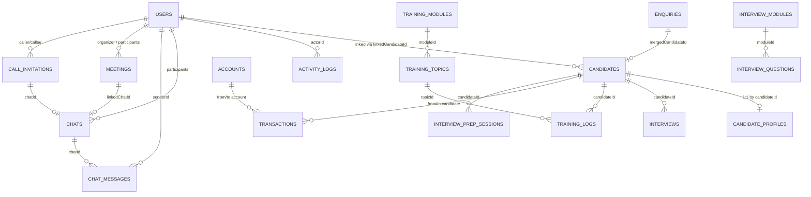
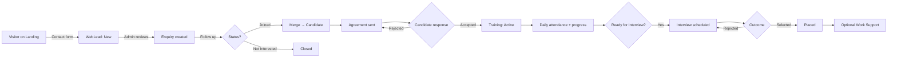

# Software Requirements Specification (SRS) & Business Requirements Specification (BRS)

# SPR Techforge Management Platform

---

## 1. Document Control

| Field | Value |
| --- | --- |
| **Project Name** | SPR Techforge Management Platform |
| **Document Type** | Combined SRS + BRS |
| **Version** | 1.0 |
| **Date** | 2026-05-17 |
| **Author** | Generated from codebase analysis (Claude Opus 4.7) |
| **Status** | Baseline — for review |
| **Repository** | https://github.com/thirumalreddy1995/SPRTechforge |

### 1.1 Revision History

| Version | Date | Author | Description |
| --- | --- | --- | --- |
| 0.1 | 2026-05-17 | Generated | Initial draft from codebase exploration |
| 1.0 | 2026-05-17 | Generated | First baseline; covers all modules through Phase 4 |

### 1.2 Glossary

| Term | Definition |
| --- | --- |
| **Admin** | A user whose `role` field is `admin`. Has access to most modules, can manage users, candidates, training, etc. |
| **Activity Log** | A persistent record of significant actions performed in the system. |
| **Agreement** | A legal/financial agreement sent by admins to candidates; candidates accept or reject via a public portal link. |
| **Announcement** | A broadcast message in SPRConnect Chat that all users can read but only admins can post. |
| **AppContext** | Central React state container for the application; exposes data and CRUD helpers via the `useApp()` hook. |
| **Batch** | A grouping of candidates studying together (e.g., a January 2026 cohort). Identified by `batchId` string. |
| **Bootstrap admin** | The hardcoded `admin-01` user (`thirumalreddy@sprtechforge.com`) that allows initial login when Firestore is empty. |
| **Bulk Upload** | An admin feature on the Interview Question Bank page to import many questions at once from text/CSV/Excel. |
| **Call Invitation** | A Firestore record representing an in-flight DM video call between two users; includes status (ringing/accepted/declined/ended). |
| **Candidate** | A trainee enrolled in the training program. Tracked separately from internal users; may also have a corresponding login (`role: candidate`). |
| **CRUD** | Create, Read, Update, Delete. |
| **DM** | Direct Message — a two-person private chat in SPRConnect Chat. |
| **Firestore** | Google's serverless NoSQL document database used as this application's primary persistence layer. |
| **GAS** | Google Apps Script — used as a free serverless backend for the email module. |
| **Jitsi** | Open-source video-conferencing platform; the application embeds `meet.jit.si` for video calls. |
| **Master / Director** | The user with username `thirumalreddy@sprtechforge.com` — has elevated privileges including Finance access. |
| **Module** | (1) A training subject (e.g., "React Fundamentals"). (2) An interview-question category. (3) A functional area of this SRS. |
| **Order Field** | Numeric field on modules/topics/questions controlling display order. |
| **PR** | Pull Request (Git/GitHub). |
| **QA** | (1) Quality Assurance. (2) The non-production environment at `https://sprtechforge-qa.web.app`. |
| **Resume** | Candidate's CV, uploaded as base64 data inside the candidate record. |
| **RSVP** | Response to a meeting invite — Accepted (Going), Declined, Tentative (Maybe), or Pending. |
| **SPA** | Single-Page Application. |
| **SPRConnect** | The collaboration sidebar group containing Chat, Meetings, Video Calls, and Email. |
| **Staff** | A user whose `role` field is `staff` — internal team member with limited admin powers. |
| **TTL** | Time-To-Live — e.g., call invitations expire client-side after 45 seconds. |
| **Web Lead** | A contact-form submission from the public Landing Page. |

---

## 2. Introduction

### 2.1 Purpose

This document specifies the complete business and software requirements of the **SPR Techforge Management Platform**. It is the authoritative reference for:

- Validating the system's behavior during QA testing.
- Onboarding new developers, testers, and stakeholders.
- Negotiating scope and priorities with the product owner.
- Producing test plans, test cases, and traceability matrices.

A QA tester or business analyst with **no access to source code** shall be able to design a complete test plan from this document alone.

### 2.2 Intended Audience

| Audience | What they get from this document |
| --- | --- |
| **QA Testers** | Module-level functional requirements with input validation rules, expected outputs, and ready-to-use test scenarios. |
| **Business Analysts** | Business goals, user roles, processes, and KPIs. |
| **Developers** | Data models, API surface, integration points, and non-functional requirements. |
| **Stakeholders / Product Owner** | High-level scope, dependencies, gaps, and acceptance criteria. |

### 2.3 Project Scope and Objectives

**In scope:**

- Authentication and user/role management.
- Recruitment funnel: web leads → enquiries → candidates → agreements → training → interviews → placement.
- Training delivery: curriculum setup, attendance, progress tracking, interview prep.
- Finance: accounts, transactions, payroll, balance sheet, P&L (master only).
- Collaboration (SPRConnect): chat, meetings, video calls, email.
- Administrative functions: activity logs, cloud setup, test runner.
- Self-service candidate portal: agreement, profile, dashboard.

**Out of scope (current release):**

- Mobile native apps (web-responsive only).
- Multi-tenant support (single organisation only).
- Localisation (English only).
- Real-time push notifications (polling/in-app only).
- Public payment-gateway integration.

### 2.4 References

- [README.md](README.md) — high-level project README.
- [SETUP-ENVIRONMENTS.md](SETUP-ENVIRONMENTS.md) — environment setup guide.
- [SETUP-EMAIL.md](SETUP-EMAIL.md) — Google Apps Script email bridge setup.
- [testing/README.md](testing/README.md) — test management pack.
- [testing/SPR-Testing.xlsx](testing/SPR-Testing.xlsx) — workbook with 142 stories, 91 test cases, bug tracker.
- [services/cloud.ts](services/cloud.ts) — Firebase client wrapper.
- [services/emailService.ts](services/emailService.ts) — email bridge client.
- [types.ts](types.ts) — TypeScript data models.
- [context/AppContext.tsx](context/AppContext.tsx) — central state and CRUD helpers.

---

## 3. Business Requirements (BRS)

### 3.1 Business Context and Problem Statement

SPR Techforge is a small training-and-placement organisation that recruits candidates from the open market, trains them on technical subjects (e.g., React, JavaScript), prepares them for interviews, and places them in partner companies. Historically the operations team has relied on spreadsheets and ad-hoc tools for:

- Recruiting leads and enquiries.
- Tracking candidate progress through training.
- Scheduling and recording interviews.
- Collecting fees, paying staff, and reporting financials.
- Internal team communication, meetings, and email correspondence with candidates.

This fragmentation causes lost data, duplicate effort, and slow decision-making. The platform consolidates these activities into one role-aware web application with shared real-time data.

### 3.2 Business Goals and Objectives

| ID | Goal | Success measure |
| --- | --- | --- |
| **BG-01** | Replace spreadsheets with a single shared system for candidate, training, and finance data. | All four operations functions (recruit, train, place, account) run from this app within one sprint of go-live. |
| **BG-02** | Make placement progress visible to candidates in real time. | Candidate dashboard shows accurate attendance, progress, and interview pipeline. |
| **BG-03** | Eliminate manual interview-question distribution. | Interview Question Bank holds ≥200 questions across all modules; admins import via bulk upload. |
| **BG-04** | Reduce daily email and meeting overhead for internal staff. | DMs, announcements, and meeting scheduling all available inside SPRConnect. |
| **BG-05** | Provide the master/director with reliable, audit-trailed financial reporting. | Balance sheet and P&L reconcile to underlying transactions; locked transactions cannot be silently edited. |
| **BG-06** | Maintain $0 monthly infrastructure cost. | Stack uses only Firebase free (Spark) tier, Google Apps Script free tier, meet.jit.si, and GitHub Pages / Firebase Hosting free quotas. |

### 3.3 Stakeholders and User Roles

| Stakeholder | Role in system | Primary needs |
| --- | --- | --- |
| **Owner / Director / Master** | `admin` role + username `thirumalreddy@sprtechforge.com` | Full visibility — finance, all modules, activity log, audit controls. |
| **Admin (non-master)** | `admin` role | Manage candidates, training, interviews, users; no Finance access. |
| **Staff Trainer** | `staff` role | Record attendance, view progress, run interview prep, view (read-only) candidates. |
| **Candidate** | `candidate` role | Complete profile, view training progress, accept/reject agreement, access interview prep. |
| **Prospect / Public Visitor** | Unauthenticated | Browse landing page, submit contact form. |
| **External Email Sender** | None (external) | Email the configured Gmail address; their messages arrive in the SPRConnect → Email inbox. |

### 3.4 High-Level Business Processes

```
                   ┌──────────────┐
                   │ Public Lead  │  (Landing page contact form)
                   └──────┬───────┘
                          │
                          ▼
                   ┌──────────────┐
                   │   Enquiry    │  (Admin captures + follows up)
                   └──────┬───────┘
                          │ (Joined)
                          ▼
                  ┌────────────────┐
                  │  Agreement     │  (Sent to candidate; accepted/rejected)
                  └──────┬─────────┘
                          │
                          ▼
                  ┌────────────────┐
                  │   Candidate    │  (Pays fee; assigned to batch)
                  └──────┬─────────┘
                          │
                          ▼
            ┌──────────────────────────┐
            │     Training Phase       │  (Attendance, progress, prep)
            └──────┬──────────────────┘
                   │ (Ready for Interview)
                   ▼
            ┌──────────────────────────┐
            │   Interview Pipeline     │  (Scheduling, prep, outcome)
            └──────┬──────────────────┘
                   │ (Selected)
                   ▼
            ┌──────────────────────────┐
            │       Placed             │  (Company + package recorded)
            └──────┬──────────────────┘
                   │ (Optional)
                   ▼
            ┌──────────────────────────┐
            │     Work Support         │  (Ongoing support tracking)
            └──────────────────────────┘
```

Parallel processes running across all stages:

- **SPRConnect** — staff message each other and candidates; meetings scheduled and joined by video.
- **Finance** — fees collected, salaries paid, statements generated (master-visible only).
- **Activity Logging** — every CRUD action is recorded for audit.

### 3.5 Success Criteria / KPIs

| KPI | Target |
| --- | --- |
| Time to mark daily attendance | ≤2 minutes for a batch of 15 candidates. |
| Time from interview scheduled → candidate notified | ≤24 hours. |
| Web Lead first-response time | ≤24 hours during business days. |
| Master can locate any transaction by candidate name | ≤30 seconds via search. |
| Audit log completeness | 100% of mutations are logged with actor + timestamp. |
| Master finance reports reconcile to underlying transactions | Within ±₹0 (no rounding errors). |
| Real-time message arrival between two users | ≤5 seconds end-to-end on QA network. |

### 3.6 Assumptions, Constraints, and Dependencies

| ID | Item |
| --- | --- |
| **A-01** | All users have modern evergreen browsers (Chrome / Edge / Firefox latest). |
| **A-02** | The organisation has a stable internet connection (Firestore real-time listeners require it). |
| **A-03** | The Gmail account used by the email module has its 100/day free send quota intact. |
| **A-04** | Candidates whose role is `candidate` will have separate user records linked to their candidate record via `linkedCandidateId`. |
| **C-01** | The app must run on Firebase Spark (free) plan. No paid services or billing card required. |
| **C-02** | Video calls use the public `meet.jit.si` instance; the first user to start a room (moderator) must sign into Google once per browser session. |
| **C-03** | Outbound email send quota is capped at 100/day by Gmail. |
| **C-04** | Production deploys to GitHub Pages at `sprtechforge.com`; QA deploys to Firebase Hosting at `sprtechforge-qa.web.app`. |
| **D-01** | The application depends on Firebase Firestore, Firebase Storage, Google Apps Script, and meet.jit.si being operational. |
| **D-02** | The master credentials (`thirumalreddy@sprtechforge.com`) determine system-administrator capabilities; renaming this account would break MasterRoute checks. |

---

## 4. System Overview

### 4.1 High-Level Architecture

```
            ┌─────────────────────────────────────────┐
            │            Browser (SPA)                │
            │  React + Vite + Tailwind                │
            │  HashRouter, AppContext (state)         │
            │  Firebase Web SDK, @daily-co (unused),  │
            │  Jitsi External API, xlsx (lazy chunk)  │
            └────────┬──────────────────────┬─────────┘
                     │ Firestore real-time │ HTTPS (GAS)
                     │ listeners            │  &  iframe (Jitsi)
                     ▼                      ▼
        ┌───────────────────┐    ┌────────────────────────┐
        │  Firebase         │    │ Google Apps Script     │
        │  Firestore (DB)   │    │ Web App: send/list mail│
        │  Storage (files)  │    │   runs as a Gmail acct │
        │  Hosting (QA)     │    └────────────────────────┘
        └───────────────────┘
                                  ┌────────────────────────┐
                                  │ meet.jit.si (Jitsi)    │
                                  │ Public video confer-   │
                                  │   encing                │
                                  └────────────────────────┘
```

### 4.2 Technology Stack

| Layer | Technology | Notes |
| --- | --- | --- |
| Frontend framework | React 18 + TypeScript | Hooks-based; no Redux. |
| Build tool | Vite 5 | Fast dev server, ES-module output. |
| Styling | Tailwind CSS 3 | Utility classes, no CSS-in-JS. |
| Routing | react-router-dom 6 with HashRouter | Compatible with GitHub Pages static hosting. |
| State management | React Context (`AppContext`) | All app state in one provider; Firestore subscriptions wire data in. |
| Database | Firebase Firestore | NoSQL document store; real-time listeners. |
| File storage | Firebase Storage | For candidate resumes, chat attachments, email outbound attachments. |
| Video | meet.jit.si via Jitsi External API | Embedded iframe; one moderator Google sign-in. |
| Email backend | Google Apps Script (Web App) | Runs as a Gmail account; HTTP GET (list) and POST (send). |
| Spreadsheet parsing | `xlsx` (SheetJS) | Lazy-loaded ~500KB chunk; used only in bulk-upload modal. |
| Production hosting | GitHub Pages | Master branch deploy via `peaceiris/actions-gh-pages`. |
| QA hosting | Firebase Hosting | QA branch deploy via `FirebaseExtended/action-hosting-deploy`. |
| CI/CD | GitHub Actions | Two workflows: `deploy.yml` (master) and `deploy-qa.yml` (QA). |

### 4.3 Deployment Environment

| Environment | URL | Database | Triggered by |
| --- | --- | --- | --- |
| **Production** | https://sprtechforge.com | Firestore project `sprtechforge` | Push to `master` |
| **QA** | https://sprtechforge-qa.web.app | Firestore project `sprtechforge-qa` | Push to `QA` |
| **Local development** | http://localhost:5173 | Whichever Firebase project the `.env.local` points at (defaults to production) | `npm run dev` |

### 4.4 External Integrations

| Integration | Purpose | Owner | Failure mode |
| --- | --- | --- | --- |
| Firebase Firestore | Persistent data store + real-time listeners | Google | App falls back to localStorage if cloud disabled. |
| Firebase Storage | File attachments | Google | Chat/email/resume uploads fail; user sees error toast. |
| Google Apps Script | Email send + inbox list | Google (user-owned) | Email page shows "not configured yet" or error toast. |
| meet.jit.si | Video conferencing | 8x8 / Jitsi community | Call iframe fails to load; user sees error and Leave button. |
| GitHub Actions | CI/CD | GitHub | Failed deploy; manual re-run from the Actions tab. |

---

## 5. Module-Wise Functional Requirements (SRS)

This section specifies each functional module. Requirements are numbered `FR-MM.N` where `MM` is the module number and `N` is sequential within the module.

The application defines four roles enforced by route wrappers in [App.tsx](App.tsx):

| Wrapper | Allows | Used for |
| --- | --- | --- |
| `ProtectedRoute` | Any authenticated user | All authenticated routes. |
| `AdminRoute` | `role=admin` OR has `users` in `modules` array | Admin → Users, Web Enquiries. |
| `MasterRoute` | `username === thirumalreddy@sprtechforge.com` | Finance, Activity Logs, Test Runner, Cloud Setup. |

Throughout this section, "the system shall" means the requirement is mandatory.

---

### MOD-01: Authentication & Session

**Purpose:** Provide secure login, logout, and session management for all users. Includes the bootstrap-admin fallback used to recover access on an empty database.

**Actors:** Anonymous visitor, Admin, Staff, Candidate, Master.

**Preconditions:**
- The application is reachable at the configured URL.
- Firestore is reachable, OR the bootstrap admin code is intact and the local users state is empty.

#### 5.1 Functional Requirements

- **FR-01.1** The system shall present a login form requesting username and password.
- **FR-01.2** The system shall authenticate the user against the `users` Firestore collection, with case-insensitive username matching.
- **FR-01.3** When the `users` collection returns no documents, the system shall fall back to an in-memory `DEFAULT_ADMIN` record (`thirumalreddy@sprtechforge.com` / `ThiruPriya@13`) so the system is never lockable-out.
- **FR-01.4** When Firestore returns a non-empty user list that does not contain `admin-01`, the system shall persist `DEFAULT_ADMIN` to Firestore automatically (idempotent regression fix).
- **FR-01.5** On successful login the system shall write a `SPR_TECHFORGE_SESSION_V4` entry to localStorage containing the userId and the current timestamp.
- **FR-01.6** The system shall keep a user logged in across page reloads while the session timestamp is younger than 60 minutes.
- **FR-01.7** After 60 minutes of inactivity, any protected route shall redirect the user to `/login`.
- **FR-01.8** The system shall provide a logout action that removes the session from localStorage and navigates to `/`.
- **FR-01.9** Failed login attempts shall display the generic message "Invalid credentials" with no information about whether the username or the password was wrong.
- **FR-01.10** The first-time-login flow shall require a candidate or new staff user to change their password before they reach the dashboard.
- **FR-01.11** The login screen shall display a "Forgot Password" link that creates a `passwordResetRequest` Firestore document the master can later resolve.

#### 5.2 Business Rules

- **BR-01.1** Only one user identified by `thirumalreddy@sprtechforge.com` has the master role; renaming the account would invalidate `MasterRoute`.
- **BR-01.2** The bootstrap admin must never be silently removed from Firestore even when admins are managing users.
- **BR-01.3** Free-text login fields must be trimmed of leading/trailing whitespace before comparison.

#### 5.3 Input Fields

| Field | Type | Mandatory | Validation |
| --- | --- | --- | --- |
| Username | text | Yes | Trimmed, lower-cased before comparison. |
| Password | password | Yes | Plain-text equality match; no hashing in current build. |

#### 5.4 Output / Expected Behavior

- On success: redirect to `/dashboard`; sidebar renders user's name.
- On failure: inline error; URL remains `/login`; no localStorage write.

#### 5.5 UI / Screen Description

- Centred card with logo, two inputs, a "Sign In" button, and a "Forgot Password" link.
- Cloud-error banner (if Firestore subscription failed) is rendered at the top.

#### 5.6 Data Touched

- Reads/writes `users` collection.
- Reads `passwordResetRequests` collection (writes during forgot-password flow).
- Writes `activityLogs` (action `LOGIN`) on successful sign-in.

#### 5.7 Test Scenarios

| TS-ID | Type | Scenario | Expected |
| --- | --- | --- | --- |
| TS-01.1 | Positive | Login with valid bootstrap admin on empty DB | Dashboard renders; Finance group visible. |
| TS-01.2 | Positive | Login with correct username different case | Authenticated successfully. |
| TS-01.3 | Negative | Login with wrong password | Generic error; URL stays `/login`. |
| TS-01.4 | Negative | Login with unknown username | Same generic error (no enumeration). |
| TS-01.5 | Negative | Empty username or password | Form-level validation prevents submission. |
| TS-01.6 | Boundary | Session timestamp 60 min + 1 sec old | Redirected to `/login` on next protected request. |
| TS-01.7 | Security | Tampered SESSION_KEY pointing to non-existent userId | App treats as unauthenticated. |
| TS-01.8 | Regression | Add a new user via Admin → Users on empty `/users` | `admin-01` auto-re-persists to Firestore. |

---

### MOD-02: User Management

**Purpose:** Admins can create, edit, delete, and assign modules to internal users (staff, admins, candidates with logins).

**Actors:** Admin, Master.

**Preconditions:** Logged in with `role=admin` or `modules` array includes `users`.

#### 5.8 Functional Requirements

- **FR-02.1** The system shall list all `users` documents on `/admin/users` with full name, login ID, contact, role, and a password show/hide toggle.
- **FR-02.2** The system shall expose an "Add User" form capturing name, username, email, phone, address, password, role, and modules array.
- **FR-02.3** Default `modules` for `role=admin` shall be `[candidates, users, training]`.
- **FR-02.4** Duplicate username submission shall be rejected with an inline error.
- **FR-02.5** The system shall provide an Edit User screen pre-populated with the user's current values; password is editable.
- **FR-02.6** The system shall provide a Delete User action, gated by the master role, that:
  - prevents the master from deleting themselves;
  - prevents the deletion of the last remaining admin.
- **FR-02.7** The Users page shall surface pending `passwordResetRequests` with Dismiss and Reset actions.
- **FR-02.8** When the master account is being edited by any other admin, master-specific protected fields shall be read-only.
- **FR-02.9** Every user CRUD operation shall produce a corresponding `activityLog` entry (`CREATE` / `UPDATE` / `DELETE`).

#### 5.9 Business Rules

- **BR-02.1** Username is unique system-wide.
- **BR-02.2** Passwords must be ≥4 characters (no other complexity enforcement in current build).
- **BR-02.3** Module assignment controls left-sidebar visibility, but master always sees Finance regardless of modules.

#### 5.10 Input Fields

| Field | Type | Mandatory | Validation |
| --- | --- | --- | --- |
| Name | text | Yes | 2–80 chars. |
| Username (login ID) | text | Yes | Unique; commonly an email address; trimmed/lower-cased. |
| Email | email | No | If present, must match RFC 5322 simple regex. |
| Phone | tel | No | Free-form (no format enforcement in current build). |
| Address | text | No | Up to 200 chars. |
| Password | text | Yes (on create) | ≥4 chars. |
| Role | enum | Yes | `admin` / `staff` / `candidate`. |
| Modules | string[] | No | Subset of `candidates, finance, users, training, web-leads`. |

#### 5.11 Test Scenarios

| TS-ID | Type | Scenario | Expected |
| --- | --- | --- | --- |
| TS-02.1 | Positive | Admin adds a new staff user | Appears in list; can log in. |
| TS-02.2 | Negative | Duplicate username | Inline error; no user created. |
| TS-02.3 | Positive | Modules=[training] on a staff user | Only Training visible in sidebar on their login. |
| TS-02.4 | Negative | Non-admin attempts to reach `/admin/users` directly | Redirected to `/dashboard`. |
| TS-02.5 | Security | Self-delete by master | Action blocked with a clear error. |
| TS-02.6 | Boundary | Delete the last admin | Action blocked. |
| TS-02.7 | Positive | Resolve a pending password reset | User can log in with new password; request marked `resolved`. |

---

### MOD-03: Dashboard

**Purpose:** Role-specific landing screen showing the most-needed KPIs and shortcuts.

**Actors:** Candidate, Staff, Admin, Master.

#### 5.12 Functional Requirements

- **FR-03.1** When `role=candidate`, the system shall render the candidate dashboard showing training progress percentage (computed from `trainingLogs`), fee summary (paid/due with a show/hide toggle), and the next three upcoming interviews.
- **FR-03.2** When `role=staff` or non-master admin, the system shall render the staff/admin dashboard with counts of active candidates, placed, ready-for-interview, today's interviews, and an 8-row interview pipeline.
- **FR-03.3** When the user is master, the system shall additionally render the financial KPIs (cash, bank, total income MTD, total payments MTD, payables, receivables) and a six-month income vs expense bar chart.
- **FR-03.4** All amount displays for the master shall support a show/hide privacy toggle.
- **FR-03.5** Every KPI card shall be a clickable link to the relevant detailed page (e.g., active candidates → /candidates filter=Training).

#### 5.13 Test Scenarios

| TS-ID | Type | Scenario | Expected |
| --- | --- | --- | --- |
| TS-03.1 | Positive | Master views dashboard | All financial KPIs reconcile with `/finance/dashboard`. |
| TS-03.2 | Positive | Candidate views dashboard | Sees only own progress and own interviews. |
| TS-03.3 | Negative | Staff views dashboard | Finance KPIs are hidden. |
| TS-03.4 | Boundary | Empty database | Cards render with 0 values, no console errors. |

---

### MOD-04: Address Book

**Purpose:** Unified directory of users and active candidates with click-to-call/email.

**Actors:** Any authenticated user.

#### 5.14 Functional Requirements

- **FR-04.1** The system shall list internal users (non-candidate role) and active candidates in one table.
- **FR-04.2** The list shall support search across name, email, phone, and role.
- **FR-04.3** The list shall provide a filter dropdown for "All / Candidate / Staff".
- **FR-04.4** Phone numbers shall render as `tel:` links; emails as `mailto:` links.

#### 5.15 Test Scenarios

| TS-ID | Type | Scenario | Expected |
| --- | --- | --- | --- |
| TS-04.1 | Positive | Search by partial phone | Matching rows remain. |
| TS-04.2 | Positive | Filter Candidate only | Staff hidden; placed candidates also hidden (only Active=true visible). |
| TS-04.3 | Boundary | A candidate with no email | Row renders an em-dash for email, not "undefined". |

---

### MOD-05: Candidate Management

**Purpose:** CRUD and pipeline management for trainees.

**Actors:** Admin (full), Staff (read), Master (delete-and-finance).

#### 5.16 Functional Requirements

- **FR-05.1** The system shall list candidates at `/candidates` with batch, status, agreed amount, paid amount (computed from transactions), and outstanding due.
- **FR-05.2** The list shall offer tabs (Active / Placed / All) plus a batch filter and status filter.
- **FR-05.3** The list shall expose KPI tiles (total enrolled, total collected, outstanding balance) with a master-only show/hide toggle.
- **FR-05.4** The system shall provide an "Add Candidate" form capturing name, batchId, phone, email, address, agreedAmount, joinedDate, status, notes, and an editable agreement-text template.
- **FR-05.5** The "Edit Candidate" form shall pre-populate all fields.
- **FR-05.6** The Delete Candidate action shall be available to master only and shall be blocked if any related `transactions` exist.
- **FR-05.7** The candidate detail screen shall display payment status (Awaiting / Due / Cleared) computed from `agreedAmount - sumPaid`.
- **FR-05.8** Master may add a custom status to the `candidateStatuses` array; all admins may then assign it.
- **FR-05.9** A candidate's status transitioning to `Placed` shall require `placedCompany` and `packageDetails` fields.
- **FR-05.10** The Active toggle shall set/clear `isActive`; only Active candidates appear in default lists.

#### 5.17 Business Rules

- **BR-05.1** Phone number is the de-facto unique identifier; duplicates are flagged but not blocked.
- **BR-05.2** `paidAmount` is derived from related `transactions`, not stored on the candidate.
- **BR-05.3** `workSupportStatus` of `Active` requires both start and end dates plus monthlyAmount.

#### 5.18 Input Fields (Add/Edit Candidate)

| Field | Type | Mandatory | Validation |
| --- | --- | --- | --- |
| Name | text | Yes | 2–80 chars. |
| BatchId | text | Yes | Free-form (e.g., `B-2026-Q1`). |
| Email | email | Yes | RFC 5322 simple validation. |
| Phone | tel | Yes | 10-digit numeric check on Add page. |
| Alternate Phone | tel | No | Same validation if present. |
| Address | text | No | Up to 200 chars. |
| Agreed Amount | currency | Yes | ≥0, integer. |
| Joined Date | date | Yes | Cannot be in the future. |
| Status | enum | Yes | Defaults to `Training`. |
| Placed Company | text | Conditional | Required when status=Placed. |
| Package Details | text | Conditional | Required when status=Placed. |
| Resume | file | No | PDF, ≤5 MB. Stored as base64 on the candidate record. |
| Agreement Text | textarea | No | Free-form; defaults to a template. |
| Notes | textarea | No | Free-form. |
| Active | boolean | Yes | Defaults to `true`. |

#### 5.19 Test Scenarios

| TS-ID | Type | Scenario | Expected |
| --- | --- | --- | --- |
| TS-05.1 | Positive | Add valid candidate | Appears in list with `paidAmount=0` and status=Training. |
| TS-05.2 | Negative | Invalid email | Inline validation; save blocked. |
| TS-05.3 | Boundary | Joined date = today | Saves successfully. |
| TS-05.4 | Boundary | Joined date = tomorrow | Validation blocks. |
| TS-05.5 | Positive | Mark Placed with company + package | Status persists; appears under Placed tab. |
| TS-05.6 | Negative | Mark Placed without company | Validation blocks save. |
| TS-05.7 | Security | Non-master attempts delete | Delete button hidden; URL-forced delete fails. |
| TS-05.8 | Negative | Delete candidate with transactions | Action blocked with explanatory message. |
| TS-05.9 | Positive | Upload 4 MB PDF resume | Resume saved as base64; downloadable from detail page. |
| TS-05.10 | Boundary | Upload 6 MB PDF resume | Error toast; resume not saved. |

---

### MOD-06: Candidate Profile (Self-Service)

**Purpose:** Candidates complete their detailed bio (`candidateProfiles`) and view their own training/interview history.

**Actors:** Candidate (own profile), Admin/Staff (view-only).

#### 5.20 Functional Requirements

- **FR-06.1** The system shall expose `/candidates/info` with tabs Personal, Education, Experience, Training Progress, Interview History.
- **FR-06.2** Candidates shall edit Personal, Education, and Experience tabs only.
- **FR-06.3** Training Progress shall show a topic-by-topic checklist of attendance status.
- **FR-06.4** Interview History shall list past interviews with company, date, status, outcome.

#### 5.21 Test Scenarios

| TS-ID | Type | Scenario | Expected |
| --- | --- | --- | --- |
| TS-06.1 | Positive | Candidate fills all profile fields | Profile saved to `candidateProfiles/{candidateId}`. |
| TS-06.2 | Negative | Staff opens Personal tab | Read-only — Save button disabled or hidden. |
| TS-06.3 | Positive | Candidate views interview history | Only their own interviews appear. |

---

### MOD-07: Agreement Portal (Public)

**Purpose:** A public URL where a candidate can read and accept (or reject) the agreement without logging in.

**Actors:** Candidate (anonymous), Admin (sends).

#### 5.22 Functional Requirements

- **FR-07.1** A candidate record shall include `agreementSentDate`, `agreementAcceptedDate`, `agreementRejectedDate`, and `agreementRejectionReason`.
- **FR-07.2** Admins shall send the agreement by clicking "Send Agreement"; the system records `agreementSentDate=now()` and generates a portal URL of the form `/portal/agreement/:id`.
- **FR-07.3** The portal page shall be accessible without authentication.
- **FR-07.4** The portal shall display the agreement text, a consent checkbox, an "Accept & Sign" button, and an "I Disagree / Reject" button.
- **FR-07.5** Acceptance shall set `agreementAcceptedDate=now()`.
- **FR-07.6** Rejection shall open a reason modal; submitting it sets `agreementRejectedDate` and `agreementRejectionReason`.
- **FR-07.7** After acceptance or rejection, the portal shall display a confirmation message and become read-only.
- **FR-07.8** A rejected agreement may be re-sent by an admin; re-sending clears the previous rejection timestamps.

#### 5.23 Test Scenarios

| TS-ID | Type | Scenario | Expected |
| --- | --- | --- | --- |
| TS-07.1 | Positive | Candidate accepts | `agreementAcceptedDate` set; admin sees Accepted status. |
| TS-07.2 | Positive | Candidate rejects with reason | Both fields persisted. |
| TS-07.3 | Negative | Open portal for non-existent ID | Error/empty state, not a crash. |
| TS-07.4 | Positive | Admin re-sends after rejection | Previous rejection timestamps cleared. |
| TS-07.5 | Security | Open portal URL without auth | Page loads. |
| TS-07.6 | Boundary | Rejection reason empty | Validation blocks submission. |

---

### MOD-08: Enquiries & Web Leads

**Purpose:** Capture prospective leads, track follow-up, and convert qualified leads into candidates.

**Actors:** Admin, Staff.

#### 5.24 Functional Requirements (Enquiries)

- **FR-08.1** The system shall expose `/candidates/enquiry` for enquiry CRUD.
- **FR-08.2** A new enquiry shall default to status `Enquiry`.
- **FR-08.3** Enquiry status flow: `Enquiry → Follow-Up → Joined → (Not Interested)`.
- **FR-08.4** Each enquiry shall support free-text notes that are time-stamped and author-stamped.
- **FR-08.5** A `Joined` enquiry may be merged into a new candidate via "Merge to Candidate"; the new candidate inherits name/phone/email, the enquiry is marked `isMerged=true` with a `mergedCandidateId` link.
- **FR-08.6** A merged enquiry cannot be merged again.

#### 5.25 Functional Requirements (Web Leads)

- **FR-08.7** Submissions to the Landing Page contact form shall create a `WebLead` document with `status='New'` and `isRead=false`.
- **FR-08.8** The Admin → Web Enquiries page shall display the lead list with an unread badge counting `isRead=false`.
- **FR-08.9** Opening a lead shall flip `isRead=true`; the sidebar badge decrements.
- **FR-08.10** Admins may set `status` to `New / In Progress / Responded / Closed` and add an internal note.

#### 5.26 Test Scenarios

| TS-ID | Type | Scenario | Expected |
| --- | --- | --- | --- |
| TS-08.1 | Positive | Add enquiry with all required fields | Saved; visible in list. |
| TS-08.2 | Positive | Move enquiry to Joined | Merge action becomes available. |
| TS-08.3 | Positive | Merge into candidate | Candidate created with enquiry data; enquiry flagged merged. |
| TS-08.4 | Negative | Merge already-merged enquiry | Merge action disabled. |
| TS-08.5 | Positive | Landing page form submission | Web Lead created; admin sidebar badge increments. |
| TS-08.6 | Positive | Mark Web Lead read | Badge decrements. |

---

### MOD-09: Training Curriculum

**Purpose:** Define training modules and topics that drive attendance + progress tracking.

**Actors:** Admin (CRUD), Staff/Candidate (read).

#### 5.27 Functional Requirements

- **FR-09.1** Admins shall create training modules with title, description, order.
- **FR-09.2** Each module may contain one or more topics with title, description, `estimatedHours`.
- **FR-09.3** Modules and topics shall sort by the `order` field across the application.
- **FR-09.4** Candidates and staff shall see the curriculum read-only.

#### 5.28 Test Scenarios

| TS-ID | Type | Scenario | Expected |
| --- | --- | --- | --- |
| TS-09.1 | Positive | Admin creates module + topic | Both saved; visible in curriculum view. |
| TS-09.2 | Positive | Reorder modules | New order reflected on all pages that use them. |
| TS-09.3 | Negative | Candidate tries to edit | No edit controls visible. |

---

### MOD-10: Daily Attendance

**Purpose:** Capture per-day attendance and assignment status per candidate.

**Actors:** Staff, Admin.

#### 5.29 Functional Requirements

- **FR-10.1** The Daily Attendance page shall list all `Active` candidates for the chosen date and topic.
- **FR-10.2** For each candidate, the user shall record `attendanceStatus` (`Present / Absent / No Class`) and `assignmentStatus` (`Pending / Completed / N/A`).
- **FR-10.3** A save shall create one `TrainingLog` document per candidate per topic per date.
- **FR-10.4** Re-opening the same (date, topic) shall pre-load the existing records.
- **FR-10.5** When `attendanceStatus=Absent`, `assignmentStatus` shall default to `N/A`.
- **FR-10.6** Each save shall append a `CREATE` activity-log entry.

#### 5.30 Test Scenarios

| TS-ID | Type | Scenario | Expected |
| --- | --- | --- | --- |
| TS-10.1 | Positive | Mark 5 candidates Present and save | All TrainingLogs persisted. |
| TS-10.2 | Positive | Reopen same date and topic | Saved marks pre-loaded. |
| TS-10.3 | Negative | Save with no candidates marked | Validation prevents save OR records `Pending` for all (confirm desired behaviour with PO). |

---

### MOD-11: Progress Tracking

**Purpose:** Aggregate training logs into per-candidate completion metrics.

**Actors:** Staff, Admin.

#### 5.31 Functional Requirements

- **FR-11.1** The Progress Monitor shall list candidates with days-present, days-absent, and `assignmentsCompleted` aggregates.
- **FR-11.2** Filters shall include batch and candidate name.
- **FR-11.3** The Candidate Dashboard view shall show the same metrics scoped to the logged-in candidate only.

#### 5.32 Test Scenarios

| TS-ID | Type | Scenario | Expected |
| --- | --- | --- | --- |
| TS-11.1 | Positive | Aggregate matches underlying logs | Counts reconcile. |
| TS-11.2 | Boundary | Candidate with no logs | Renders 0s, no division-by-zero errors. |
| TS-11.3 | Positive | Candidate user opens dashboard | Sees only own data. |

---

### MOD-12: Interview Scheduling

**Purpose:** Schedule, track, and report on candidate interviews.

**Actors:** Admin (full), Staff (record outcomes), Candidate (view + resume upload).

#### 5.33 Functional Requirements

- **FR-12.1** The Interviews page shall provide tabs: Ready Candidates, Active (Scheduled), History.
- **FR-12.2** Schedule Interview shall capture date, time, company, round (`L1 / L2 / L3 / HR`), type (`F2F / Zoom / Teams / Telephonic`), support person, and notes.
- **FR-12.3** Status shall progress through `Scheduled → Completed / Rescheduled / Cancelled`.
- **FR-12.4** Outcome shall be `Selected / Rejected / Pending` and may be set only when status=Completed.
- **FR-12.5** Selecting `Selected` shall prompt the admin to mark the candidate as `Placed` with company + package.
- **FR-12.6** Candidates shall upload their resume from this page; the resume is stored on the candidate record as base64 (≤5 MB).
- **FR-12.7** The sidebar shall show a `Today: N` badge for interviews starting today and a total upcoming badge.
- **FR-12.8** Bulk status updates shall be supported via multi-select.

#### 5.34 Test Scenarios

| TS-ID | Type | Scenario | Expected |
| --- | --- | --- | --- |
| TS-12.1 | Positive | Schedule interview for tomorrow | Appears under Active; sidebar count updates. |
| TS-12.2 | Positive | Cancel scheduled interview | Row visibly de-emphasised; badge decrements. |
| TS-12.3 | Positive | Outcome=Selected | Prompt to mark candidate Placed. |
| TS-12.4 | Negative | Set outcome on Scheduled interview | Action blocked. |
| TS-12.5 | Boundary | Upload 5.5 MB resume | Save rejected with clear error. |

---

### MOD-13: Interview Question Bank (with Bulk Upload)

**Purpose:** Maintain a categorised question library used for interview preparation; admins import many at once.

**Actors:** Admin (CRUD + bulk upload), Candidate (read + AI lookup).

#### 5.35 Functional Requirements

- **FR-13.1** Admins shall create interview modules with title, color, and order.
- **FR-13.2** Each module may contain any number of questions; each question carries a question text and order.
- **FR-13.3** Candidates may click a question to copy a prepared ChatGPT prompt and open chatgpt.com in a new tab.
- **FR-13.4** Admins may multi-select questions and delete them in batch.
- **FR-13.5** Admins shall access a **Bulk Upload Questions** modal supporting three input methods:
  - **Paste text** — textarea, one question per line.
  - **Upload .csv / .txt** — first column of each row.
  - **Upload .xlsx / .xls** — first column of the first sheet (uses lazy-loaded `xlsx` library).
- **FR-13.6** A leading row of `Question` / `Questions` / `Q` (case-insensitive) shall be automatically skipped.
- **FR-13.7** Each parsed question shall be appended after existing ones in the chosen module with `order = maxExistingOrder + i + 1`.
- **FR-13.8** A live preview shall show the first 50 parsed questions before commit.
- **FR-13.9** The bulk save shall use Firestore batch writes (≤500 docs per batch).
- **FR-13.10** A single activity-log entry shall record `Bulk imported N interview questions`.

#### 5.36 Input Fields (Bulk Upload)

| Field | Type | Mandatory | Validation |
| --- | --- | --- | --- |
| Target Module | dropdown | Yes | Must exist. |
| Paste textarea | text | One of paste/file | Empty lines ignored. |
| File upload | file | One of paste/file | .csv / .txt / .xlsx / .xls. |

#### 5.37 Test Scenarios

| TS-ID | Type | Scenario | Expected |
| --- | --- | --- | --- |
| TS-13.1 | Positive | Paste 3 questions; commit | 3 questions appended to chosen module. |
| TS-13.2 | Positive | Upload CSV with a `Question` header | Header skipped; only data rows imported. |
| TS-13.3 | Positive | Upload .xlsx with text in column A | First column imported. |
| TS-13.4 | Negative | Upload .docx | Error: unsupported file type. |
| TS-13.5 | Boundary | Paste 1000 lines | All imported via batch writes. |
| TS-13.6 | Negative | No module exists | Modal disables import and shows warning. |
| TS-13.7 | Security | Non-admin reaches the modal via direct URL | Button is hidden; even if forced, save fails (admin check). |

---

### MOD-14: Interview Prep Module

**Purpose:** Candidate-facing prompt-practice tool that scores spoken/typed responses to interview questions.

**Actors:** Candidate (primary), Admin (review).

#### 5.38 Functional Requirements

- **FR-14.1** Candidates shall start a prep session via `/training/interview-prep`.
- **FR-14.2** Each session records per-question `modelAnswer`, `spokenAnswer`, `score`, `feedback`, `missedKeywords` plus an overall `score`, `grade`, `improvementAreas`, `strongAreas`.
- **FR-14.3** Sessions shall persist to `interviewPrepSessions`.
- **FR-14.4** Candidates may replay past sessions to see their answers.

#### 5.39 Test Scenarios

| TS-ID | Type | Scenario | Expected |
| --- | --- | --- | --- |
| TS-14.1 | Positive | Complete a session | Session saved; overall score visible. |
| TS-14.2 | Positive | Re-open a past session | Per-question details visible. |

---

### MOD-15: Finance — Accounts & Transactions (Master-Only)

**Purpose:** Track every fee collected and every payment made.

**Actors:** Master only.

#### 5.40 Functional Requirements

- **FR-15.1** The Chart of Accounts shall support account types: Cash, Bank, Debtor, Creditor, Expense, Salary, Income, Equity, Fixed Asset, Current Asset, Loan, Tax, Capital.
- **FR-15.2** Each account shall capture name, type, sub-type, openingBalance, description, optional recurring schedule (amount, start/end, due-day).
- **FR-15.3** Transactions shall be one of types: Income, Payment, Transfer, Refund.
- **FR-15.4** Each transaction carries date, amount, fromEntityId, fromEntityType (`Account / Candidate / Staff`), toEntityId, toEntityType, description, optional category, `isLocked` flag.
- **FR-15.5** Account balances shall be computed at read time from the sum of relevant transactions plus openingBalance.
- **FR-15.6** A locked transaction (`isLocked=true`) shall not be editable or deletable through the UI.
- **FR-15.7** Delete-account shall be blocked if any transaction references the account.
- **FR-15.8** Every create/update/delete shall emit an activity-log entry.

#### 5.41 Business Rules

- **BR-15.1** All Finance routes are gated by MasterRoute.
- **BR-15.2** A transaction's from and to entity must not be the same.
- **BR-15.3** Transfer between two Bank accounts both increments target and decrements source.
- **BR-15.4** Refund reduces a candidate's effective paid amount.

#### 5.42 Input Fields (Add Transaction)

| Field | Type | Mandatory | Validation |
| --- | --- | --- | --- |
| Date | date | Yes | Cannot be future-dated by more than 1 day. |
| Type | enum | Yes | One of Income / Payment / Transfer / Refund. |
| Amount | currency | Yes | >0 integer. |
| From entity | id+type | Yes | Must exist; must differ from "to". |
| To entity | id+type | Yes | Must exist; must differ from "from". |
| Description | text | Yes | 3–200 chars. |
| Category | text | No | Free-form. |
| Locked | boolean | No | Defaults to false. |

#### 5.43 Test Scenarios

| TS-ID | Type | Scenario | Expected |
| --- | --- | --- | --- |
| TS-15.1 | Positive | Add Income from candidate to bank | Bank +amount, Candidate fees due -amount. |
| TS-15.2 | Positive | Lock a transaction | Edit/Delete disabled. |
| TS-15.3 | Negative | Edit a locked transaction via URL | Save fails with error. |
| TS-15.4 | Negative | From == To | Save rejected. |
| TS-15.5 | Positive | Transfer between two bank accounts | Source -amount, destination +amount; statements show both legs. |
| TS-15.6 | Security | Non-master types `/finance/transactions` | Redirected to /dashboard. |
| TS-15.7 | Negative | Delete account with related transactions | Action blocked with clear error. |

---

### MOD-16: Finance — Statements & Reports (Master-Only)

**Purpose:** Per-account statements, balance sheet, P&L, and multi-sheet Excel exports.

**Actors:** Master only.

#### 5.44 Functional Requirements

- **FR-16.1** `/finance/accounts/:id/statement` shall list all transactions involving the account with a running balance column.
- **FR-16.2** The Balance Sheet shall compute Assets = Cash + Bank + Receivables; Liabilities = Creditors + Salary Payables + Customer Advances; Equity = Capital + Net Profit.
- **FR-16.3** The Profit & Loss shall compute total revenue (Income transactions) minus total expense (Payment transactions) for the selected period.
- **FR-16.4** A "Export Full Report" action shall download a multi-sheet `.xls` covering Candidates, Transactions, Sundry Debtors, Debts and Creditors, Balance Sheet, and P&L.
- **FR-16.5** All amounts shall be Indian-rupee formatted (no decimal places in current build).

#### 5.45 Test Scenarios

| TS-ID | Type | Scenario | Expected |
| --- | --- | --- | --- |
| TS-16.1 | Positive | Balance sheet reconciles | Assets = Liabilities + Equity. |
| TS-16.2 | Positive | P&L for a month | Revenue and expense match underlying transactions for that month. |
| TS-16.3 | Positive | Export full report | `.xls` downloads; expected sheets present. |
| TS-16.4 | Boundary | Period with no transactions | Sheets render with zeros, no errors. |

---

### MOD-17: Finance — Payroll (Master-Only)

**Purpose:** Run periodic salary payments for staff.

**Actors:** Master only.

#### 5.46 Functional Requirements

- **FR-17.1** The Payroll page shall list staff users with linked Salary accounts.
- **FR-17.2** Clicking Run for a month shall create Payment transactions from a chosen Bank account to each Salary account.
- **FR-17.3** Re-running the same month shall either be blocked or clearly flag duplicates (decide with PO).

#### 5.47 Test Scenarios

| TS-ID | Type | Scenario | Expected |
| --- | --- | --- | --- |
| TS-17.1 | Positive | Run payroll for current month | Transactions created for each eligible staff member. |
| TS-17.2 | Negative | Re-run same month | Duplicates prevented or clearly flagged. |

---

### MOD-18: SPRConnect → Chat

**Purpose:** Real-time direct messages and a global Announcements channel.

**Actors:** All authenticated users.

#### 5.48 Functional Requirements

- **FR-18.1** Clicking `+` in the chat sidebar shall open a user picker; selecting a user creates (or opens) a DM with deterministic id `dm-<sortedUserA>-<sortedUserB>`.
- **FR-18.2** Sending a message shall write a `chatMessages` document, update the `chats` doc's `lastMessage*`, and propagate to the other user via Firestore listener within 5 seconds.
- **FR-18.3** Composer shall send on Enter; Shift+Enter shall insert a newline.
- **FR-18.4** Attachments shall upload to `chats/{chatId}/...` in Firebase Storage; images render inline, others as a download card.
- **FR-18.5** Per-message `readBy: string[]` shall track which users have viewed; unread counts derive from messages where `senderId != me && me ∉ readBy`.
- **FR-18.6** Opening a chat shall mark its messages as read for the current user.
- **FR-18.7** Sidebar Chat entry shall display the total unread count across visible chats.
- **FR-18.8** There shall be exactly one global Announcements chat (id `announcements-global`) auto-created on first open.
- **FR-18.9** Only admins may post in Announcements; non-admins see "Read-only".
- **FR-18.10** The chat header in a DM shall offer Call and Schedule shortcuts that open the video call flow (MOD-20) or the meeting modal (MOD-19) pre-populated with the other user.

#### 5.49 Test Scenarios

| TS-ID | Type | Scenario | Expected |
| --- | --- | --- | --- |
| TS-18.1 | Positive | Start DM with user B; send message | B sees the message within 5 seconds without refresh. |
| TS-18.2 | Positive | Image attachment | Renders inline on both sides. |
| TS-18.3 | Positive | Non-admin opens Announcements | Read-only state visible. |
| TS-18.4 | Positive | Unread badge increments | When recipient is on another page. |
| TS-18.5 | Boundary | Same two users open DM from different places | Deterministic id prevents duplicates. |
| TS-18.6 | Security | Send a chat message with role=candidate to admin | Message visible only to participants of the DM (other users do not see it). |

---

### MOD-19: SPRConnect → Meetings

**Purpose:** Schedule and RSVP-track internal meetings and training sessions.

**Actors:** All authenticated users (organize/RSVP), Master (override).

#### 5.50 Functional Requirements

- **FR-19.1** A meeting shall capture title, description, meetingType (`meeting / class / other`), organizer, participants[], startTime, endTime, location, optional linkedChatId, status (`scheduled / cancelled / completed`).
- **FR-19.2** Creating a meeting shall set the organizer's RSVP to `accepted` automatically.
- **FR-19.3** Each participant's RSVP shall be one of `pending / accepted / declined / tentative` with optional `respondedAt`.
- **FR-19.4** The Meetings page shall present Upcoming, Organized by me, Past tabs.
- **FR-19.5** Upcoming view shall group meetings under Today / Tomorrow / This week / Later.
- **FR-19.6** Only the organizer or master may edit or cancel a meeting.
- **FR-19.7** Cancelling shall set `status=cancelled`; Join controls disappear; participants see a "Cancelled" badge.
- **FR-19.8** Sidebar shall show a `Today: N` badge counting today's scheduled meetings the user organizes or is invited to.
- **FR-19.9** The DM "Schedule" button shall pre-fill the participants list with the other user.

#### 5.51 Test Scenarios

| TS-ID | Type | Scenario | Expected |
| --- | --- | --- | --- |
| TS-19.1 | Positive | Schedule meeting for tomorrow with one invitee | Appears under Tomorrow; invitee sees Pending. |
| TS-19.2 | Positive | Invitee clicks Going | Organizer sees badge change live. |
| TS-19.3 | Negative | Non-organizer clicks Edit | Edit button hidden. |
| TS-19.4 | Positive | Cancel a meeting | Join hidden; badge says Cancelled. |
| TS-19.5 | Negative | End time ≤ start time | Validation blocks save. |

---

### MOD-20: SPRConnect → Video Calls (Jitsi)

**Purpose:** Embed Jitsi for instant 1:1 calls and scheduled-meeting calls.

**Actors:** All authenticated users.

#### 5.52 Functional Requirements

- **FR-20.1** Clicking Call in a DM header shall create a `callInvitations` document with `status=ringing` and navigate the caller to `/call/<roomId>`.
- **FR-20.2** A global `IncomingCallOverlay` component shall render when a `ringing` invitation targets the current user and the user is not already on a `/call/*` route.
- **FR-20.3** The overlay shall display the caller's name, large Accept (green) and Decline (red) buttons, and play a soft ringtone.
- **FR-20.4** Accept shall update the invitation to `status=accepted` and navigate the callee to `/call/<roomId>` with the same room.
- **FR-20.5** Decline shall update the invitation to `status=declined`; the caller sees a toast "X declined the call" and is taken back to `/chat`.
- **FR-20.6** Invitations older than 45 seconds (TTL) shall not produce a ring overlay on the callee.
- **FR-20.7** Meeting cards and the meeting detail modal shall expose a Join Call action that opens the meeting's Jitsi room.
- **FR-20.8** The /call route shall load Jitsi External API on demand; the Leave button or Jitsi's `readyToClose` event shall end the call and (if caller) mark the invitation `status=ended`.
- **FR-20.9** The prejoin screen shall be disabled; display name shall be prefilled from the logged-in user.

#### 5.53 Known Constraint

The first user to start a `meet.jit.si` room (moderator) must sign in once with Google. This is enforced by Jitsi's free service and cannot be disabled by application configuration.

#### 5.54 Test Scenarios

| TS-ID | Type | Scenario | Expected |
| --- | --- | --- | --- |
| TS-20.1 | Positive | Call user B from DM | B sees full-screen overlay regardless of page. |
| TS-20.2 | Positive | Accept the call | Both users land in same Jitsi room; A is prompted for Google sign-in once. |
| TS-20.3 | Positive | Decline the call | Caller gets toast; status=declined. |
| TS-20.4 | Boundary | 45 second TTL | Overlay disappears on B. |
| TS-20.5 | Positive | Join meeting call | Multiple users join the same room. |
| TS-20.6 | Negative | Call user equal to self | Action blocked. |
| TS-20.7 | Security | Call URL with a guessed roomId | No invitation, no overlay; only direct URL access. |

---

### MOD-21: SPRConnect → Email (Google Apps Script Bridge)

**Purpose:** Send and receive Gmail via a Google Apps Script Web App, with attachments staged in Firebase Storage.

**Actors:** Admin (send), All authenticated users (read inbox).

#### 5.55 Functional Requirements

- **FR-21.1** When `VITE_EMAIL_ENDPOINT` and `VITE_EMAIL_SHARED_SECRET` are present in the build, the Email page shall display an Inbox view with a Compose action.
- **FR-21.2** When either env var is missing, the page shall render an "Email isn't configured yet" card.
- **FR-21.3** The Inbox shall poll the GAS Web App every 30 seconds and update the list.
- **FR-21.4** Each inbox row shall display sender, subject, snippet, and time; unread (Gmail unread) is bold.
- **FR-21.5** Compose shall accept To (comma-separated), Subject, Body, and zero-or-more file attachments.
- **FR-21.6** File attachments shall upload to `emails/outbound/...` in Firebase Storage; URLs are sent in the request and fetched by GAS before the email send.
- **FR-21.7** Reply shall pre-fill To = sender, Subject prefixed `Re: ` (de-duplicating to a single `Re:` if already present), Body containing a quoted snippet.
- **FR-21.8** Inbox shall be searchable by sender, subject, or snippet.
- **FR-21.9** The GAS endpoint shall reject any request without the matching `SHARED_SECRET`.

#### 5.56 Constraints

- **C-21.1** Gmail free account: 100 sends/day. The UI does not enforce or warn at the 90+ mark in current build.
- **C-21.2** Polling = 30 s lag on inbound; no push notifications.

#### 5.57 Test Scenarios

| TS-ID | Type | Scenario | Expected |
| --- | --- | --- | --- |
| TS-21.1 | Positive | Configured build | Inbox renders. |
| TS-21.2 | Negative | Build without env vars | Friendly fallback card; no console errors. |
| TS-21.3 | Positive | Send plain text | Recipient receives the message from the configured Gmail. |
| TS-21.4 | Positive | Send with two attachments | Recipient gets both files openable. |
| TS-21.5 | Boundary | 24 MB attachment | Accepted. |
| TS-21.6 | Negative | 25 MB+ attachment | Rejected; clear error. |
| TS-21.7 | Negative | Empty To | Inline error; no send. |
| TS-21.8 | Security | Bad shared secret in build | GAS returns error; UI shows banner. |

---

### MOD-22: Activity Logs (Master-Only)

**Purpose:** Persistent audit trail of every significant action.

**Actors:** Master only.

#### 5.58 Functional Requirements

- **FR-22.1** Every CRUD operation across the app shall append an `activityLogs` document with `id, timestamp, actorId, actorName, action (CREATE/UPDATE/DELETE/LOGIN/RESTORE/OTHER), entityType, entityId, description`.
- **FR-22.2** `/admin/logs` shall page through the logs at 15 per page, newest first.
- **FR-22.3** Master shall be able to clear all logs (irreversible).
- **FR-22.4** Master shall be able to export the visible logs to CSV.
- **FR-22.5** Search shall filter by actor name or description substring.

#### 5.59 Test Scenarios

| TS-ID | Type | Scenario | Expected |
| --- | --- | --- | --- |
| TS-22.1 | Positive | Recent action by another user | Appears in master's log within 5 seconds. |
| TS-22.2 | Positive | Clear all logs | Table empties; subsequent actions repopulate. |
| TS-22.3 | Security | Non-master opens `/admin/logs` | Redirected to /dashboard. |

---

### MOD-23: Cloud Setup (Master-Only)

**Purpose:** Configure or change the active Firebase project at runtime.

**Actors:** Master only.

#### 5.60 Functional Requirements

- **FR-23.1** `/admin/cloud` shall display the current Firebase project ID and a textarea accepting a Firebase config JSON.
- **FR-23.2** Saving a new config shall persist it to `localStorage.SPR_TECHFORGE_FIREBASE_CONFIG` and reload the page so the SDK picks it up.
- **FR-23.3** "Disconnect" shall clear the override and revert to the build-time config.
- **FR-23.4** A "Sync local to cloud" action shall batch-write every local collection to the active Firestore project.
- **FR-23.5** On a permissions error, the page shall auto-display copy-pasteable Firestore security rules.

#### 5.61 Test Scenarios

| TS-ID | Type | Scenario | Expected |
| --- | --- | --- | --- |
| TS-23.1 | Positive | Paste a different valid Firebase config | App reconnects to that project. |
| TS-23.2 | Negative | Paste malformed JSON | Validation error; no override saved. |
| TS-23.3 | Positive | Sync local→cloud | All collections appear in the connected project's Firestore. |

---

### MOD-24: Test Runner (Master-Only)

**Purpose:** Built-in diagnostic suite running ~20 unit/integration assertions to validate core logic.

**Actors:** Master only.

#### 5.62 Functional Requirements

- **FR-24.1** `/admin/test-runner` shall list available tests with pass/fail badges.
- **FR-24.2** Running all shall execute the tests sequentially and stream results to a live log.
- **FR-24.3** Temporary test entities shall use the `TEST_` prefix and be cleaned up on completion.
- **FR-24.4** A summary card shall show total/passed/failed/duration.

#### 5.63 Test Scenarios

| TS-ID | Type | Scenario | Expected |
| --- | --- | --- | --- |
| TS-24.1 | Positive | Run all tests | All assertions pass on a healthy build. |
| TS-24.2 | Negative | Force a fail (e.g., delete a system account) | Failure is captured with reason. |
| TS-24.3 | Boundary | Run twice in a row | No `TEST_` artifacts remain. |

---

### MOD-25: Public Landing & Web Enquiry

**Purpose:** Marketing site that converts visitors to leads.

**Actors:** Anonymous visitor; Admin (consumes web leads).

#### 5.64 Functional Requirements

- **FR-25.1** `/` shall render a public landing page with services, about, and contact sections.
- **FR-25.2** A contact form shall capture name, phone, email, optional company, service dropdown, and message.
- **FR-25.3** On submit, a `WebLead` document shall be created with `status='New'`, `isRead=false`, current timestamp.
- **FR-25.4** Phone field shall validate 10 digits.
- **FR-25.5** The form shall show a success toast and reset after submission.

#### 5.65 Test Scenarios

| TS-ID | Type | Scenario | Expected |
| --- | --- | --- | --- |
| TS-25.1 | Positive | Submit valid contact form | Web Lead created; admin sidebar badge increments. |
| TS-25.2 | Negative | Submit with invalid phone | Inline error; no Web Lead. |
| TS-25.3 | Boundary | Submit form 3 times in 1 minute | All three are recorded (no client-side throttling in current build). |

---

## 6. Non-Functional Requirements

### 6.1 Performance

- **NFR-PERF-01** Initial page load shall complete in ≤4 seconds on a 10 Mbps connection.
- **NFR-PERF-02** Sidebar navigation transitions shall feel instantaneous (≤200 ms perceived).
- **NFR-PERF-03** Real-time Firestore updates (chat, RSVP, candidate add) shall reach a second browser in ≤5 seconds.
- **NFR-PERF-04** Bulk Firestore writes shall use batches of ≤500 documents per round-trip.
- **NFR-PERF-05** The `xlsx` library shall not load until the bulk-upload modal opens (lazy chunk).

### 6.2 Security

- **NFR-SEC-01** Passwords are stored in cleartext in Firestore today; this is a **known weakness** documented as a gap (see §11).
- **NFR-SEC-02** Master-only routes are enforced both in the React `MasterRoute` wrapper and (intended) in Firestore Security Rules. Current QA rules are wide-open; production rules must be tightened before exposing finance data publicly (see §11).
- **NFR-SEC-03** Firestore documents holding personally identifiable information (candidate phone, email, agreement text) shall be accessible only to authenticated app users.
- **NFR-SEC-04** Firebase Storage paths for chat and email attachments shall be unguessable (UUID-derived).
- **NFR-SEC-05** The application shall not log secrets to the browser console.
- **NFR-SEC-06** The Google Apps Script email bridge shall reject any request without the matching shared secret.

### 6.3 Scalability and Availability

- **NFR-SCA-01** The application shall handle up to 50 concurrent authenticated users on the Firebase Spark tier without latency degradation.
- **NFR-SCA-02** The application shall function offline-degraded: if Firestore is unreachable, the user remains on the last-rendered page and sees a banner; reconnect resumes real-time updates.
- **NFR-SCA-03** Static hosting (GitHub Pages / Firebase Hosting) provides ≥99.9% monthly availability per their respective SLAs.

### 6.4 Usability and Accessibility

- **NFR-USE-01** All primary actions shall be reachable via keyboard (Tab + Enter).
- **NFR-USE-02** The application shall be responsive at viewport widths from 375px (phone) to 1920px (desktop).
- **NFR-USE-03** Color shall not be the sole carrier of meaning (icons/labels always accompany colored badges).
- **NFR-USE-04** All forms shall display inline validation errors (no silent failures).

### 6.5 Compatibility

| Tier | Browser | Required? |
| --- | --- | --- |
| 1 | Chrome (latest) | Yes |
| 1 | Edge (latest) | Yes |
| 2 | Firefox (latest) | Yes |
| 2 | Safari (latest, macOS) | Best-effort |
| 3 | Mobile Chrome (Android) | Smoke only |
| 3 | Mobile Safari (iOS) | Smoke only |

### 6.6 Maintainability and Logging

- **NFR-MAINT-01** Frontend code shall be typed (TypeScript) and pass `tsc` with no errors before every CI build.
- **NFR-MAINT-02** Console errors are an automatic test failure in CI smoke.
- **NFR-MAINT-03** The activity log shall remain the single source of truth for actor attribution.

### 6.7 Compliance

- **NFR-COMP-01** No PII shall leave the user's browser without TLS encryption (Firestore + GAS over HTTPS).
- **NFR-COMP-02** Right-to-erasure: deleting a user (master action) removes their `users` document and renames their historical chat messages to "Deleted user" labels — this is a **gap** in current build (see §11).

---

## 7. Data Requirements

### 7.1 Key Entities

The complete TypeScript model lives in [types.ts](types.ts). The Firestore collections mirror these types one-to-one.

| Entity / Collection | Key fields | Relationships |
| --- | --- | --- |
| `users` | id, name, username, password, role, modules, linkedCandidateId | linkedCandidateId → candidates |
| `candidates` | id, name, batchId, phone, agreedAmount, status, isActive, joinedDate, placedCompany, packageDetails, agreement* fields, resume(base64) | — |
| `candidateProfiles` | candidateId, dob, education, experience, skills | candidateId → candidates |
| `interviews` | id, candidateId, date, time, companyName, interviewType, round, status, outcome | candidateId → candidates |
| `accounts` | id, name, type, openingBalance, recurring* fields | — |
| `transactions` | id, date, type, amount, fromEntityId, fromEntityType, toEntityId, toEntityType, description, isLocked | from/to → accounts or candidates |
| `passwordResetRequests` | id, username, requestDate, status | username → users.username |
| `activityLogs` | id, timestamp, actorId, actorName, action, entityType, entityId, description | actorId → users |
| `trainingModules` | id, title, description, order | — |
| `trainingTopics` | id, moduleId, title, estimatedHours | moduleId → trainingModules |
| `trainingLogs` | id, candidateId, date, topicId, timeSpentMinutes, assignmentStatus, attendanceStatus | candidateId, topicId |
| `interviewModules` | id, title, color, order | — |
| `interviewQuestions` | id, moduleId, question, order | moduleId → interviewModules |
| `enquiries` | id, name, phone, email, status, notes[], isMerged, mergedCandidateId | mergedCandidateId → candidates |
| `webLeads` | id, name, phone, email, status, isRead, submittedAt | — |
| `interviewPrepSessions` | id, candidateId, date, responses[], overallScore, grade | candidateId → candidates |
| `chats` | id, type, participants, createdAt, createdBy, lastMessage* | participants → users |
| `chatMessages` | id, chatId, senderId, senderName, text, attachments, callRoomId, timestamp, readBy | chatId → chats |
| `meetings` | id, title, organizerId, participants[], startTime, endTime, status, linkedChatId | participants → users; linkedChatId → chats |
| `callInvitations` | id, callerId, calleeId, chatId, roomId, status, createdAt | callerId/calleeId → users; chatId → chats |

### 7.2 Entity-Relationship Diagram (Mermaid)



### 7.3 Validation Rules Summary

| Field type | Rule |
| --- | --- |
| email | Simple RFC 5322 regex: `^[^\s@]+@[^\s@]+\.[^\s@]+$` |
| phone | 10-digit numeric on Add Candidate and Landing page; free-form elsewhere |
| date | Cannot be in the future (joined date, transaction date) |
| amount | Integer ≥0 (transactions: >0) |
| resume | PDF or DOCX, ≤5 MB |
| chat / email attachments | Any binary, ≤24 MB |

### 7.4 Data Retention and Archival

- No automated retention or archival in current build. All data persists indefinitely.
- Master may clear activity logs manually.
- Cancelled meetings and rejected agreements remain in Firestore (soft-state flags, no auto-delete).
- Firestore Spark tier provides 1 GiB storage; usage should be monitored.

---

## 8. Interface Requirements

### 8.1 User Interfaces (List of Screens)

| Route | Screen | Auth | Role |
| --- | --- | --- | --- |
| `/` | Landing page + contact form | None | Public |
| `/login` | Login | None | Public |
| `/portal/agreement/:id` | Agreement portal | None | Public via link |
| `/dashboard` | Role-based dashboard | Yes | Any |
| `/candidates` | Candidate list | Yes | Any |
| `/candidates/info` | Candidate profile | Yes | Candidate (own), Staff/Admin (view) |
| `/candidates/new` | Add candidate | Yes | Admin |
| `/candidates/edit/:id` | Edit candidate | Yes | Admin |
| `/candidates/agreement/:id` | Internal agreement page | Yes | Admin |
| `/candidates/enquiry` | Enquiries CRUD | Yes | Admin |
| `/address-book` | Directory | Yes | Any |
| `/finance/dashboard` | Finance overview | Yes | Master |
| `/finance/transactions` | Transactions list + new + edit | Yes | Master |
| `/finance/accounts` | Accounts list + new + edit | Yes | Master |
| `/finance/statement/:type/:id` | Account / candidate statement | Yes | Master |
| `/finance/financial-statements` | Balance Sheet + P&L | Yes | Master |
| `/finance/payroll` | Payroll | Yes | Master |
| `/finance/reports` | Reports + export | Yes | Master |
| `/admin/users` (+ /new + /edit) | User CRUD | Yes | Admin |
| `/admin/logs` | Activity logs | Yes | Master |
| `/admin/test-runner` | Diagnostic suite | Yes | Master |
| `/admin/cloud` | Cloud setup | Yes | Master |
| `/training/curriculum` | Curriculum setup | Yes | Admin (edit), Candidate (read) |
| `/training/monitor` | Progress tracker | Yes | Staff/Admin |
| `/training/dashboard` | Candidate's own training dashboard | Yes | Candidate |
| `/training/attendance` | Daily attendance | Yes | Staff/Admin |
| `/training/interview-questions` | Question bank + bulk upload | Yes | Admin (edit), Candidate (read) |
| `/training/interviews` | Interview scheduler | Yes | Admin |
| `/training/interview-prep` | Prompt practice | Yes | Candidate (primary) |
| `/chat` | SPRConnect Chat | Yes | Any |
| `/meetings` | SPRConnect Meetings | Yes | Any |
| `/email` | SPRConnect Email | Yes | Admin (compose), Any (read) |
| `/call/:roomId` | Jitsi video call | Yes | Any |
| `/web-leads` | Web Enquiries | Yes | Admin |

### 8.2 Software Interfaces

| External | Endpoint | Direction |
| --- | --- | --- |
| Firebase Firestore | `firestore.googleapis.com` (via SDK) | Read + write, real-time listeners. |
| Firebase Storage | `storage.googleapis.com` (via SDK) | Upload + download files. |
| Google Apps Script | `https://script.google.com/macros/s/<id>/exec` | GET (list), POST (send). |
| meet.jit.si | `https://meet.jit.si/external_api.js` | iframe + JS bridge. |
| ChatGPT | `https://chatgpt.com/?q=...` | Outbound link, new tab. |
| SheetJS xlsx | NPM (lazy chunk) | In-browser parsing. |

### 8.3 Communication Interfaces

- All external traffic is HTTPS.
- Firestore listeners use WebSocket-over-HTTPS internally.
- Email bridge uses HTTPS POST/GET with `Content-Type: text/plain;charset=utf-8` to avoid CORS preflight.

---

## 9. Assumptions, Constraints & Dependencies

Consolidated from §3.6:

- App runs on Firebase Spark (free) tier — no Cloud Functions in current build.
- Email module assumes a Gmail account with 100 sends/day quota.
- Video module assumes `meet.jit.si` continues to allow guest joins (after first-user Google sign-in).
- Production hosting on GitHub Pages assumes custom domain `sprtechforge.com` is DNS-pointed at `<user>.github.io`.
- All test data on QA may be wiped without notice by anyone with master access.

---

## 10. Appendices

### 10.1 Sample Firestore Document — Candidate

```json
{
  "id": "cand-abc123",
  "name": "Alice Kumar",
  "batchId": "B-2026-Q1",
  "email": "alice.k@example.com",
  "phone": "9999999999",
  "agreedAmount": 50000,
  "joinedDate": "2026-01-15",
  "status": "Training",
  "isActive": true,
  "agreementSentDate": "2026-01-12T10:30:00.000Z",
  "agreementAcceptedDate": "2026-01-14T18:22:00.000Z"
}
```

### 10.2 Sample Firestore Document — Chat Message

```json
{
  "id": "msg-xyz789",
  "chatId": "dm-userA-userB",
  "senderId": "userA",
  "senderName": "Alice",
  "text": "Hey, can we sync at 3?",
  "timestamp": "2026-05-17T14:30:00.000Z",
  "readBy": ["userA"]
}
```

### 10.3 Sample GAS Email Request

```
POST https://script.google.com/macros/s/.../exec?secret=...
Content-Type: text/plain;charset=utf-8

{
  "to": "alice.k@example.com",
  "subject": "Welcome to SPR Techforge",
  "body": "Hi Alice, your batch starts on...",
  "attachments": [
    { "url": "https://...firebasestorage.googleapis.com/.../welcome.pdf",
      "name": "welcome.pdf",
      "mimeType": "application/pdf" }
  ]
}
```

Response:

```json
{ "ok": true, "sentTo": "alice.k@example.com", "quotaRemaining": 92 }
```

### 10.4 Recruitment Workflow Diagram



### 10.5 Call Flow Diagram (DM Instant Call)

```mermaid
sequenceDiagram
    participant A as User A (caller)
    participant FS as Firestore
    participant B as User B (callee)
    participant J as Jitsi (meet.jit.si)

    A->>FS: Create callInvitations{status: ringing}
    A->>J: Navigate /call/<roomId>, load Jitsi
    FS-->>B: Real-time push of new invitation
    B->>B: IncomingCallOverlay renders + ringtone
    alt Accept
        B->>FS: Update invitation status=accepted
        B->>J: Navigate /call/<roomId>
        J-->>A: Peer joined
        J-->>B: Peer joined
    else Decline
        B->>FS: Update invitation status=declined
        FS-->>A: Toast "X declined"; navigate /chat
    else 45s TTL
        B->>B: Overlay auto-hides; ringtone stops
    end
```

---

## 11. Traceability Matrix

Each functional requirement traces to its module and primary source file(s).

| FR-ID | Module | Source files |
| --- | --- | --- |
| FR-01.1 – 01.11 | MOD-01 Auth | [pages/Login.tsx](pages/Login.tsx), [context/AppContext.tsx](context/AppContext.tsx), [App.tsx](App.tsx) (ProtectedRoute) |
| FR-02.1 – 02.9 | MOD-02 Users | [pages/admin/UserList.tsx](pages/admin/UserList.tsx), [pages/admin/AddUser.tsx](pages/admin/AddUser.tsx), [context/AppContext.tsx](context/AppContext.tsx) |
| FR-03.1 – 03.5 | MOD-03 Dashboard | [pages/Dashboard.tsx](pages/Dashboard.tsx) |
| FR-04.1 – 04.4 | MOD-04 Address Book | [pages/AddressBook.tsx](pages/AddressBook.tsx) |
| FR-05.1 – 05.10 | MOD-05 Candidates | [pages/candidates/CandidateList.tsx](pages/candidates/CandidateList.tsx), [pages/candidates/AddCandidate.tsx](pages/candidates/AddCandidate.tsx) |
| FR-06.1 – 06.4 | MOD-06 Candidate Profile | [pages/candidates/CandidateInfo.tsx](pages/candidates/CandidateInfo.tsx) |
| FR-07.1 – 07.8 | MOD-07 Agreement Portal | [pages/public/PortalAgreement.tsx](pages/public/PortalAgreement.tsx), [pages/candidates/CandidateAgreement.tsx](pages/candidates/CandidateAgreement.tsx) |
| FR-08.1 – 08.10 | MOD-08 Enquiries + Web Leads | [pages/candidates/Enquiry.tsx](pages/candidates/Enquiry.tsx), [pages/WebLeads.tsx](pages/WebLeads.tsx), [pages/LandingPage.tsx](pages/LandingPage.tsx) |
| FR-09.1 – 09.4 | MOD-09 Curriculum | [pages/training/Curriculum.tsx](pages/training/Curriculum.tsx) |
| FR-10.1 – 10.6 | MOD-10 Attendance | [pages/training/AttendanceSheet.tsx](pages/training/AttendanceSheet.tsx) |
| FR-11.1 – 11.3 | MOD-11 Progress | [pages/training/ProgressMonitor.tsx](pages/training/ProgressMonitor.tsx), [pages/training/CandidateDashboard.tsx](pages/training/CandidateDashboard.tsx) |
| FR-12.1 – 12.8 | MOD-12 Interviews | [pages/training/Interviews.tsx](pages/training/Interviews.tsx) |
| FR-13.1 – 13.10 | MOD-13 Question Bank + Bulk Upload | [pages/training/InterviewQuestions.tsx](pages/training/InterviewQuestions.tsx), [context/AppContext.tsx](context/AppContext.tsx) (addInterviewQuestionsBulk) |
| FR-14.1 – 14.4 | MOD-14 Interview Prep | [pages/training/InterviewPrepModule.tsx](pages/training/InterviewPrepModule.tsx) |
| FR-15.1 – 15.8 | MOD-15 Finance Tx | [pages/finance/AccountList.tsx](pages/finance/AccountList.tsx), [pages/finance/AddAccount.tsx](pages/finance/AddAccount.tsx), [pages/finance/TransactionList.tsx](pages/finance/TransactionList.tsx), [pages/finance/AddTransaction.tsx](pages/finance/AddTransaction.tsx) |
| FR-16.1 – 16.5 | MOD-16 Finance Reports | [pages/finance/AccountStatement.tsx](pages/finance/AccountStatement.tsx), [pages/finance/FinancialStatements.tsx](pages/finance/FinancialStatements.tsx), [pages/Reports.tsx](pages/Reports.tsx) |
| FR-17.1 – 17.3 | MOD-17 Payroll | [pages/finance/Payroll.tsx](pages/finance/Payroll.tsx) |
| FR-18.1 – 18.10 | MOD-18 Chat | [pages/chat/Chat.tsx](pages/chat/Chat.tsx), [context/AppContext.tsx](context/AppContext.tsx) (chat helpers) |
| FR-19.1 – 19.9 | MOD-19 Meetings | [pages/meetings/Meetings.tsx](pages/meetings/Meetings.tsx) |
| FR-20.1 – 20.9 | MOD-20 Video Calls | [pages/spconnect/CallRoom.tsx](pages/spconnect/CallRoom.tsx), [pages/spconnect/IncomingCallOverlay.tsx](pages/spconnect/IncomingCallOverlay.tsx) |
| FR-21.1 – 21.9 | MOD-21 Email | [pages/spconnect/Email.tsx](pages/spconnect/Email.tsx), [services/emailService.ts](services/emailService.ts), [apps-script/Code.gs](apps-script/Code.gs) |
| FR-22.1 – 22.5 | MOD-22 Activity Logs | [pages/admin/ActivityLogs.tsx](pages/admin/ActivityLogs.tsx), [context/AppContext.tsx](context/AppContext.tsx) (logActivity) |
| FR-23.1 – 23.5 | MOD-23 Cloud Setup | [pages/admin/CloudSetup.tsx](pages/admin/CloudSetup.tsx), [services/cloud.ts](services/cloud.ts) |
| FR-24.1 – 24.4 | MOD-24 Test Runner | [pages/admin/TestRunner.tsx](pages/admin/TestRunner.tsx) |
| FR-25.1 – 25.5 | MOD-25 Landing | [pages/LandingPage.tsx](pages/LandingPage.tsx) |

Cross-cutting source files (used by many modules):

- [context/AppContext.tsx](context/AppContext.tsx) — all state and CRUD helpers.
- [services/cloud.ts](services/cloud.ts) — Firebase client wrapper.
- [components/Layout.tsx](components/Layout.tsx) — sidebar nav, badges.
- [components/Components.tsx](components/Components.tsx) — shared UI primitives.
- [types.ts](types.ts) — data model definitions.

---

## 12. Codebase Gaps & Ambiguities (for Product-Owner Clarification)

The codebase exploration surfaced the following items that need a decision from the product owner before they can be marked "done":

| # | Area | Gap / Ambiguity | Question for PO |
| --- | --- | --- | --- |
| **G-01** | Authentication | Passwords are stored as plain text in Firestore. | When is the cutover to bcrypt / Firebase Auth scheduled? Tester impact: cannot test "secure storage" in NFR-SEC-01 without this. |
| **G-02** | Firestore Rules | QA rules are wide-open (`allow read, write: if true`). | What is the target rules policy for production? Will admins be matched by `request.auth.token` or by Firestore document lookups? |
| **G-03** | User Deletion | When a user is deleted, their historical chat messages keep the senderName field but their `id` may become orphaned. | Should the system soft-delete users (preserving foreign keys) or hard-delete and rewrite history? |
| **G-04** | Candidate Deletion w/ Records | Behaviour when deleting a candidate who has interviews/training logs/transactions is not consistently enforced. | Cascade, block, or soft-delete? |
| **G-05** | Payroll Re-run | Running payroll twice for the same month is not prevented in current build. | Should second run be blocked, flagged, or allowed (e.g., bonus run)? |
| **G-06** | Master Login | Master is identified by a single hardcoded username constant. | Should this be a `isMaster` flag on the user record so the master can be changed without code edits? |
| **G-07** | Failed Login Logging | Failed logins are NOT recorded in activityLogs. | Should they be (for security audit)? |
| **G-08** | Quota Warnings | Email page doesn't warn at 90+/100 daily sends; chat doesn't warn at high upload counts. | Acceptable, or add warnings? |
| **G-09** | Web Lead Throttling | The landing-page contact form has no rate limiting; a bot could create unlimited Web Leads. | Add CAPTCHA / honeypot / rate limit? |
| **G-10** | Activity-Log Retention | No automated archival. Logs grow indefinitely. | Retention period? (e.g., 12 months auto-delete) |
| **G-11** | Resume Storage | Resumes are stored as base64 inside the candidate Firestore document, increasing read costs. | Should resumes move to Firebase Storage with a URL on the candidate record? |
| **G-12** | Module/Role Matrix | `modules` array semantics overlap with `role`. A staff user with `modules=[finance]` does not actually get Finance access (master-gate). | Should `modules` be deprecated, or should it grant access when master-role is not required? |
| **G-13** | Time Zone | All dates are stored as ISO with no timezone. Multi-location use would surface bugs. | Single-timezone assumption (IST) — confirm. |
| **G-14** | Web Lead → Candidate | No direct merge from Web Lead → Candidate (must go via Enquiry). | Add a direct merge action? |
| **G-15** | Master Visual Indicator | The UI does not visibly indicate "master" mode anywhere — only the Finance group's presence hints at it. | Add a visible badge? |
| **G-16** | Bulk-Upload UI on Curriculum | The user originally referred to bulk question upload on the "curriculum manager page". Bulk upload was added on `/training/interview-questions` (the actual question bank). | Confirm correct interpretation. Also confirm whether bulk-upload of training topics on the Curriculum page is wanted. |
| **G-17** | Call History | Call invitations accumulate in `callInvitations` with no surfacing UI. | Add a call-history page? |
| **G-18** | Production Email Setup | Production environment does not currently have the email bridge env vars wired up. | When is prod email setup scheduled? |
| **G-19** | Jitsi Sign-in UX | Caller must sign into Google once per browser session — accepted as a known constraint, but no in-UI tutorial. | Add a one-time hint dialog on first call? |
| **G-20** | Encryption At Rest | Firebase Storage and Firestore are encrypted at rest by Google, but no application-level encryption for resumes or sensitive notes. | Acceptable for current scope? |

---

*End of document.*
